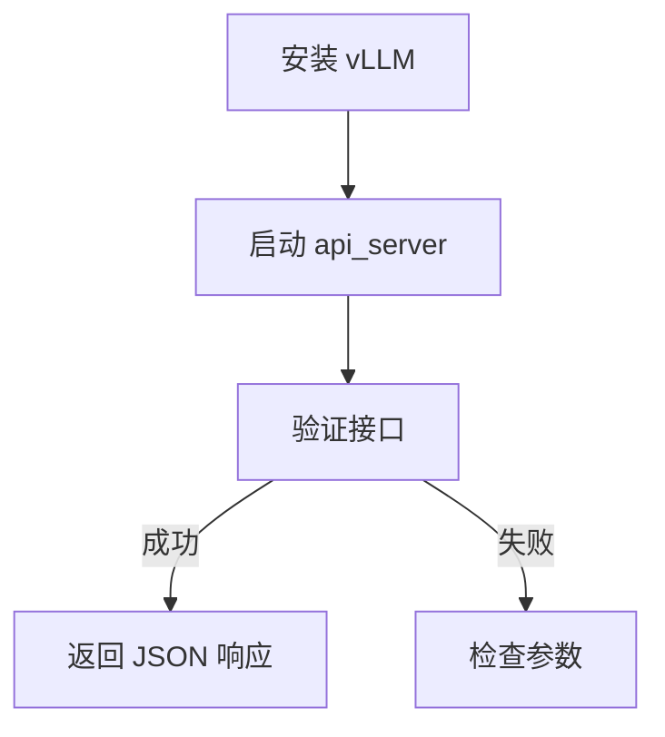
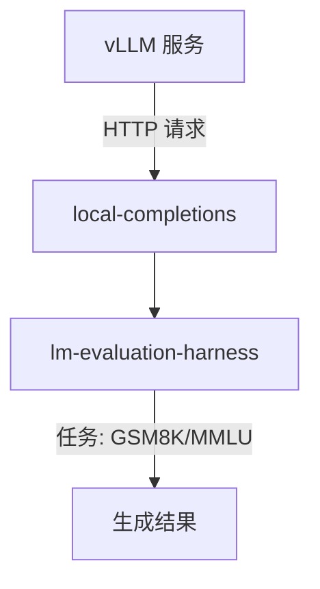
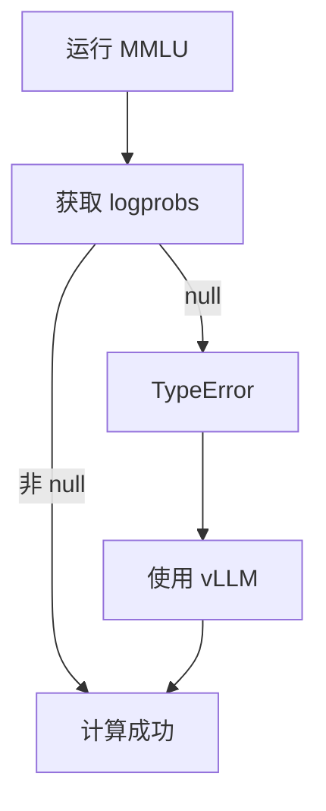

# 使用 vLLM 部署 OpenAI 兼容接口并与 lm-evaluation-harness 集成

**版本**: 2.1  
**日期**: 2025 年 2 月 27 日  
**作者**: xAI 技术团队  
**状态**: 最终版

---

## 目录
1. [概述](#概述)
2. [环境设置](#环境设置)
3. [部署 vLLM 的 OpenAI 兼容接口](#部署-vllm-的-openai-兼容接口)
4. [验证 logprobs 支持](#验证-logprobs-支持)
5. [与 lm-evaluation-harness 集成](#与-lm-evaluation-harness-集成)
6. [支持的任务与选择](#支持的任务与选择)
7. [测试与结果](#测试与结果)
8. [解决 MMLU 任务中的 logprobs 错误](#解决-mmlu-任务中的-logprobs-错误)
9. [推荐方案与结论](#推荐方案与结论)
10. [附录](#附录)

---

## 概述

本技术文档指导用户使用 vLLM 部署 OpenAI 兼容的 RESTful 接口服务，作为主力评测框架，并与 `lm-evaluation-harness` 集成，评估语言模型（如 Qwen2.5 系列）的性能。文档整合了环境配置、vLLM 部署、任务选择和测试结果，特别解决了 MMLU 任务中的 `logprobs` 相关错误。

### 目标
- 部署 vLLM 支持的 OpenAI ChatCompletions 接口。
- 验证 `logprobs` 支持。
- 使用 `lm-evaluation-harness` 运行 MMLU、GPQA 等任务。

---

## 环境设置

### 创建并激活 Conda 环境
1. **创建环境**  
   ```bash
   conda create -n lm-evaluation-harness python=3.10 -y
   ```
2. **激活环境**  
   ```bash
   conda activate lm-evaluation-harness
   ```

---

## 部署 vLLM 的 OpenAI 兼容接口

vLLM 是高效的推理框架，支持 OpenAI API 和 `logprobs`，适合评测需求。

### 部署步骤

1. **安装 vLLM**  
   在 Conda 环境中安装：
   
   ```bash
   pip install vllm
   ```
   
2. **启动服务**  
   - **基础模型 (Qwen2.5-3B)**  
     ```bash
     python -m vllm.entrypoints.openai.api_server --model Qwen/Qwen2.5-3B
     export VLLM_USE_V1=0
     ```
     或合并为单行：
     ```bash
     python -m vllm.entrypoints.openai.api_server --model Qwen/Qwen2.5-3B && export VLLM_USE_V1=0
     ```
   - **量化模型 (Qwen2.5-32B-Instruct-AWQ)**  
     ```bash
     python -m vllm.entrypoints.openai.api_server \
       --model Qwen/Qwen2.5-32B-Instruct-AWQ \
       --swap-space 16 \
       --disable-log-requests \
       --quantization awq \
       --enable-prefix-caching \
       --api_key test_123
     ```

3. **验证接口**  
   - **列出模型**  
     ```bash
     curl http://localhost:8000/v1/models \
       -H "Content-Type: application/json" \
       -H "Authorization: Bearer test_123"
     ```
   - **测试 ChatCompletions**  
     ```bash
     curl http://localhost:8000/v1/chat/completions \
       -H "Content-Type: application/json" \
       -H "Authorization: Bearer test_123" \
       -d '{
         "model": "Qwen/Qwen2.5-3B",
         "messages": [
           {"role": "system", "content": "You are a helpful assistant."},
           {"role": "user", "content": "Hello!"}
         ]
       }'
     ```

**流程图**：



---

## 验证 logprobs 支持

vLLM 原生支持 `logprobs`，无需额外配置。

### 测试 logprobs

1. **发送请求**  
   ```bash
   curl http://localhost:8000/v1/chat/completions \
     -H "Content-Type: application/json" \
     -H "Authorization: Bearer test_123" \
     -d '{
       "model": "Qwen/Qwen2.5-3B",
       "messages": [{"role": "user", "content": "你好"}],
       "max_tokens": 50,
       "logprobs": true,
       "top_logprobs": 5
     }'
   ```

2. **预期响应**  
   ```json
   {
     "choices": [
       {
         "index": 0,
         "message": {"role": "assistant", "content": "你好！"},
         "logprobs": {
           "tokens": ["你", "好", "！"],
           "token_logprobs": [-0.05, -0.10, -0.02],
           "top_logprobs": [
             {"你": -0.05, "我": -1.2, "他": -2.3},
             {"好": -0.10, "很": -1.5, "不": -2.0},
             {"！": -0.02, "。": -1.0, "，": -2.0}
           ]
         }
       }
     ]
   }
   ```

---

## 与 lm-evaluation-harness 集成

### 配置与运行

1. **安装 lm-evaluation-harness**  
   ```bash
   git clone https://github.com/EleutherAI/lm-evaluation-harness.git
   cd lm-evaluation-harness
   pip install -e .
   ```

2. **设置 API Key**  
   ```bash
   export OPENAI_API_KEY=test_123
   ```

3. **运行评估**  
   - 示例任务（GSM8K）：
     ```bash
     lm_eval --model local-completions \
       --tasks gsm8k \
       --model_args model=Qwen/Qwen2.5-3B,base_url=http://localhost:8000/v1/completions,num_concurrent=10,max_retries=3,tokenized_requests=False
     ```
   - **结果**：
     | Tasks | Version | Filter           | n-shot | Metric      |      | Value  |      | Stderr |
     | ----- | ------- | ---------------- | ------ | ----------- | ---- | ------ | ---- | ------ |
     | gsm8k | 3       | flexible-extract | 5      | exact_match | ↑    | 0.7453 | ±    | 0.0120 |
     |       |         | strict-match     | 5      | exact_match | ↑    | 0.6861 | ±    | 0.0128 |

**架构图**：



---

## 支持的任务与选择

### 查看支持任务
```bash
lm_eval --tasks list
```

### 查看更细粒度的任务
```
lm-eval --tasks {{list_groups,list_subtasks,list_tags,list}}` to list out all available names for task groupings; only (sub)tasks; tags; or all of the above
```


### 选择任务

参考 Qwen2.5 技术报告（[arXiv:2412.15115](https://arxiv.org/pdf/2412.15115)），推荐以下任务：
- **MMLU/MMLU-Pro**：多选题评估通用知识。
- **GPQA**：高质量问答任务（[数据集](https://huggingface.co/datasets/Idavidrein/gpqa)）。

---

## 测试与结果

### 测试命令
以下为针对 `global_mmlu_en` 任务的测试：
1. **Qwen2.5-3B**  
   ```bash
   lm_eval --model local-completions \
     --tasks global_mmlu_en \
     --model_args model=Qwen/Qwen2.5-3B,base_url=http://localhost:8000/v1/completions,num_concurrent=1,max_retries=3,tokenized_requests=False
   ```

2. **Qwen2.5-7B-Instruct**  
   ```bash
   lm_eval --model local-completions \
     --tasks global_mmlu_en \
     --model_args model=Qwen/Qwen2.5-7B-Instruct,base_url=http://localhost:8000/v1/completions,num_concurrent=1,max_retries=3,tokenized_requests=False
   ```

3. **Qwen2.5-14B-Instruct**  
   ```bash
   lm_eval --model local-completions \
     --tasks global_mmlu_en \
     --model_args model=Qwen/Qwen2.5-14B-Instruct,base_url=http://localhost:8000/v1/completions,num_concurrent=1,max_retries=3,tokenized_requests=False
   ```

4. **Qwen2.5-14B-Instruct-AWQ**  
   ```bash
   lm_eval --model local-completions \
     --tasks global_mmlu_en \
     --model_args model=Qwen/Qwen2.5-14B-Instruct-AWQ,base_url=http://localhost:8000/v1/completions,num_concurrent=1,max_retries=3,tokenized_requests=False
   ```

5. **Qwen2.5-7B-Instruct-AWQ**  
   ```bash
   lm_eval --model local-completions \
     --tasks global_mmlu_en \
     --model_args model=Qwen/Qwen2.5-7B-Instruct-AWQ,base_url=http://localhost:8000/v1/completions,num_concurrent=2,max_retries=3,tokenized_requests=False
   ```

6. **Qwen2.5-32B-Instruct-AWQ**  
   ```bash
   lm_eval --model local-completions \
     --tasks global_mmlu_en \
     --model_args model=Qwen/Qwen2.5-32B-Instruct-AWQ,base_url=http://localhost:8000/v1/completions,num_concurrent=1,max_retries=3,tokenized_requests=False
   ```

**注意**：`lm-evaluation-harness` 对 v1 接口的支持有限，建议使用 `/v1/completions`。

---

## 解决 MMLU 任务中的 logprobs 错误

### 错误描述
运行 MMLU 任务时，若服务不支持 `logprobs`，会出现：
```
logprobs = sum(choice["logprobs"]["token_logprobs"][ctxlen:-1])
TypeError: 'NoneType' object is not subscriptable
```

### 使用 vLLM 解决
vLLM 默认支持 `logprobs`，避免此错误：
- 部署 vLLM（如上）。
- 运行评估，无需修改代码。

**错误处理流程**：



---

## 推荐方案与结论

### 推荐方案
- **主力框架**：vLLM，提供稳定的接口和 `logprobs` 支持。
- **部署命令**：
  ```bash
  python -m vllm.entrypoints.openai.api_server \
    --model Qwen/Qwen2.5-32B-Instruct-AWQ \
    --swap-space 16 \
    --quantization awq \
    --api_key test_123
  ```
- **评估**：使用 `--tasks global_mmlu_en` 等任务。

### 结论
vLLM 作为主力评测框架，解决了 `logprobs` 问题，与 `lm-evaluation-harness` 无缝集成，支持 Qwen2.5 系列模型的 MMLU 等任务评估。

---

## 附录

### 参考资料
- [vLLM GitHub](https://github.com/vllm-project/vllm)
- [lm-evaluation-harness README](https://github.com/EleutherAI/lm-evaluation-harness/blob/main/README.md)
- [Qwen2.5 Technical Report](https://arxiv.org/pdf/2412.15115)
- [GPQA 数据集](https://huggingface.co/datasets/Idavidrein/gpqa)

---

**版权所有 © 2025 xAI**  
本文档受版权保护，未经许可不得转载或分发。