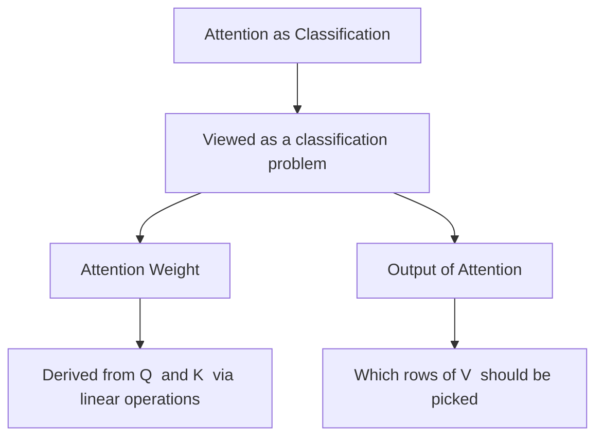
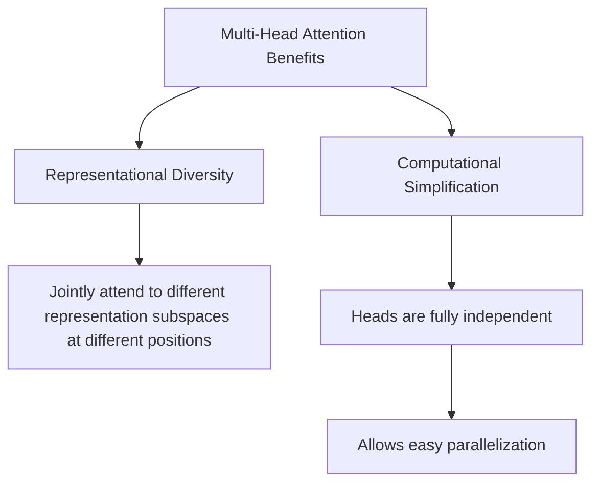
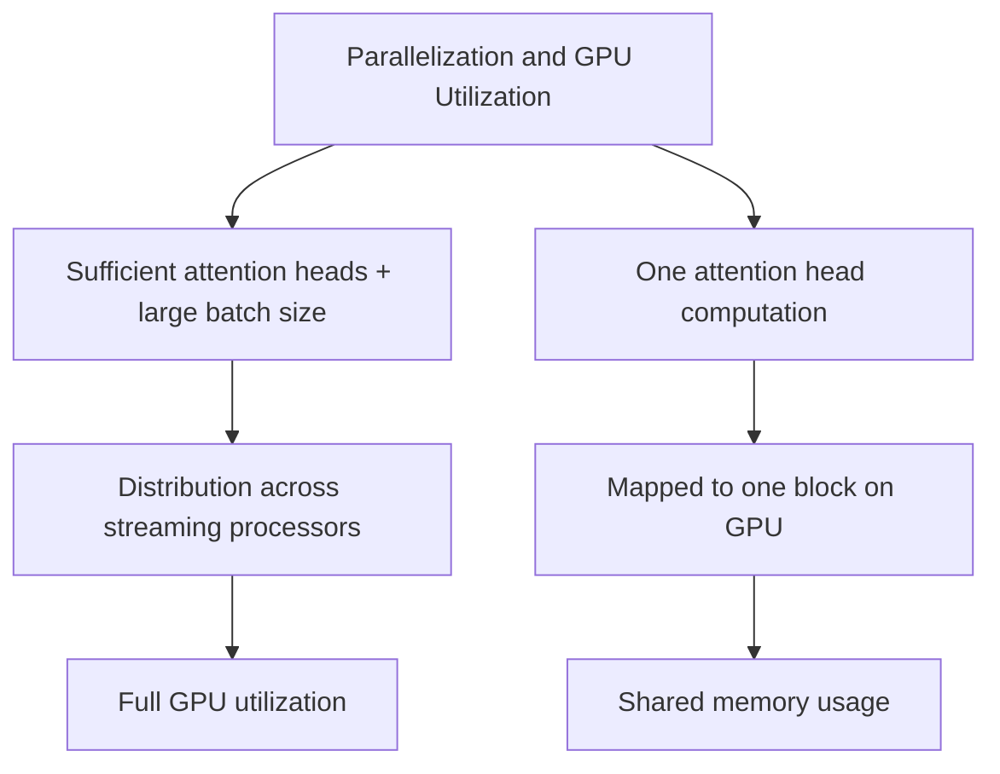
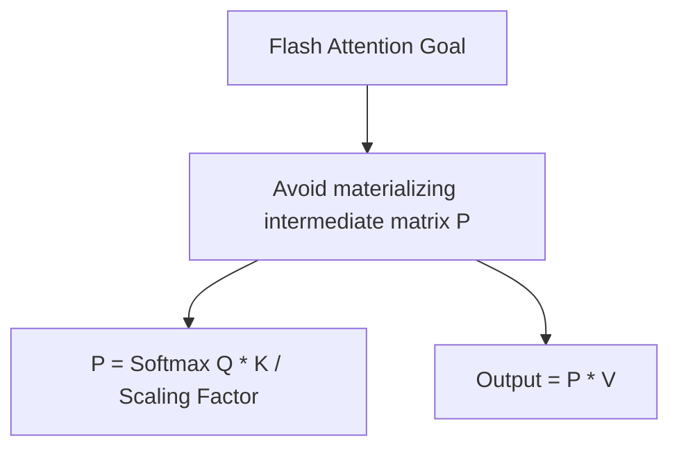
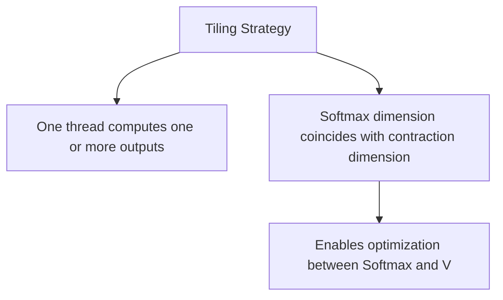
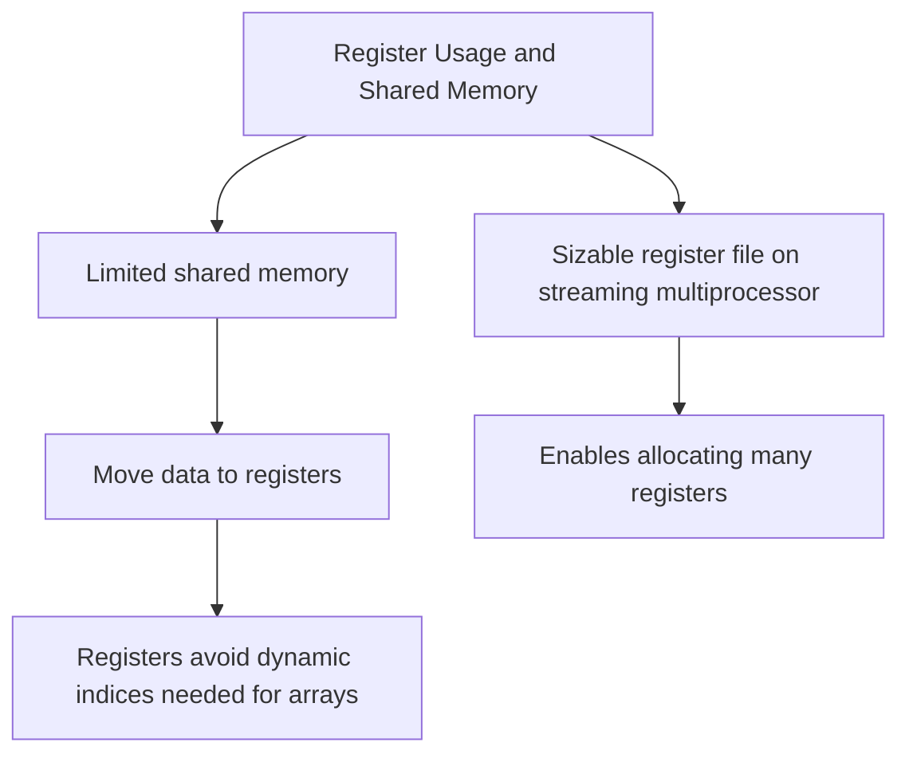
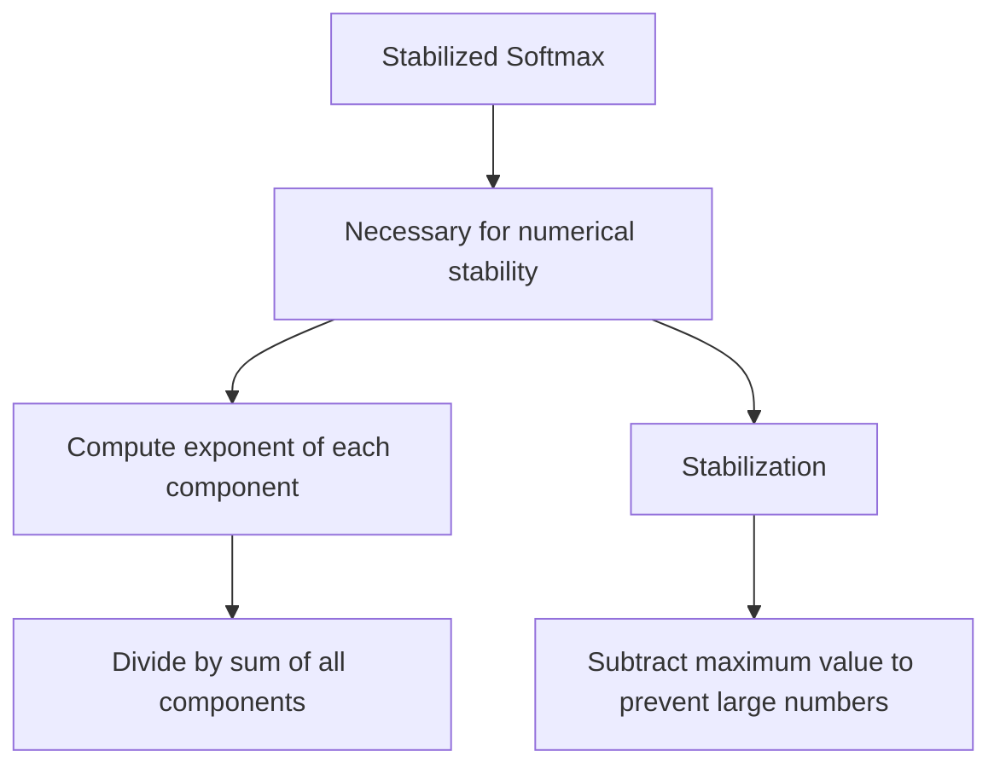
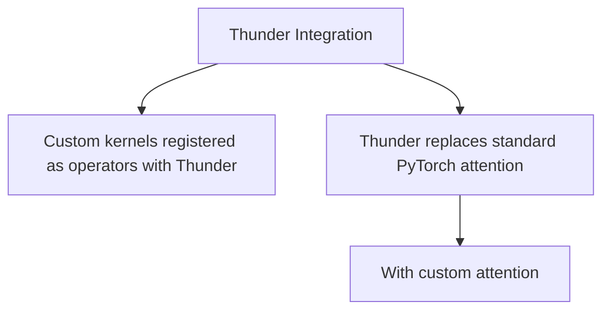
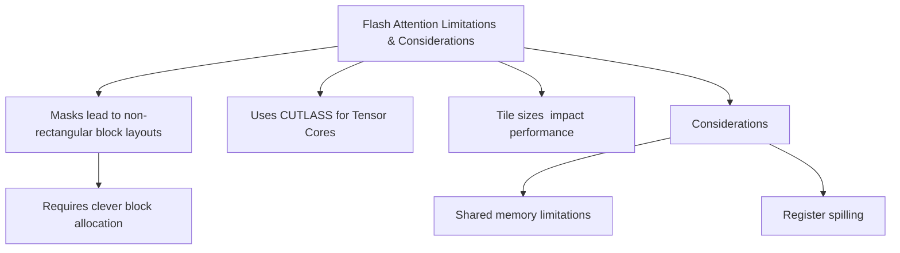
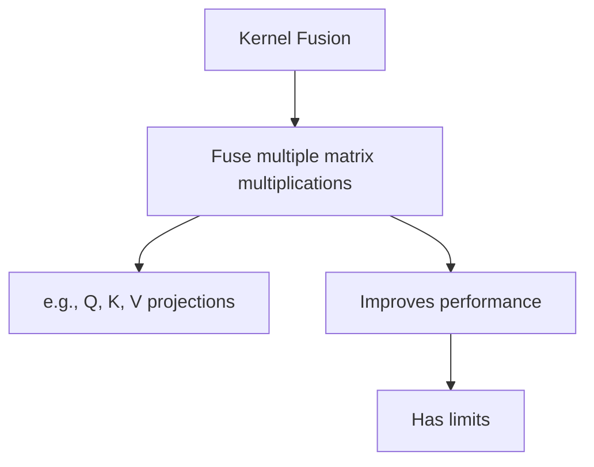

Below is a Mermaid.js representation of the content you provided earlier, where each section is split into a completely separate Mermaid diagram (unit). Each unit is independent, with its own `graph` definition, and reflects the hierarchical structure of the original content using `TD` (top-down) direction for clarity. These can be rendered individually or combined as needed.

---

### 1. Attention as Classification

---

### 2. Multi-Head Attention Benefits

---

### 3. Parallelization and GPU Utilization

---

### 4. Flash Attention Goal

---

### 5. Tiling Strategy

---

### 6. Register Usage and Shared Memory

---

### 7. Stabilized Softmax

---

### 8. Thunder Integration

---

### 9. Flash Attention Limitations & Considerations

---

### 10. Kernel Fusion

---

### Notes:
- **Independent Units**: Each section is a standalone `graph TD`, making it a distinct Mermaid unit that can be rendered separately.
- **Structure**: The hierarchy follows the bullet-point levels, with arrows (`-->`) connecting related concepts.
- **Rendering**: You can paste each block into a Mermaid-compatible tool (e.g., `mermaid.live`) to visualize them individually.

Let me know if you’d like any modifications, such as changing the direction (e.g., `LR` for left-right) or adjusting the layout!
