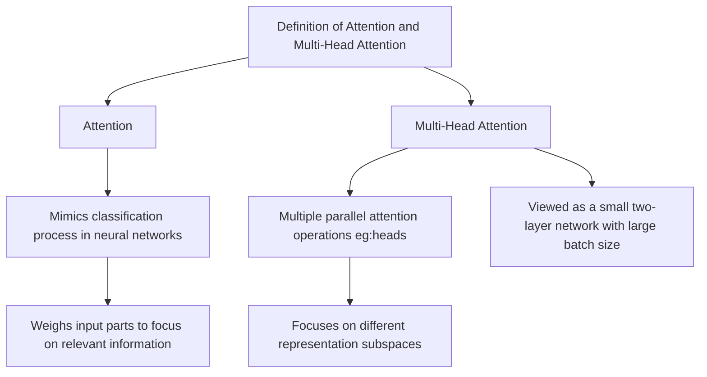
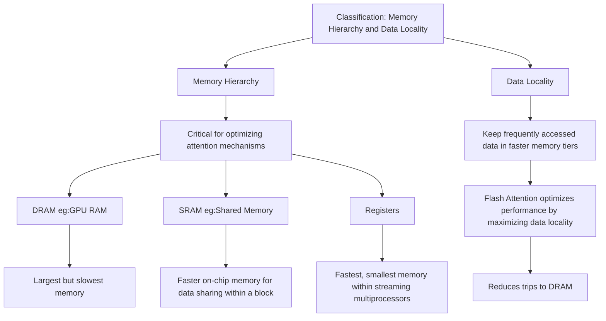
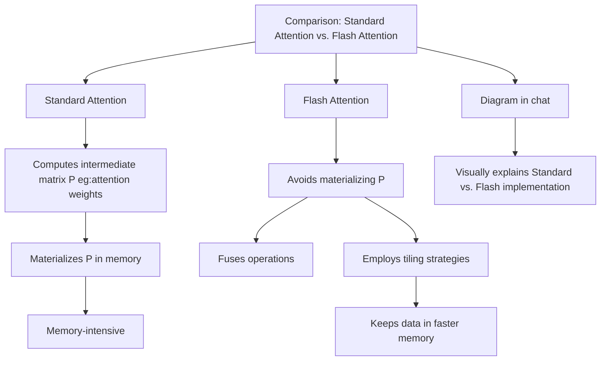
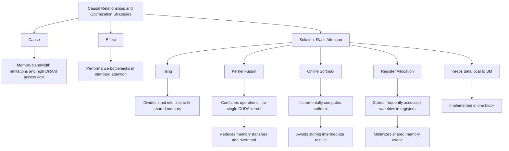
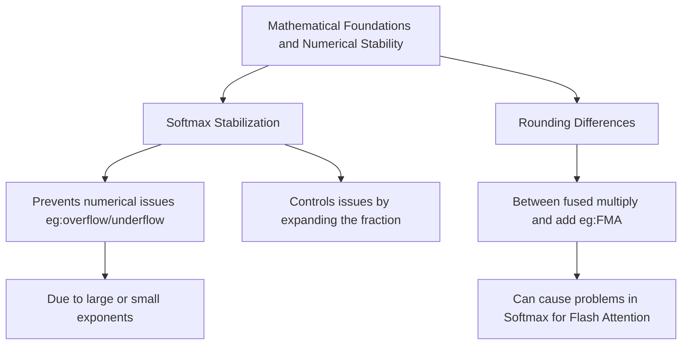
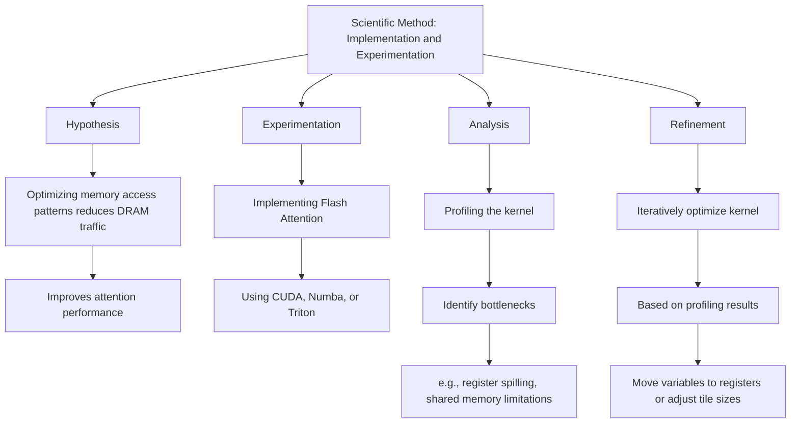
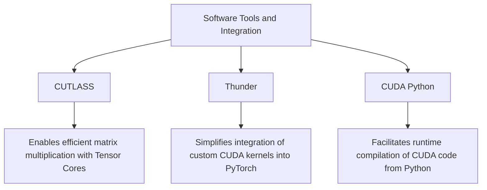

Below is a Mermaid.js representation of the provided content, where each section is a separate, standalone Mermaid unit (graph). Each unit uses `graph TD` (top-down) to reflect the hierarchical structure of the information clearly. These can be rendered individually in a Mermaid-compatible tool like `mermaid.live`.

---

### 1. Definition of Attention and Multi-Head Attention

---

### 2. Classification: Memory Hierarchy and Data Locality

---

### 3. Comparison: Standard Attention vs. Flash Attention

---

### 4. Causal Relationships and Optimization Strategies

---

### 5. Mathematical Foundations and Numerical Stability

---

### 6. Scientific Method: Implementation and Experimentation

---

### 7. Software Tools and Integration

---

### Explanation:
- **Standalone Units**: Each section is a fully independent `graph TD`, ensuring it can be rendered as a separate Mermaid unit.
- **Hierarchy**: The structure preserves the bullet-point levels, with arrows (`-->`) connecting concepts logically.
- **Clarity**: Descriptive node labels in square brackets `[ ]` make the diagrams self-explanatory.
- **Rendering**: Paste each block into a Mermaid-compatible editor (e.g., `mermaid.live`) to visualize them individually.

Let me know if you’d like adjustments, such as changing the direction to `LR` (left-right) or refining the layout further!