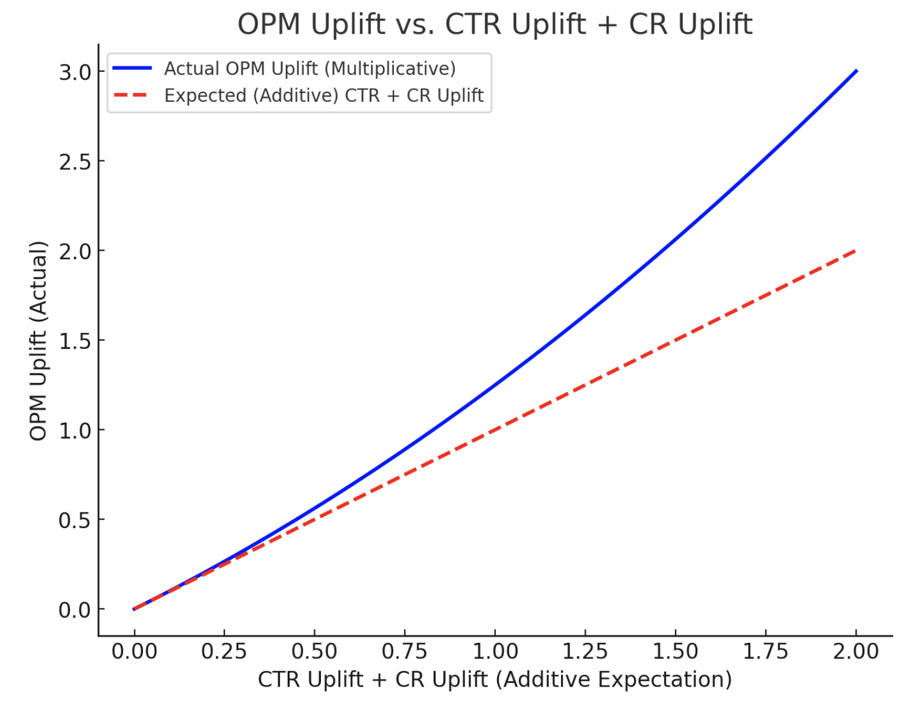

# opm uplift

### **Key Takeaway**

- If both **CTR and CR increase**, OPM will increase **more than their individual sum** due to the multiplicative effect.
- If one increases and the other decreases, **OPM uplift could be smaller or even negative**.

### **Understanding the Relationship**

- **OPM (Orders per Mille) uplift** measures how much the number of orders per 1,000 impressions increases after an optimization.
- **CTR (Click-Through Rate) uplift** measures the increase in the proportion of users who click on an ad.
- **CR (Conversion Rate) uplift** measures the increase in the proportion of users who convert after clicking.

Since **OPM is derived from both CTR and CR**, we can express OPM as:
$$
OPM= \text{Impressions} \times \text{CTR} \times \text{CR}
$$

Taking relative changes (uplift) on both sides:
$$
OPM Uplift= \left( 1 + \frac{\Delta \text{CTR}}{\text{CTR}} \right) \times \left( 1 + \frac{\Delta \text{CR}}{\text{CR}} \right) - 1
$$
This means **OPM uplift is approximately the combined effect of CTR uplift and CR uplift, but with an interaction term.**

### **Approximation**

For small uplifts, you can approximate:

OPM Uplift≈CTR Uplift+CR Uplift\text{OPM Uplift} \approx \text{CTR Uplift} + \text{CR Uplift}

But for larger uplifts, the correct formula is:
$$
OPM Uplift= \text{CTR Uplift} + \text{CR Uplift} + (\text{CTR Uplift} \times \text{CR Uplift})
$$

### **Example Calculation**

- **CTR Uplift** = 20% (1.2x increase)
- **CR Uplift** = 30% (1.3x increase)
- **OPM Uplift Calculation**:

OPM Uplift=(1.2×1.3)−1=56%\text{OPM Uplift} = (1.2 \times 1.3) - 1 = 56\%

So, **OPM uplift is not just CTR uplift × CR uplift, but also includes their interaction.**

## visual

To represent the **relationship between OPM Uplift and (CTR Uplift + CR Uplift)**, I'll generate a **curve** that shows how the interaction term causes OPM Uplift to be **greater than the simple sum** of CTR Uplift and CR Uplift.

The expected shape:

- **Linear growth** if there were no interaction.
- **Upward curvature** due to multiplicative interaction.

Here’s the curve illustrating the relationship between **OPM uplift** and **CTR uplift + CR uplift**:

- The **dashed red line** represents the **additive expectation** (if OPM uplift were just CTR uplift + CR uplift).
- The **solid blue curve** shows the **actual OPM uplift**, which is higher due to the **multiplicative interaction effect**.
- The **gap between the curves** represents the **interaction term**, showing that OPM uplift grows **non-linearly**.

Would you like a deeper breakdown or an alternative visualization? 🚀