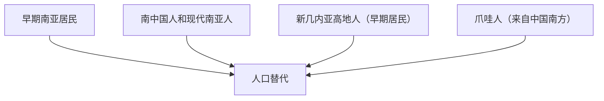
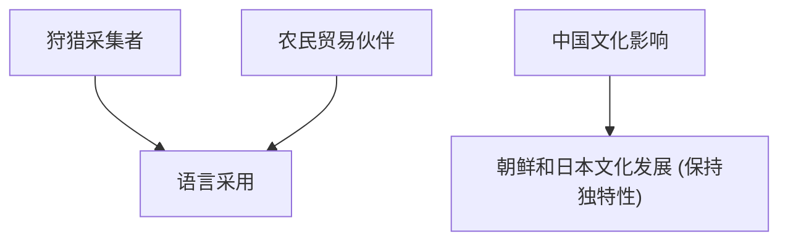
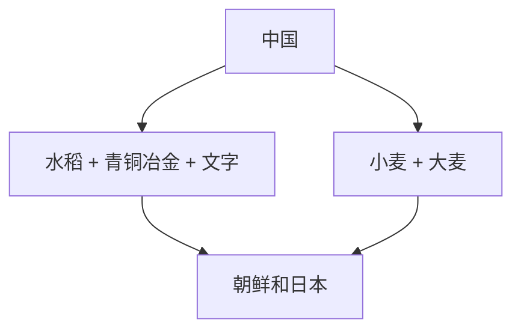
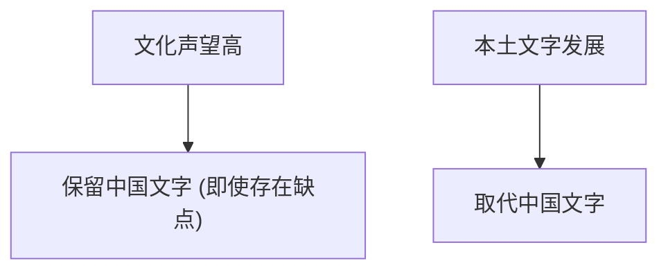
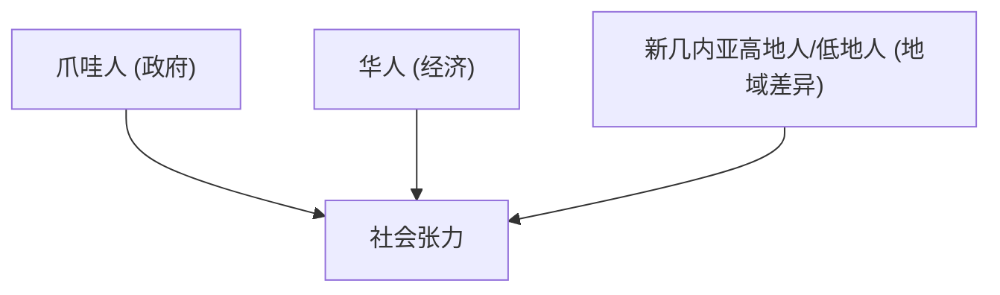
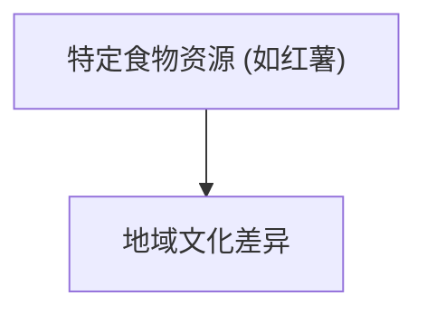
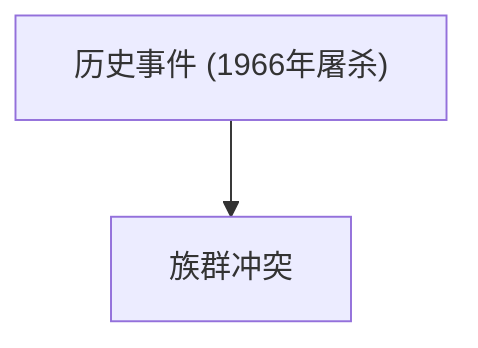
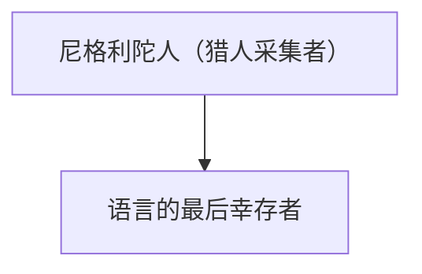
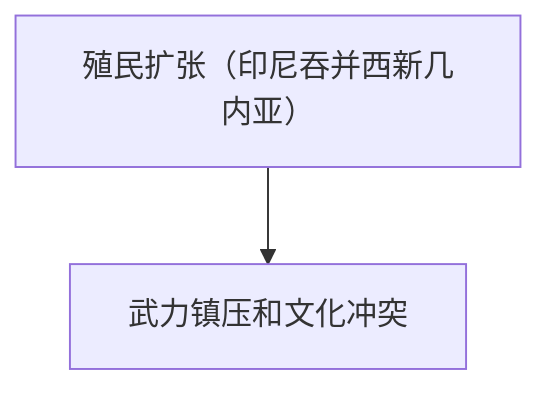

# 亚洲的迁移和文化遗产

下面将整体内容拆分成9个独立的 Mermaid 子图，每个子图对应一个概念关系图。你可以将以下代码分别复制到 Mermaid 编辑器中单独渲染：

------

### Diagram 1: 人口迁移与替代 (Population Migration and Replacement)

------

### Diagram 2: 语言的采用与文化影响 (Language Adoption and Cultural Influence)

------

### Diagram 3: 文化传播与技术转移 (Cultural Diffusion and Technology Transfer)

------

### Diagram 4: 文化认同与文字使用 (Cultural Identity and Writing System Usage)

------

### Diagram 5: 族群关系与社会张力 (Ethnic Relations and Social Tension)

------

### Diagram 6: 食物与文化 (Food and Culture)

------

### Diagram 7: 历史事件与族群冲突 (Historical Events and Ethnic Conflicts)

------

### Diagram 8: 生存方式与语言 (Lifestyle and Language)

------

### Diagram 9: 殖民与冲突 (Colonization and Conflict)

------

这样，每个子图都是独立的 Mermaid 流程图，方便单独查看和调试。如需更多信息，请参阅 [Mermaid Flowchart 语法文档](https://mermaid.js.org/syntax/flowchart/)。