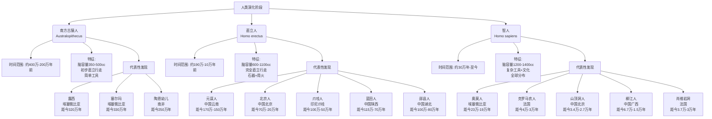

# 人类史-从南方古猿到现代智人

南方古猿人（Australopithecus）、直立人（Homo erectus）和智人（Homo sapiens）是人类演化史上的重要阶段，每个时期都有其独特的特征和区别。以下是对这三个阶段的主要特征与差异的介绍：

### 1. 南方古猿人（Australopithecus）
- **时间范围**：大约生活在距今约400万年至200万年前。
- **主要特征**：
  - **体型与外貌**：体型较小，身高约1.2-1.5米，脑容量较小（约350-500立方厘米），类似现代黑猩猩。
  - **行走方式**：能够直立行走（两足行走），这是与早期灵长类的重要区别，但行走姿势不如现代人自然。
  - **工具使用**：证据表明他们可能使用简单的自然工具（如木棒或石头），但没有明确的制造工具的记录。
  - **生活方式**：主要以植物性食物为主，可能也食用水果和小型动物，属于采集者。
  - **代表物种**：如“露西”（Australopithecus afarensis）。
- **环境**：生活在非洲的森林和草原交界处。

### 2. 直立人（Homo erectus）
- **时间范围**：大约生活在距今约190万年至10万年前。
- **主要特征**：
  - **体型与外貌**：身高接近现代人（约1.6-1.8米），脑容量显著增大（约600-1100立方厘米），面部较南方古猿人平坦。
  - **行走方式**：完全直立行走，步伐更接近现代人。
  - **工具使用**：能够制造和使用较为复杂的石器（如阿舍利手斧），标志着技术进步。
  - **生活方式**：是猎人和采集者，可能已开始使用火（用于取暖、烹饪和防御），社会行为更复杂。
  - **地理分布**：从非洲扩散到亚洲和欧洲，是最早走出非洲的古人类之一。
- **代表化石**：如“北京人”（Sinanthropus pekinensis）。

### 3. 智人（Homo sapiens）
- **时间范围**：大约从距今约30万年前出现，一直延续至今。
- **主要特征**：
  - **体型与外貌**：现代人的体型，脑容量更大（约1200-1400立方厘米），高额头、下巴突出。
  - **行走方式**：完全直立行走，身体结构高度适应多样环境。
  - **工具使用**：制造精致的工具，包括石器、骨器和后来的金属器具，技术不断进步。
  - **生活方式**：发展出复杂的语言、艺术（如洞穴壁画）、宗教和社会结构，从狩猎采集转向农业定居。
  - **地理分布**：遍布全球，适应各种气候和环境。
- **代表性标志**：文化和认知能力的飞跃，如符号思维和抽象概念的出现。

### 主要区别总结
| 特征         | 南方古猿人      | 直立人           | 智人                   |
| ------------ | --------------- | ---------------- | ---------------------- |
| **脑容量**   | 350-500 cc      | 600-1100 cc      | 1200-1400 cc           |
| **行走方式** | 初步直立行走    | 完全直立行走     | 完全直立行走           |
| **工具使用** | 简单自然工具    | 制造石器、使用火 | 复杂工具、文化创造     |
| **生活方式** | 采集为主        | 狩猎采集、使用火 | 农业、艺术、社会复杂化 |
| **分布范围** | 非洲            | 非洲、亚洲、欧洲 | 全球                   |
| **时间跨度** | 400万-200万年前 | 190万-10万年前   | 30万年前至今           |

### 演化意义
- **南方古猿人**是人类与猿类分化的过渡阶段，标志着两足行走的开端。
- **直立人**是早期人类的代表，技术和火的使用为其扩散和生存提供了基础。
- **智人**则通过语言、文化和技术革新，奠定了现代人类文明的基础。

这三个阶段展示了人类从原始灵长类到现代人类的渐进演化过程，每一步都伴随着身体和认知能力的显著提升。

## 南方古猿人、直立人和智人三个阶段的代表性考古发现

以下是南方古猿人、直立人和智人三个阶段的代表性考古发现，涵盖了重要化石和遗址，反映了各自时期的特征和发展：

### 1. 南方古猿人（Australopithecus）
- **露西（Lucy）**
  - **学名**：Australopithecus afarensis
  - **发现地点**：埃塞俄比亚哈达尔地区
  - **发现时间**：1974年
  - **特征**：保存约40%的骨骼，身高约1.1米，脑容量约400立方厘米，是已知最完整的南方古猿化石之一。露西证明了南方古猿能够直立行走。
  - **年代**：距今约320万年。
- **塞尔玛（Selam，又称“露西的婴儿”）**
  - **学名**：Australopithecus afarensis
  - **发现地点**：埃塞俄比亚迪基卡地区
  - **发现时间**：2000年
  - **特征**：一个3岁幼童的化石，包括头骨和部分身体骨骼，显示出南方古猿的发育特征。
  - **年代**：距今约330万年。
- **陶恩幼儿（Taung Child）**
  - **学名**：Australopithecus africanus
  - **发现地点**：南非陶恩地区
  - **发现时间**：1924年
  - **特征**：一个幼儿的头骨化石，脑容量约440立方厘米，显示南方古猿早期特征。
  - **年代**：距今约250万年。

### 2. 直立人（Homo erectus）
- **元谋人**
  - **学名**：Homo erectus yuanmouensis
  - **发现地点**：中国云南元谋县
  - **发现时间**：1965年
  - **特征**：两颗牙齿化石，推测脑容量约600-900立方厘米，是中国最早的直立人证据。
  - **年代**：距今约170万-150万年。
- **北京人（周口店遗址）**
  - **学名**：Homo erectus pekinensis
  - **发现地点**：中国北京周口店
  - **发现时间**：1921年起，1929年发现完整头盖骨
  - **特征**：多个头骨、下颌骨和牙齿化石，脑容量约900-1100立方厘米，有用火和石器证据。
  - **年代**：距今约70万-20万年。
- **爪哇人（Java Man）**
  - **学名**：Homo erectus erectus
  - **发现地点**：印度尼西亚爪哇岛桑iran地区
  - **发现时间**：1891-1892年
  - **特征**：头盖骨和股骨化石，脑容量约900立方厘米，显示直立人走出非洲的证据。
  - **年代**：距今约100万-50万年。

### 3. 智人（Homo sapiens）
- **奥莫人（Omo Remains）**
  - **学名**：Homo sapiens
  - **发现地点**：埃塞俄比亚奥莫河谷
  - **发现时间**：1967年
  - **特征**：两个头骨化石（Omo I和Omo II），具有现代人特征，脑容量接近现代人，是已知最早的智人化石。
  - **年代**：距今约23万-19万年。
- **克罗马农人（Cro-Magnon）**
  - **学名**：Homo sapiens
  - **发现地点**：法国南部克罗马农岩棚
  - **发现时间**：1868年
  - **特征**：多个完整骨骼，脑容量约1350立方厘米，伴有精致石器和艺术品（如珠饰），代表欧洲早期智人。
  - **年代**：距今约4万-3万年。
- **丹尼索瓦人（Denisovans，与智人相关）**
  - **学名**：Homo sapiens denisova（或独立种）
  - **发现地点**：俄罗斯西伯利亚丹尼索瓦洞
  - **发现时间**：2010年（通过DNA分析确认）
  - **特征**：牙齿、指骨化石和DNA证据，与智人有基因混合，显示复杂的人类迁徙和杂交。
  - **年代**：距今约20万-5万年。

### 总结
- **南方古猿人**的代表性发现（如露西）展示了直立行走的开端，主要集中于非洲。
- **直立人**的发现（如北京人、爪哇人）表明其扩散到欧亚大陆，并掌握了火和工具制作。
- **智人**的发现（如奥莫人、克罗马农人）反映了现代人类的身体特征、文化创造和全球分布。

这些考古发现为人类演化提供了关键证据，串联起从南方古猿到智人的发展脉络。

## 东亚中国在直立人时期的代表考古发现

东亚特别是中国地区在直立人（Homo erectus）时期的代表性考古发现非常丰富，这些发现展示了直立人在中国地区的分布、生活方式和技术水平。直立人时期大致跨度为距今约190万年至10万年，以下是一些重要的代表性考古发现：

### 1. 元谋人（Yuanmou Man）
- **发现地点**：云南省元谋县上那蚌村附近
- **发现时间**：1965年
- **年代**：距今约170万-150万年
- **特征**：
  - 发现了两颗人类牙齿化石（门牙），形态属于直立人，推测脑容量约600-900立方厘米。
  - 伴随少量石器和动物化石，但石器是否为人工制作尚存争议。
- **意义**：元谋人是目前中国已知最早的直立人化石，表明直立人早在170万年前已进入东亚，是研究东亚人类起源的重要证据。

### 2. 北京人（Peking Man，周口店遗址）
- **发现地点**：北京市房山区周口店龙骨山
- **发现时间**：1921年起，1929年发现完整头盖骨
- **年代**：距今约70万-20万年
- **特征**：
  - 发现了多个头盖骨、下颌骨、牙齿和肢骨化石，脑容量约900-1100立方厘米，具有直立人典型特征（头骨厚、眉骨突出）。
  - 伴随大量石器（如砍砸器）和动物化石，有明确的用火证据（如灰烬、烧骨）。
- **意义**：北京人是东亚直立人的经典代表，其用火和石器技术表明较高的生存适应能力，周口店遗址被列为世界文化遗产。

### 3. 蓝田人（Lantian Man）
- **发现地点**：陕西省蓝田县公王岭和陈家窝
- **发现时间**：1963-1964年
- **年代**：距今约115万-70万年
- **特征**：
  - 发现了一具女性头骨（公王岭）和下颌骨（陈家窝），脑容量约780立方厘米，头骨较厚，具有直立人特征。
  - 伴随石器和动物化石，反映狩猎采集生活。
- **意义**：蓝田人是华北地区较早的直立人化石，填补了元谋人与北京人之间的时间空隙，显示直立人在中国的长期存在。

### 4. 金牛山人（Jinniu Shan Man）
- **发现地点**：辽宁省营口市金牛山
- **发现时间**：1984年
- **年代**：距今约28万-20万年
- **特征**：
  - 发现一具较为完整的骨架，包括头骨、脊椎和四肢骨，脑容量约1100-1200立方厘米，接近智人水平。
  - 伴有石器、骨器和动物化石，显示较复杂的技术。
- **意义**：金牛山人被认为是晚期直立人或直立人与早期智人的过渡类型，反映了东亚人类演化的复杂性。

### 5. 郧县人（Yunxian Man）
- **发现地点**：湖北省郧县（现郧阳区）学堂梁子
- **发现时间**：1989-1990年
- **年代**：距今约100万-80万年
- **特征**：
  - 发现了两个完整头骨（郧县人1号和2号），脑容量约900-1000立方厘米，头骨变形但保留直立人特征。
  - 伴随石器和大量动物化石（如大象、犀牛）。
- **意义**：郧县人提供了华中地区直立人的重要证据，表明直立人已广泛分布于中国不同地理区域。

### 6. 和县人（Hexian Man）
- **发现地点**：安徽省和县龙潭洞
- **发现时间**：1980-1981年
- **年代**：距今约40万-30万年
- **特征**：
  - 发现一具头盖骨和部分牙齿，脑容量约1000立方厘米，形态接近北京人。
  - 伴有石器和动物化石，显示狩猎生活。
- **意义**：和县人是华东地区直立人的代表，与北京人关系密切，反映了直立人在东亚的区域性特征。

### 7. 南京人（Nanjing Man）
- **发现地点**：江苏省南京市汤山葫芦洞
- **发现时间**：1993年
- **年代**：距今约60万-50万年
- **特征**：
  - 发现两具头骨（一男一女），脑容量约900-1100立方厘米，具有直立人特征。
  - 伴随石器和动物化石，显示较发达的生存能力。
- **意义**：南京人进一步证实了直立人在华东地区的分布，丰富了东亚直立人的化石记录。

### 东亚中国直立人时期的特征与意义
- **时间跨度**：从元谋人（约170万年）到金牛山人（约20万年），直立人在中国持续存在超过百万年。
- **分布范围**：覆盖华北（北京人、金牛山人）、华中（郧县人）、华东（和县人、南京人）、西南（元谋人），显示直立人适应多种环境。
- **技术水平**：早期（如元谋人）工具简单，后期（如北京人）掌握用火和复杂石器制作。
- **演化意义**：东亚直立人（如金牛山人）可能与早期智人存在过渡，部分学者认为他们对东亚现代人起源有贡献（多地区起源说），但也可能被非洲起源的智人取代（单一起源说）。

### 总结
中国在直立人时期的代表性考古发现包括元谋人、北京人、蓝田人、金牛山人、郧县人、和县人和南京人。这些发现不仅证明了直立人在东亚的广泛分布，还展示了他们在技术、生活方式和适应能力上的进步，为研究东亚人类演化提供了关键证据。

## 东亚中国在智人时期的代表考古发现

东亚特别是中国地区在智人（Homo sapiens）时期的代表性考古发现主要集中在晚更新世（Late Pleistocene）至全新世（Holocene）早期，这些发现展示了现代智人在中国地区的出现、扩散以及文化发展。以下是一些重要的代表性考古发现：

### 1. 田园洞人（Tianyuandong Man）
- **发现地点**：北京市房山区田园洞
- **发现时间**：2001年
- **年代**：距今约4.2万-3.9万年
- **特征**：
  - 发现了一具较为完整的成年个体骨骼，包括头骨、四肢骨等，具有现代智人的典型特征（如高额头、下巴突出）。
  - 伴随少量石器和动物骨骼，显示狩猎采集生活方式。
- **意义**：田园洞人是华北地区已知最早的现代智人化石之一，表明智人早在4万多年前已进入中国北方。

### 2. 许家窑人（Xujiayao Man）
- **发现地点**：山西省阳高县许家窑遗址
- **发现时间**：1976年起
- **年代**：距今约12.5万-10万年（可能更早）
- **特征**：
  - 发现多块头骨碎片、牙齿和下颌骨，脑容量接近现代人，部分特征介于直立人与智人之间。
  - 伴随大量石器（如刮削器）和动物化石，显示较复杂的技术。
- **意义**：许家窑人被认为是早期智人或与尼安德特人杂交的后代，反映了东亚人类演化的复杂性。

### 3. 山顶洞人（Shandingdong Man）
- **发现地点**：北京市周口店龙骨山山顶洞（与北京人遗址相邻）
- **发现时间**：1933-1934年
- **年代**：距今约3.4万-2.7万年
- **特征**：
  - 发现多具完整骨骸（包括3个头骨），具有现代智人特征，脑容量约1300-1500立方厘米。
  - 伴有石器、骨器和装饰品（如穿孔兽牙、贝壳），以及红色赭石粉末（可能用于仪式或装饰），显示出早期文化行为。
  - 有证据表明他们会埋葬死者。
- **意义**：山顶洞人代表了中国北方晚期智人阶段的文化发展，展现了艺术和社会行为的萌芽。

### 4. 柳江人（Liujiang Man）
- **发现地点**：广西壮族自治区柳江县通天岩洞
- **发现时间**：1958年
- **年代**：距今约6.7万-1.5万年（具体年代存争议）
- **特征**：
  - 发现一具完整头骨及部分身体骨骼，头骨特征与现代东亚人相似，显示现代智人特征。
  - 未发现明确的工具或文化遗物，但其年代可能反映智人向华南扩散的时间。
- **意义**：柳江人是华南地区已知最早的智人化石之一，表明智人可能较早进入中国南方。

### 5. 湖南道县福岩洞人（Fuyan Cave Man）
- **发现地点**：湖南省道县福岩洞
- **发现时间**：2015年公布（发掘始于1984年）
- **年代**：距今约12万-8万年
- **特征**：
  - 发现了47颗人类牙齿，形态完全符合现代智人特征。
  - 伴随大量动物化石，但未发现明确石器。
- **意义**：福岩洞人是中国南方最早的智人证据之一，表明智人可能在10万年前已到达东亚，比此前认为的更早。

### 6. 穿洞遗址（Chuangdong Site）
- **发现地点**：贵州省盘县大洞
- **发现时间**：1970年代起
- **年代**：距今约5.5万-1万年
- **特征**：
  - 发现人类牙齿和骨骼碎片，属于现代智人。
  - 伴有石器、骨器和动物遗骸，显示狩猎采集和早期文化活动。
- **意义**：该遗址反映了智人在西南地区的生存适应能力。

### 东亚智人时期的特征与意义
- **时间跨度**：中国地区的智人化石和遗址主要集中在距今12万年至1万年之间，表明现代智人可能在晚更新世早期就已进入东亚。
- **分布范围**：从华北（田园洞人、山顶洞人）到华南（柳江人、福岩洞人）和西南（穿洞人），显示智人广泛适应不同环境。
- **文化发展**：早期智人（如许家窑人）技术较为简单，后期（如山顶洞人）出现装饰品和埋葬行为，标志着文化复杂性的提升。
- **与其他人类的关系**：东亚智人化石显示出与尼安德特人或丹尼索瓦人可能的杂交痕迹（如许家窑人），反映了复杂的演化过程。

### 总结
中国在智人时期的代表性考古发现包括田园洞人、许家窑人、山顶洞人、柳江人、福岩洞人和穿洞遗址等人。这些发现不仅证明了现代智人在东亚的早期存在，还展示了他们在技术、文化和社会行为上的逐步发展，为研究东亚人类的起源与扩散提供了重要证据。

## 欧洲尼安德特人

尼安德特人（Neanderthals，学名：Homo neanderthalensis）属于**智人（Homo sapiens）**演化阶段的广义范畴，但更具体地说，他们是晚期更新世（Late Pleistocene）的人类分支，与现代智人（Homo sapiens sapiens）并存一段时间。尼安德特人通常被视为一个独立的亚种或近亲物种，而不是直接归类于南方古猿人或直立人时期。

### 尼安德特人的时间与背景
- **时间范围**：大约生活在距今约40万年至4万年前。
  - 最早的尼安德特人化石证据可追溯至约40万年前，而他们在大约4万年前逐渐消失或与现代智人融合。
- **演化位置**：尼安德特人被认为是从直立人（Homo erectus）或其近亲（如海德堡人，Homo heidelbergensis）演化而来，与现代智人共享一个共同祖先。
- **地理分布**：主要生活在欧洲和西亚地区，适应寒冷气候。

### 主要特征
- **体型与外貌**：身材较矮壮（约1.5-1.7米），脑容量较大（约1200-1750立方厘米，甚至略高于现代人），头骨较长，眉骨突出，鼻子宽大（可能适应寒冷干燥空气）。
- **工具使用**：使用复杂的石器（如勒瓦娄哇技术制作的工具），显示出较高技术水平。
- **生活方式**：狩猎采集者，以大型动物（如猛犸象、野牛）为主要猎物；有证据表明他们会用火、建造简单庇护所，甚至可能有埋葬死者的行为，暗示早期象征性思维。
- **文化与行为**：近年研究发现尼安德特人可能具备艺术表达（如洞穴壁画）和语言能力，尽管不如现代智人发达。
- **与智人的关系**：基因证据显示，现代欧洲和亚洲人群中约有1-2%的尼安德特人DNA，表明他们与早期现代智人发生了杂交。

### 尼安德特人与其他时期的对比
- **与南方古猿人（距今400万-200万年）**：南方古猿人是早期人类演化的过渡阶段，脑容量小，无法与尼安德特人相比，后者属于晚期人类。
- **与直立人（距今190万-10万年）**：直立人是尼安德特人的祖先之一，但尼安德特人的脑容量更大，技术和社会行为更复杂，生活在更晚的时期。
- **与智人（距今30万年至今）**：尼安德特人与早期智人（如奥莫人）同期存在，但智人最终占据主导地位。尼安德特人被认为是智人演化史中的旁支，其消失可能与智人的竞争、气候变化或基因融合有关。

### 代表性考古发现
- **尼安德特人化石（首次发现）**
  - **地点**：德国尼安德河谷（Neander Valley）
  - **时间**：1856年
  - **特征**：头骨和骨骼化石，确立了尼安德特人作为一个独立群体的地位。
  - **年代**：距今约4万年。
- **拉夏佩勒-奥-桑人（La Chapelle-aux-Saints）**
  - **地点**：法国
  - **时间**：1908年
  - **特征**：老年男性骨架，显示关节炎和牙齿磨损，暗示群体照顾行为。
  - **年代**：距今约6万年。
- **沙尼达尔洞（Shanidar Cave）**
  - **地点**：伊拉克库尔德地区
  - **时间**：1950年代
  - **特征**：多具骨骸，包括可能埋葬的个体和受伤后存活的证据，伴有花粉（暗示葬礼仪式）。
  - **年代**：距今约7万-4万年。

### 结论
尼安德特人属于**晚期更新世的人类演化阶段**，与现代智人同期存在，通常被归类为“晚期 archaic Homo”或“Homo sapiens neanderthalensis”。他们不是南方古猿人或直立人的直接延续，而是从直立人演化而来的一个分支，最终在智人崛起后逐渐退出历史舞台。他们的存在丰富了我们对人类演化多样性的理解。

## 欧洲在智人时期的代表考古发现

欧洲在智人（Homo sapiens）时期的代表性考古发现主要集中在晚更新世（Late Pleistocene），大约从距今约4.5万年至1万年左右。这一时期，现代智人从非洲迁徙进入欧洲，与当地的尼安德特人（Homo neanderthalensis）发生接触、竞争甚至杂交，同时带来了更先进的技术和文化（如艺术、符号行为）。以下是一些重要的代表性考古发现：

### 1. 克罗马农人（Cro-Magnon）
- **发现地点**：法国南部多尔多涅地区克罗马农岩棚（Abri de Cro-Magnon）
- **发现时间**：1868年
- **年代**：距今约4万-3万年
- **特征**：
  - 发现多具完整骨骸（包括5个个体），具有现代智人特征：脑容量约1350立方厘米，高额头、下巴突出，身高约1.6-1.8米。
  - 伴有精致的石器（如奥瑞纳文化工具）、骨器和装饰品（如穿孔贝壳、象牙珠），显示艺术和象征行为。
- **意义**：克罗马农人是欧洲早期现代智人的典型代表，与奥瑞纳文化（Aurignacian Culture）相关，标志着智人在欧洲的扩散和技术进步。

### 2. 奥瑞纳文化遗址（Aurignacian Sites）
- **发现地点**：分布于欧洲多地，如法国（拉费拉西洞）、德国（沃格尔赫德）
- **发现时间**：19世纪末至20世纪
- **年代**：距今约4.3万-3万年
- **特征**：
  - 发现大量石器（如刮削器、尖状器）、骨器和艺术品，包括沃格尔赫德遗址的小型动物雕像（如马、猛犸象）。
  - 有洞穴壁画和装饰品的证据，显示符号思维和审美能力。
- **意义**：奥瑞纳文化是智人进入欧洲后最早的考古文化之一，与克罗马农人相关，可能标志着智人取代尼安德特人的开端。

### 3. 肖维岩洞（Chauvet Cave）
- **发现地点**：法国南部阿尔代什地区
- **发现时间**：1994年
- **年代**：距今约3.7万-3万年
- **特征**：
  - 洞内保存数百幅壁画，包括狮子、犀牛、马等动物图案，使用炭笔和赭石绘制，技法精湛。
  - 未发现人类化石，但与奥瑞纳文化时期的智人活动相关。
- **意义**：肖维岩洞展示了智人早期的艺术创造力，是欧洲最古老、最精美的洞穴艺术遗址之一。

### 4. 拉斯科洞（Lascaux Cave）
- **发现地点**：法国多尔多涅地区
- **发现时间**：1940年
- **年代**：距今约1.7万-1.5万年
- **特征**：
  - 洞内有约600幅壁画和1500个雕刻，描绘野牛、马、鹿等动物，色彩鲜艳，布局复杂。
  - 与马格德林文化（Magdalenian Culture）相关，伴有石器和骨器。
- **意义**：拉斯科洞是智人晚期艺术的杰作，反映了狩猎采集社会的文化复杂性和精神世界。

### 5. 格拉维特文化遗址（Gravettian Sites）
- **发现地点**：分布于欧洲多地，如法国（拉格拉维特）、捷克（多尔尼韦斯托尼采）
- **发现时间**：19世纪至20世纪
- **年代**：距今约3万-2.2万年
- **特征**：
  - 发现多具智人骨骸（如多尔尼韦斯托尼采的墓葬群），伴有“维纳斯”雕像（如肥胖女性小雕像，象征生育）。
  - 石器技术精湛，出现小型尖状器和投矛器。
- **意义**：格拉维特文化代表欧洲中期智人的发展，显示出社会组织和宗教信仰的萌芽。

### 6. 佩什梅尔人（Předmostí at Přerov）
- **发现地点**：捷克共和国佩什梅尔遗址
- **发现时间**：19世纪末至20世纪初
- **年代**：距今约2.7万-2.5万年
- **特征**：
  - 发现约20具智人骨骸，包括集体墓葬，伴有猛犸象骨制成的工具和装饰品。
  - 有证据显示仪式性埋葬和可能的食人行为。
- **意义**：佩什梅尔遗址反映了格拉维特文化时期智人的群体生活和复杂丧葬习俗。

### 7. 科斯腾基遗址（Kostenki Sites）
- **发现地点**：俄罗斯沃罗涅日地区顿河沿岸
- **发现时间**：20世纪初起
- **年代**：距今约4万-2万年
- **特征**：
  - 发现多具智人骨骸和居住遗址，伴有石器、骨器和猛犸象骨搭建的房屋遗迹。
  - 包括早期艺术品（如雕刻和装饰物）。
- **意义**：科斯腾基是东欧智人最早的定居点之一，表明智人适应寒冷草原环境的能力。

### 欧洲智人时期的特征与意义
- **时间跨度**：从约4.5万年前（智人进入欧洲）至1万年前（全新世开始），涵盖奥瑞纳、格拉维特、马格德林等文化阶段。
- **分布范围**：从西欧（法国、西班牙）到东欧（俄罗斯、捷克），智人逐步取代尼安德特人。
- **文化发展**：
  - **技术**：从简单的石器发展到复合工具（如投矛器）和骨器。
  - **艺术**：洞穴壁画（如肖维、拉斯科）和雕像（如维纳斯）显示符号思维和审美能力。
  - **社会行为**：墓葬和装饰品暗示社会复杂性和信仰体系。
- **与其他人类的关系**：智人进入欧洲后，与尼安德特人共存数千年，基因证据显示两者有杂交（如欧洲人带有1-2%尼安德特人DNA）。

### 总结
欧洲在智人时期的代表性考古发现包括克罗马农人、奥瑞纳文化遗址、肖维岩洞、拉斯科洞、格拉维特文化遗址、佩什梅尔人和科斯腾基遗址。这些发现展示了智人在欧洲的扩散、技术进步和文化繁荣，标志着现代人类在欧洲取代尼安德特人并奠定文明基础的过程。