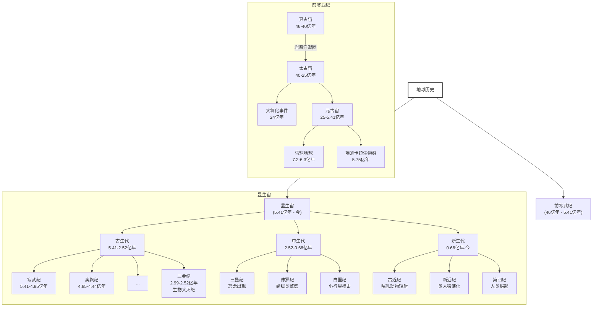

# 🌍 ‌**地质年代表（2025年更新版）**‌

## 🔬 ‌**前寒武纪（Precambrian）**‌

‌**时间跨度**‌：地球形成（约46亿年前）至5.41亿年前
‌**占地球历史的80%以上**‌

| ‌**宙（Eon）**‌ | ‌**代（Era）**‌ | ‌**时间范围（亿年前）**‌ | ‌**标志性事件**‌                                |
| ------------- | ------------- | ---------------------- | --------------------------------------------- |
| 冥古宙        | -             | 46–40                  | 地球形成、岩浆洋凝固、原始大气形成            |
| 太古宙        | 始太古代      | 40–36                  | 最早海洋出现、原始生命（叠层石蓝菌）          |
|               | 古太古代      | 36–32                  | 大陆地壳初步形成                              |
|               | 中太古代      | 32–28                  | 光合作用起源（产氧菌）                        |
|               | 新太古代      | 28–25                  | 大氧化事件前期（条带状铁构造沉积）            |
| 元古宙        | 古元古代      | 25–16                  | 大氧化事件（24亿年前）、真核生物出现          |
|               | 中元古代      | 16–10                  | 罗迪尼亚超大陆形成、多细胞藻类演化            |
|               | 新元古代      | 10–5.41                | 雪球地球事件（7.2–6.3亿年前）、埃迪卡拉生物群 |

------

## 🦕 ‌**显生宙（Phanerozoic Eon）**‌

‌**时间跨度**‌：5.41亿年前至今
‌**生物多样性爆发与现代生态系统形成**‌

### 🌿 ‌**古生代（Paleozoic Era）**‌

‌**时间范围**‌：5.41–2.52亿年前
‌**关键词**‌：寒武纪生命大爆发、鱼类→两栖类→爬行类演化

| ‌**纪（Period）**‌ | ‌**时间范围（百万年）**‌ | ‌**标志性事件**‌                           |
| ---------------- | ---------------------- | ---------------------------------------- |
| 寒武纪           | 541–485                | 三叶虫繁盛、澄江生物群（动物门类爆发）   |
| 奥陶纪           | 485–444                | 笔石与头足类繁盛、脊椎动物（甲胄鱼）出现 |
| 志留纪           | 444–419                | 陆生植物登陆（库克逊蕨）、颌的演化       |
| 泥盆纪           | 419–359                | 鱼类时代（盾皮鱼）、森林出现（晚泥盆世） |
| 石炭纪           | 359–299                | 巨型昆虫、煤炭森林（石松和木贼）         |
| 二叠纪           | 299–252                | 合弓纲崛起、P-T大灭绝（96%物种消失）     |

------

### 🦖 ‌**中生代（Mesozoic Era）**‌

‌**时间范围**‌：2.52–0.66亿年前
‌**关键词**‌：恐龙统治、被子植物与哺乳类起源

| ‌**纪（Period）**‌ | ‌**时间范围（百万年）**‌ | ‌**标志性事件**‌                       |
| ---------------- | ---------------------- | ------------------------------------ |
| 三叠纪           | 252–201                | 恐龙出现、盘古大陆形成               |
| 侏罗纪           | 201–145                | 蜥脚类恐龙巅峰（梁龙）、始祖鸟演化   |
| 白垩纪           | 145–66                 | 被子植物扩散、K-Pg灭绝（小行星撞击） |

------

### 🐒 ‌**新生代（Cenozoic Era）**‌

‌**时间范围**‌：6600万年前至今
‌**关键词**‌：哺乳动物与人类崛起、冰期-间冰期旋回

| ‌**纪（Period）**‌ | ‌**世（Epoch）**‌ | ‌**时间范围（百万年）**‌ | ‌**标志性事件**‌                   |
| ---------------- | --------------- | ---------------------- | -------------------------------- |
| 古近纪           | 古新世          | 66–56                  | 哺乳动物辐射（原始灵长类出现）   |
|                  | 始新世          | 56–34                  | 热带气候、早期鲸类（巴基鲸）演化 |
|                  | 渐新世          | 34–23                  | 全球变冷、草原生态系统形成       |
| 新近纪           | 中新世          | 23–5.3                 | 类人猿分化（普罗猿）、C4植物扩张 |
|                  | 上新世          | 5.3–2.58               | 人科（南方古猿）出现             |
| 第四纪           | 更新世          | 2.58–0.0117            | 冰河时期、智人演化与扩散         |
|                  | 全新世          | 0.0117–至今            | 农业文明、工业革命→人类世争议    |

------

## 📌 ‌**补充说明**‌

1. ‌**时间精度**‌：地质年代边界基于放射性同位素测年（如铀-铅法）和全球地层剖面（GSSP）确定。
2. ‌**人类世（Anthropocene）**‌：尚未正式批准，但2024年ICS提议以1950年（核爆层/塑料沉积）为起点。

## 晚更世与全新世详解

### 🌍 ‌**时间范围与地质地位**‌

- ‌**晚更新世（Late Pleistocene）**‌
  - ‌**时间**‌：约12.6万年前至1.17万年前（以末次冰期结束为界）
  - ‌**地位**‌：第四纪更新世的最后一个阶段，紧接全新世。
- ‌**全新世（Holocene）**‌
  - ‌**时间**‌：约1.17万年前至今
  - ‌**地位**‌：第四纪的第二个世，当前所处的地质时期。

------

### ❄️ ‌**晚更新世：冰期的最后篇章**‌

1. ‌**气候特征**‌
   - 多次冰期-间冰期旋回，末次冰盛期（约2.6万年前）全球平均气温比现在低5-10℃，海平面下降约120米。
   - 末期出现“新仙女木事件”（约1.3万年前），短暂气候回冷。
2. ‌**生物与人类**‌
   - ‌**巨型动物群**‌：猛犸象、剑齿虎、大地懒等广泛分布，末期发生大规模灭绝（可能与人类狩猎、气候变化相关）。
   - ‌**人类演化**‌：智人向全球扩散，石器技术（如细石器）和洞穴艺术（如拉斯科壁画）快速发展。

------

### 🌱 ‌**全新世：人类文明的摇篮**‌

1. ‌**气候与环境**‌
   - 气候温暖稳定（间冰期），海平面回升，形成现代地理格局。
   - 约8000年前进入“全新世气候最适宜期”，北半球温带扩张。
2. ‌**人类活动里程碑**‌
   - ‌**农业革命**‌：约1.2万年前开始动植物驯化（西亚小麦、中国水稻）。
   - ‌**文明兴起**‌：城市、文字、金属工具相继出现（如两河流域、古埃及）。
   - ‌**工业革命后**‌：人类活动显著影响地球系统（部分学者认为已进入“人类世”）。

------

### 🔍 ‌**地层标志与争议**‌

- ‌**更新世-全新世界限**‌：以格陵兰冰芯中 Younger Dryas 冷事件结束（约11700年前）为标志。
- ‌**人类世争议**‌：部分学者提议将1950年（核试验、塑料污染）作为人类世起点，尚未被国际地层委员会正式批准。

------

### 📊 对比总结

| ‌**特征**‌     | 晚更新世               | 全新世                 |
| ------------ | ---------------------- | ---------------------- |
| ‌**气候**‌     | 冰期主导，剧烈波动     | 温暖稳定，间冰期       |
| ‌**海平面**‌   | 比现在低约120米        | 接近现代水平           |
| ‌**生物群**‌   | 巨型动物群繁盛→大灭绝  | 现代生态系统形成       |
| ‌**人类角色**‌ | 狩猎采集，初步技术革新 | 农业文明→工业化→全球化 |

