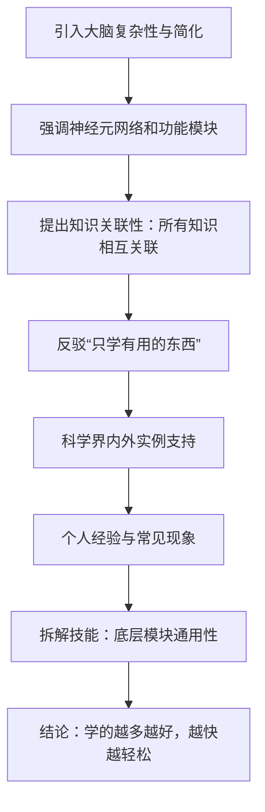

### Mermaid 流程图代码

### 流程图说明

以下是对每个节点的详细解释，反映作者的推理步骤：

1. **A: 引入大脑复杂性与简化**
   - 作者从大脑皮层的复杂结构入手，指出其基本构成是神经元及其连接。
   - 同时澄清误解，否定“人脑只使用10%”的说法，为后续论证奠定基础。

2. **B: 强调神经元网络和功能模块**
   - 说明大脑活动依赖于神经元形成的功能模块，以及模块间构成的网络来完成复杂任务。
   - 用“6度空间理论”类比，强调神经元间的间接联系。

3. **C: 提出知识关联性：所有知识相互关联**
   - 核心观点：大脑中没有孤立的知识，所有信息相互连接。
   - 由此提出“学什么都有用”的主张。

4. **D: 反驳“只学有用的东西”**
   - 针对普遍观点“只学有用的”，作者用事实和数据反驳。
   - 举例：爱因斯坦等多才多艺的科学家证明广泛学习与成功相关。

5. **E: 科学界内外实例支持**
   - 通过托马斯·索维尔和生理学教授的例子，展示跨领域学习的益处。
   - 强调网络效应：学的越多，已有知识越有用。

6. **F: 个人经验与常见现象**
   - 作者以《托福核心词汇21天突破》的成功为例，说明知识网络如何助力。
   - 观察英语系学生的多才多艺，否定“天分”或“努力”的单一解释，引入大脑可塑性。

7. **G: 拆解技能：底层模块通用性**
   - 任何技能可分解为功能模块，这些模块在不同技能间通用。
   - 用素描和折纸为例，揭示知识间的共通性。

8. **H: 结论：学的越多越好，越快越轻松**
   - 总结：学习无止境且有益，已有知识增强新学习效率。
   - 对比过早专业化的劣势，倡导广泛学习，避免偏科。

### 设计思路
- **线性流程**：图表采用从上到下的流程（`graph TD`），反映作者逐步递进的推理。
- **简洁节点**：每个节点概括一个关键步骤，便于理解整体逻辑。
- **无需分支**：虽然作者提供了多重支持证据（如例子、观察），但这些都服务于主线论证，因此保持单线流程，避免复杂化。

这份流程图完整呈现了作者从大脑结构到知识关联，再到实例验证和最终结论的推理过程，符合用户要求以 Mermaid 格式生成图标的需求。