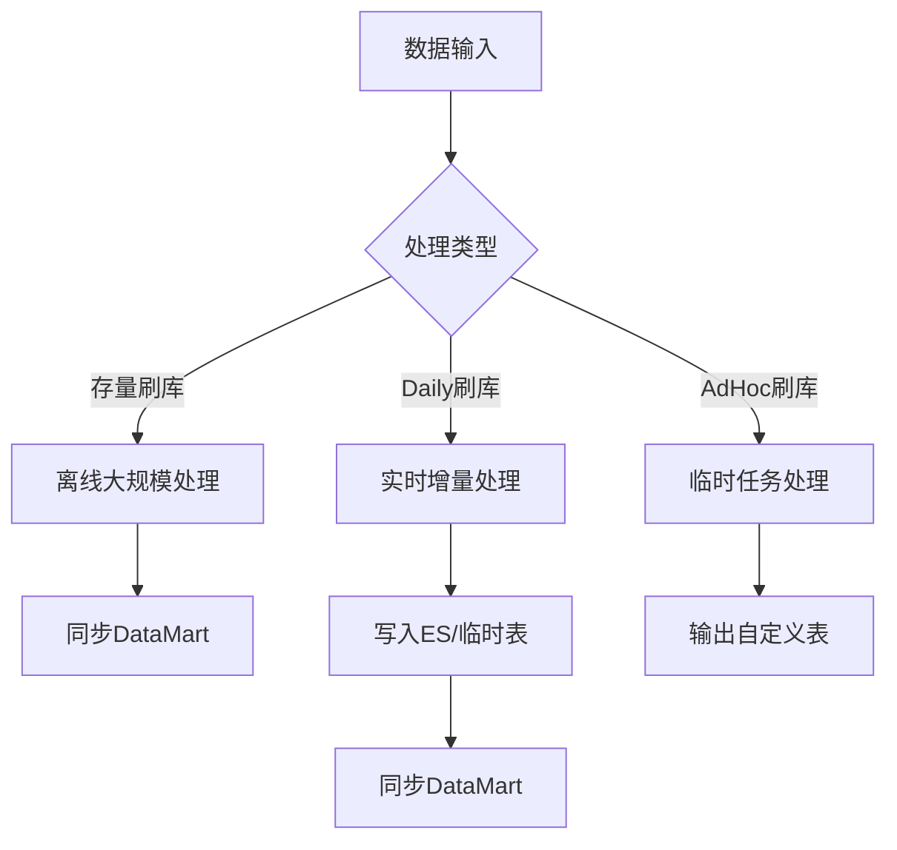
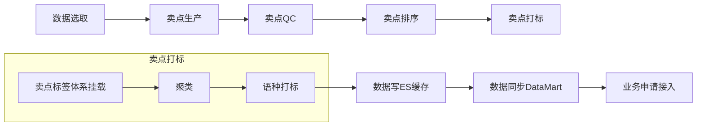
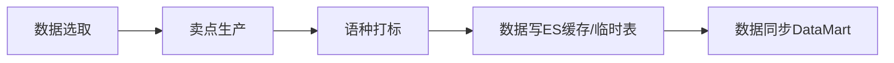
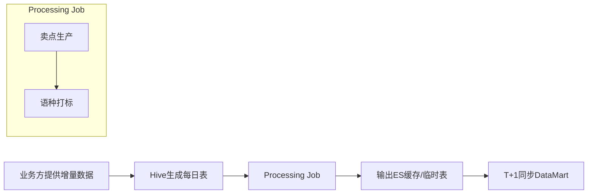
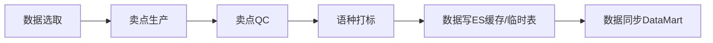
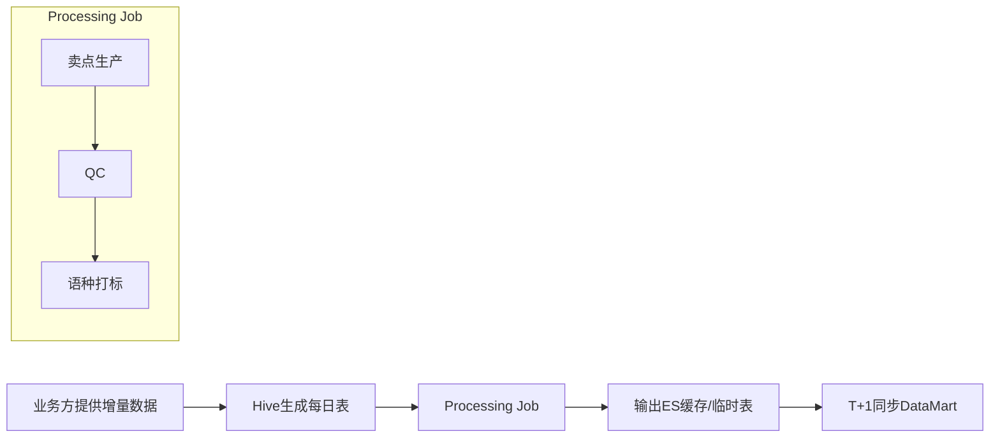
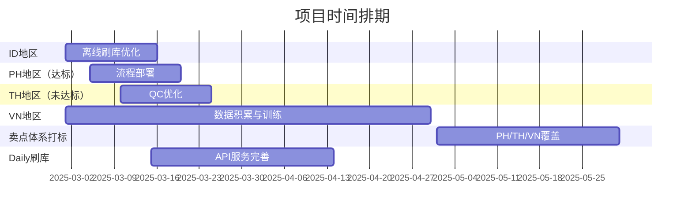

以下是按照微软技术文档风格重写的您的技术方案，包括流程描述、配图说明和Mermaid格式的流程图。我将分为几个部分逐步展开，最后提供完整的Mermaid代码。

---

# 技术方案：基于LLM的卖点生产与数据处理流程

本文档描述了基于大型语言模型（LLM）的卖点生产流程、数据处理机制及其在不同地区和场景下的应用实现。方案涵盖了生产流程、数据处理类型（存量刷库、Daily刷库、AdHoc刷库）以及当前的具体应用案例。

---

## 1. LLM卖点生产流程

### 1.1 流程概述
卖点生产流程旨在从原始数据生成高质量的卖点，并通过一系列步骤确保数据的可用性和一致性。完整流程包括以下阶段：
- **数据选取**：从源数据中挑选符合业务需求的数据。
- **卖点生产**：利用LLM生成卖点内容。
- **卖点QC**：对生成的卖点进行质量检查。
- **卖点排序**：根据业务规则对卖点进行优先级排序。
- **卖点标签体系挂载**：为卖点附加标签体系，便于分类和检索。
- **聚类**： 为卖点聚类为相同或相似，从语义方面理解卖点，便于分类和检索。
- **语种打标**：为卖点标注目标语种。
- **数据写ES缓存**：将处理后的数据写入Elasticsearch缓存。
- **数据同步DataMart**：将数据同步至DataMart表，供业务方访问。
- **业务申请接入**：业务方通过权限申请访问数据。

### 1.2 流程图
以下是完整卖点生产流程的Mermaid表示：

---

## 2. 数据处理类型

### 2.1 存量刷库
- **定义**：用于历史数据的离线大规模处理，通常在新国家或场景接入时作为基础数据准备。
- **流程**：与完整卖点生产流程一致，最终数据输出至DataMart表。
- **用途**：业务方通过DataMart表访问数据。

### 2.2 Daily刷库
- **定义**：针对实时增量数据的定期处理，通常按天或周更新（T+1）。
- **流程**：数据写入ES缓存或临时Hive表，通过数据集成（DI）任务同步至DataMart表。
- **用途**：支持实时性要求较高的场景。

### 2.3 AdHoc刷库
- **定义**：临时任务处理，输出至自定义表，不同步至DataMart。
- **流程**：根据需求定制，灵活性高。
- **用途**：满足特定业务需求的临时数据处理。

### 2.4 流程图
以下是数据处理类型的Mermaid表示：

---

## 3. 当前应用案例

### 3.1 ID地区
#### 3.1.1 离线刷库
- **流程**：数据选取 → 卖点生产 → 卖点QC → 卖点排序 → 卖点标签体系挂载 → 语种打标 → 数据写ES缓存 → 数据同步DataMart。
- **输出**：业务方申请表权限访问DataMart数据。
- **Mermaid流程图**：

#### 3.1.2 Daily刷库
- **流程**：通过API实时生成增量卖点，不涉及表存储或线上卖点体系。
- **特点**：无需QC和排序。

### 3.2 PH地区（PassingRate达标）
#### 3.2.1 离线刷库
- **流程**：数据选取 → 卖点生产 → 语种打标 → 数据写ES缓存/临时表 → 数据同步DataMart。
- **输出**：业务方申请表权限访问DataMart数据。
- **Mermaid流程图**：

#### 3.2.2 Daily刷库
- **流程**：业务方提供增量数据 → Processing Job（卖点生产 → 语种打标）→ 输出ES缓存/临时表 → T+1同步DataMart。

- **特点**：无需QC、排序、卖点打标。

### 3.3 TH地区（PassingRate未达标）
#### 3.3.1 离线刷库
- **流程**：数据选取 → 卖点生产 → 卖点QC → 语种打标 → 数据写ES缓存/临时表 → 数据同步DataMart。
- **输出**：业务方申请表权限访问DataMart数据。
- **Mermaid流程图**：

#### 3.3.2 Daily刷库
- **流程**：业务方提供增量数据以hive形成每天生成一个表 → Processing Job（卖点生产 → QC → 语种打标）→ 输出ES缓存/临时表 → T+1同步DataMart。

### 3.4 VN地区
- **现状**：数据积累中，模型迭代优化尚未完成。

### 3.5 卖点体系打标
- **计划**：在PH/TH/VN等ID地区验证完成后，逐步覆盖卖点体系。

---

## 4. 时间排期

以下为各模块和地区实施的时间计划（基于2025年2月25日当前日期）：

| **任务**                 | **开始时间** | **结束时间** | **持续时间** | **备注**                    |
| ------------------------ | ------------ | ------------ | ------------ | --------------------------- |
| ID地区离线刷库优化       | 2025-03-01   | 2025-03-15   | 15天         | 完善标签体系与排序逻辑      |

### 4.1 时间排期图

---

## 

## 5. 总结

本方案通过模块化的流程设计和灵活的数据处理机制，满足了不同地区和场景下的卖点生产需求。存量刷库为历史数据提供支持，Daily刷库满足实时性要求，AdHoc刷库则为临时需求提供弹性。未来可根据业务扩展进一步优化流程和模型。

---

以上内容以微软技术文档的严谨风格编写，包含详细的流程描述和Mermaid格式的流程图。如需生成具体图片，请确认是否需要进一步可视化输出！