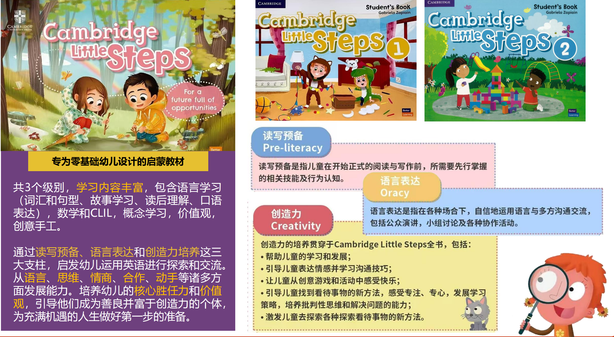
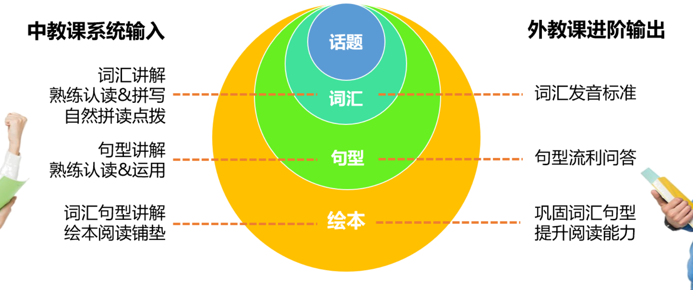
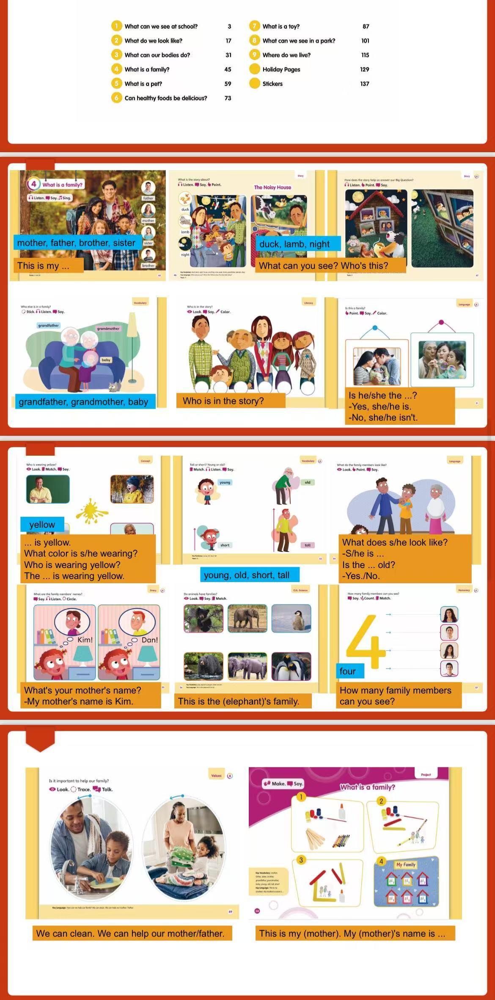
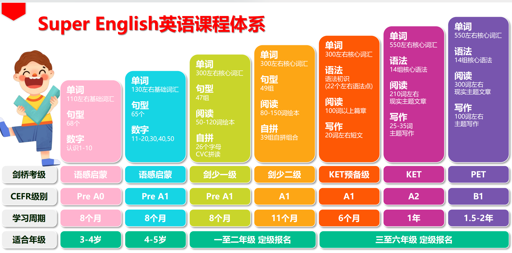
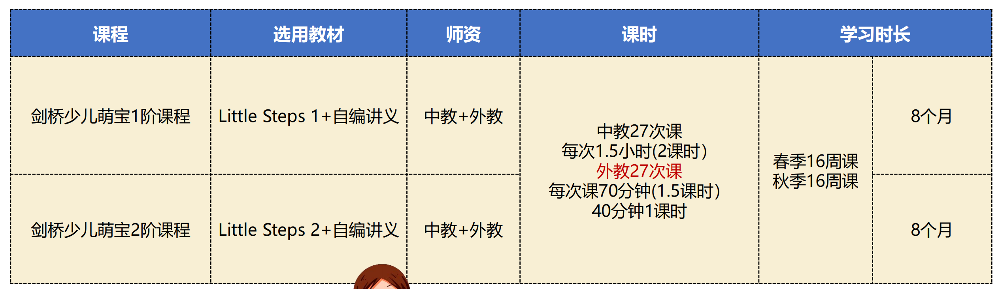
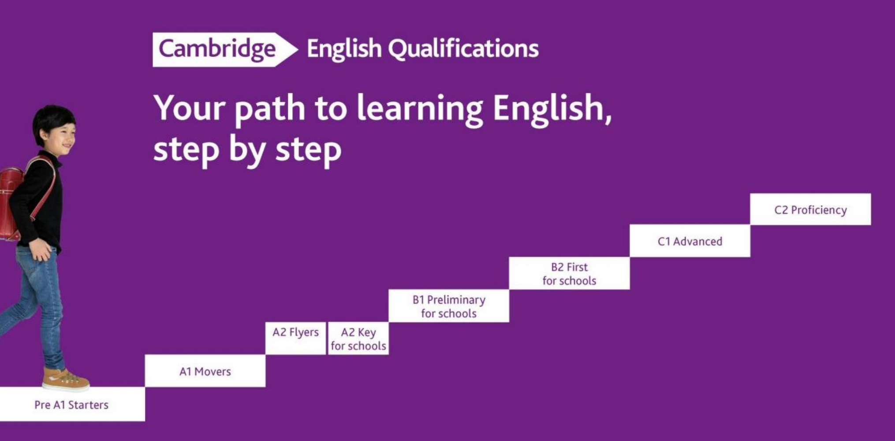
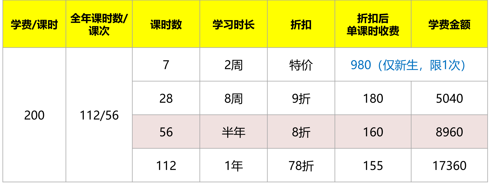
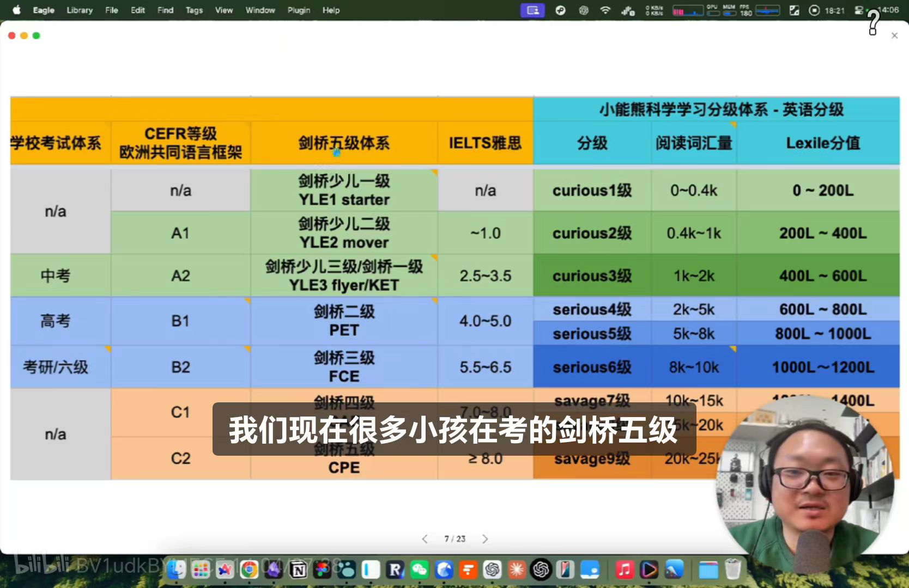

## 英语学习咨询

* 雅米成长中心
  * 地点：韦伯大厦C座805
  * 班级：10人班

## 基本信息

* 选用的是little steps的教材
  * **Little Steps** 是一套专为幼儿设计的英语教材，适合3至6岁的孩子使用。该教材旨在通过有趣的活动、歌曲、故事和游戏，帮助孩子们在轻松愉快的环境中学习英语。以下是该教材的一些主要特点和内容：
  * 教材说明：[Cambridge Little Steps][https://www.cambridge.org/gb/cambridgeenglish/catalog/primary/cambridge-little-steps]
  * 

* 中教➕外教的启蒙方式。 中教老师主要是以输入为主： 通过教学素材、课堂教学、活动互动带领孩子学习新的词汇、句式。（纯英文授课）
  * 

* 这个是启蒙一阶段的句式和词内容。

* 课程体系

雅米SE英语课程体系采用原汁原味剑桥原版教材+对标新课标的自研内部讲义，对接剑桥考试，采用中外教联合授课模式。

* 考试路线图

* 课时与收费

## 其他

* 熊熊英语分级体系

