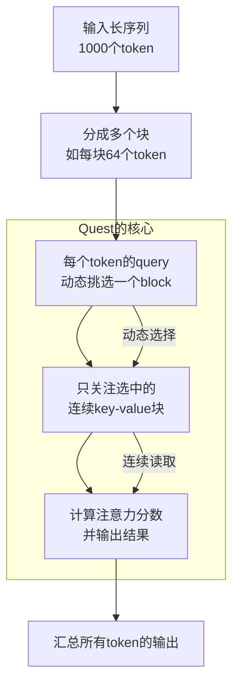
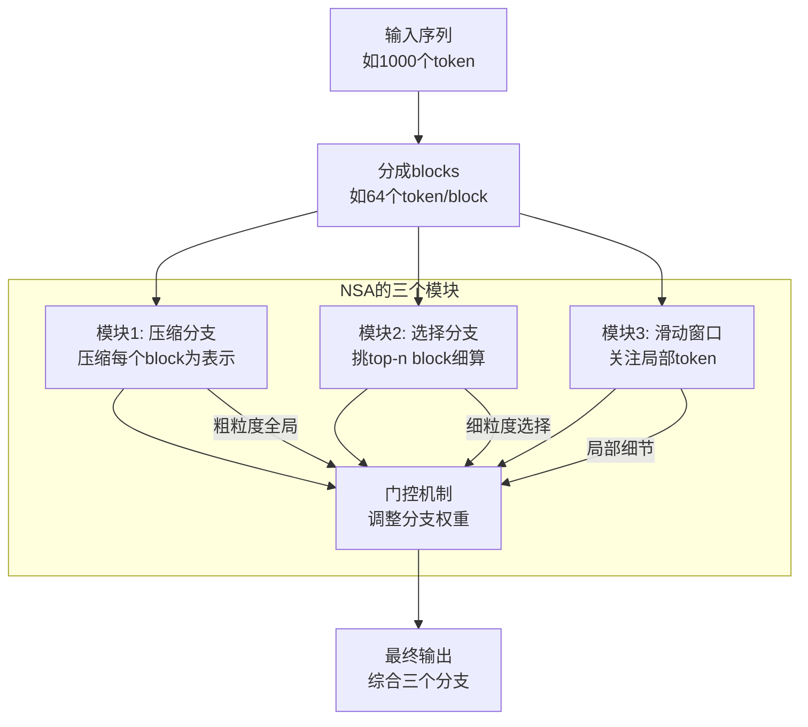

# DSA

### 使用费曼学习法介绍 Quest

好的，我会用**费曼学习法**来介绍 **Quest**，也就是通过简单易懂的方式解释这个复杂概念，像是给一个对技术不太熟悉的朋友讲解。同时，我会在最后提供一个 **Mermaid 图形** 来直观展示 Quest 的工作原理。

---

#### Quest 是什么？
Quest 是由 MIT 的韩松（Han Song）实验室在 2024 年 SML 会议上提出的一种**稀疏注意力机制**（Sparse Attention Mechanism）。简单来说，它是帮 AI 模型（比如语言模型）在处理长文本时节省力气的一种方法。传统上，AI 模型会“看”文本里的每个词，然后决定哪些词重要，但这很费时间和计算资源。Quest 就像一个聪明的小助手，只让模型关注“连续的一块”重要内容，而不是零散地到处看。

---

#### Quest 怎么工作？（用生活化的比喻）
想象你在图书馆找一本书的答案，书很厚，有 1000 页。传统方法是把每页都翻一遍，太累了。Quest 就像你请了个助手，他告诉你：“别全看，你的问题答案大概在前 200 到 250 页这一块，重点读这里就行了。” 这块连续的区域叫 **block**（块），Quest 会动态决定每个词（在 AI 里叫 token）需要关注哪一块，而不是固定的模式。

**关键点：**
1. **动态选择**：每个词（token）自己决定要看哪块内容。比如第一个词可能看第 100 到 150 页，第二个词可能看第 300 到 350 页。
2. **连续读取**：它挑的是一整块连续的内容，而不是跳来跳去（比如第 10 页、第 50 页这种），因为电脑喜欢连续读东西，速度更快。
3. **硬件友好**：连续读取节省了电脑的“力气”（内存访问开销），让它跑得更顺畅。

---

#### 为什么 Quest 很重要？
传统的注意力机制（比如 Transformer 里的 self-attention）会让每个词都跟其他所有词“打招呼”，计算量是平方级别（比如 1000 个词要算 100 万次交互）。这对长文本来说太慢了。Quest 通过“只看一块”的方式，把计算量降下来，还能跟硬件配合得更好，适合用来训练大模型或加速推理。

比喻一下：传统方法像你在派对上跟每个人都聊一遍天，Quest 是你只挑一个感兴趣的小组聊，效率高多了。

---

#### Quest 的核心步骤（简单版）
1. 把长文本分成很多小块（blocks），比如每块 64 个词。
2. 每个词（token）的“问题”（query）去挑一个它想看的块（key 和 value 的连续区域）。
3. 只算这块的内容，其他忽略。
4. 把结果汇总，输出给模型用。

---

#### Quest 的优缺点
**优点**：
- 快：因为只关注一块，计算量少。
- 硬件友好：连续读取让 GPU 很开心。
- 灵活：每个 token 动态挑块，比固定模式（静态稀疏注意力）聪明。

**缺点**：
- 不够灵活：挑的块是固定的连续区域，可能会漏掉分散但重要的信息。
- 兼容性差：跟一些现代机制（比如 GQA，分组查询注意力）不好配合，因为它要求每个注意力头挑自己的块，而 GQA 喜欢共享。

---

#### 用一个例子总结
假设你在读一本 1000 页的侦探小说，想知道“谁是凶手”。传统方法是读完全书，Quest 是你猜“答案在第 300 到 350 页”，然后只读这一块。如果猜对了，你省了 90% 的时间；如果错了，可能漏了关键线索。Quest 就是这么个“聪明但有点冒险”的方法。

---

### Mermaid 图形展示 Quest 工作原理
下面是用 Mermaid 语法画的 Quest 工作流程图，展示了它如何动态选择块并计算注意力：

**解释**：
- **A 到 B**：把长文本切成小块（blocks）。
- **B 到 C**：每个 token 的 query（查询）决定看哪个块。
- **C 到 D**：只从选中的连续块里拿 key 和 value。
- **D 到 E**：算出注意力分数，输出结果。
- **E 到 F**：把所有 token 的结果合起来。

---

#### 总结
Quest 是一个“挑一块看”的注意力机制，聪明、快速、硬件友好，像个会帮你找重点的助手。它是动态稀疏注意力的代表，适合长文本任务，但也有局限性，比如不够灵活和兼容性问题。希望这个解释让你觉得 Quest 简单又有趣！如果还有疑问，我可以再细讲哦！

## 三大模块

是的，你提到的“压缩（Compression）”、“选择（Selection）”和“siling”（应为“Sliding Window”的笔误，意为“滑动窗口”）确实是文档中描述的 **DeepSeek 的 Native Sparse Attention (NSA)** 架构中的三个核心模块。这三个模块在文章中明确出现在对 NSA 的架构讲解部分（发言人 1，从 21:44 开始），具体对应其三个分支（branches）。我将使用 **费曼学习法** 以简单易懂的方式介绍这三个模块，并附上 **Mermaid 图** 直观展示它们的结构和工作原理。

---

### 用费曼学习法介绍 DSA（Native Sparse Attention）的三个模块

#### **背景：NSA 是什么？**
Native Sparse Attention (NSA) 是 DeepSeek 提出的一种动态稀疏注意力机制，旨在解决传统全注意力（Full Attention）在长文本上的高计算开销问题。它通过只关注部分关键信息，既提高效率又保持性能。文章中提到，NSA 有三个分支，分别对应“压缩”、“选择”和“滑动窗口”，就像一个团队分工处理信息。

**比喻**：想象你在读一本厚书，NSA 像一个聪明助手，分三步帮你找重点：先快速扫全书（压缩）、再挑几页细读（选择）、最后看看身边几页（滑动窗口）。下面逐一解释这三个模块。

---

#### **模块 1：压缩（Compression Branch）**
- **是什么**：这个模块把大块数据“压缩”成简洁的代表，快速抓住全局要点。就像把一章书缩成一句话摘要。
- **怎么工作**：把输入序列分成多个 block（比如每 64 个 token 一块），然后对每个 block 的 key 和 value 进行压缩，生成一个代表性的向量（representation）。每个 token 的 query 跟这些压缩后的表示算注意力分数，粗略了解全局信息。
- **为什么重要**：它让模型快速扫描所有 block，不用细看每个 token，减少计算量。而且压缩后的表示参与训练，能反向传播梯度，帮助模型学会哪些 block 重要（01:06:21-01:07:22）。
- **生活比喻**：你在书店翻书，先看每章的标题和大意，不用读全文就知道大概讲什么。
- **文档例子**：NSA 把 key 和 value block 压缩成表示（22:51），粗粒度（coarse-grained）关注全局。

---

#### **模块 2：选择（Selection Branch）**
- **是什么**：这个模块从压缩结果中挑出最重要的几块，细致处理。就像从书里挑出几页重点读。
- **怎么工作**：基于压缩分支的注意力分数，选出 top-n 个 block（比如 n=2，选两个得分最高的 block，25:10）。然后用 query 对这些 block 里的所有 token 再算一次细粒度的注意力，得到更精确的输出。
- **为什么重要**：它聚焦关键信息，避免全看（不像 Full Attention 的平方复杂度），效率高还能抓住细节。NSA 通过 GQA（Grouped Query Attention）优化，确保同一组注意力头共享选择，减少内存读取浪费（35:11-36:16）。
- **生活比喻**：你从标题挑出两章觉得最有用，仔细读里面的每句话。
- **文档例子**：NSA 选第二个和第四个 block 做细粒度注意力（25:44），提升精度。

---

#### **模块 3：滑动窗口（Sliding Window Branch）**
- **是什么**：这个模块关注 token 附近的局部信息，像一个“滑动窗口”只看前后几页。
- **怎么工作**：每个 token 只关注它周围固定范围内的 token（比如前后几百个 token），直接计算这些局部 token 的注意力分数。文章提到这是利用语言模型的“归纳偏置”（inductive bias），因为局部信息往往更重要（26:10）。
- **为什么重要**：局部信息通常对语言理解关键（比如语法、上下文），滑动窗口补全了压缩和选择可能漏掉的细节，简单高效。
- **生活比喻**：你读到某页时，翻前后几页看看上下文，补充细节。
- **文档例子**：NSA 的滑动窗口分支默认关注局部 token（26:10），利用 attention sink 现象提升效果。

---

#### **三个模块怎么协同？**
- **压缩**：快速扫全局，粗略找重点（像书的目录）。
- **选择**：挑出关键块深入分析（像读重点章节）。
- **滑动窗口**：补上局部细节（像查上下文）。
- **门控机制**：每个分支输出后，通过模型自己学的“门控”（gating，24:01）决定三者贡献多少，灵活平衡全局和局部信息（27:47-28:43）。

**比喻总结**：就像你在考试复习，压缩是大纲速览，选择是重点突破，滑动窗口是查笔记细节，三者配合让你高效又全面。

---

### Mermaid 图展示 NSA 三个模块
以下是用 Mermaid 语法绘制的 NSA 三个模块流程图：

**图解**：
- **A 到 B**：输入长序列被切成 block。
- **B 到 C/D/E**：分给三个模块处理。
- **C：压缩**：每个 block 压缩为表示，粗略扫描。
- **D：选择**：挑 top-n block 细算。
- **E：滑动窗口**：关注局部范围。
- **F：门控**：融合三者输出，灵活调整。
- **G：输出**：综合结果。

---

### 总结
NSA 的三个模块——**压缩、选择、滑动窗口**——分工明确：
1. **压缩** 提供全局概览，高效筛选。
2. **选择** 聚焦关键块，精准处理。
3. **滑动窗口** 补全局部细节，简单实用。

通过门控机制协同工作，NSA 不仅比传统 Full Attention 快（从 O(n²) 降到接近线性），还能在性能上超越（01:03:45），是硬件友好和高效训练的典范。如果你想深入某个模块的细节（比如数学公式或代码实现），告诉我，我可以再展开！