以下是将每个子图拆分为独立的 Mermaid 格式内容，每个子图使用单独的 `graph TD` 语法表示。我将按照之前的结构，分别为“开场与背景介绍”、“心理适应”、“习惯培养”、“同伴交往”、“家长行动建议”和“教育理念与总结”创建独立的图表。

---

### 1. 开场与背景介绍
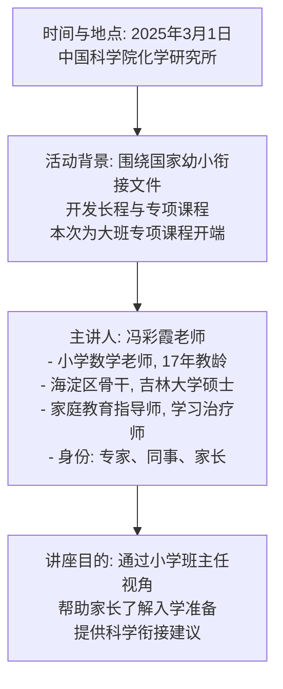

---

### 2. 心理适应
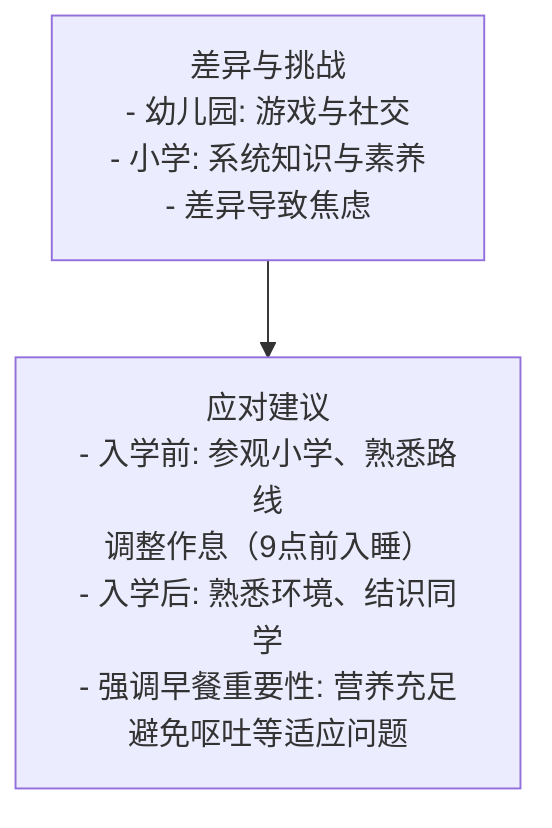

```
心理适应要做的事情
├── 1. 入学前准备
│   ├── 目标: 减少陌生感，提前适应小学环境和生活节奏
│   ├── 1.1 参观小学
│   │   ├── 内容: 利用开放日带孩子参观校园
│   │   └── 目的: 了解上课方式，熟悉环境
│   ├── 1.2 熟悉上学路线
│   │   ├── 内容: 放学时带孩子走上学路线
│   │   └── 目的: 熟悉地理位置，入学后感觉是舒适区
│   ├── 1.3 调整作息时间
│   │   ├── 内容: 8月初开始，9点前入睡，早上早起
│   │   └── 目的: 适应小学节奏，确保精神和健康
│   └── 1.4 重视早餐
│       ├── 内容: 提前一个月调整，确保吃饱吃好
│       └── 目的: 提供能量，避免不适，支撑学习
└── 2. 入学后适应
    ├── 目标: 消除陌生感和压力，建立归属感
    ├── 2.1 熟悉校园环境
    │   ├── 内容: 老师和家长带孩子熟悉校园设施
    │   └── 目的: 消除陌生感，提升自理能力
    ├── 2.2 结识新同学
    │   ├── 内容: 询问朋友名字，打印名单一起念
    │   └── 目的: 建立友谊，减少孤单感
    └── 2.3 参与入学前培训
        ├── 内容: 参加学校培训（如两个半天）
        └── 目的: 适应生活节奏，提升信心
```

---

### Mermaid 格式（流程图）
以下是将上述内容转化为 Mermaid 格式的流程图，清晰展示层级关系：

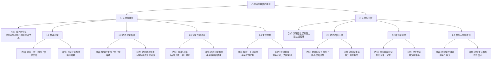


---

### 3. 习惯培养
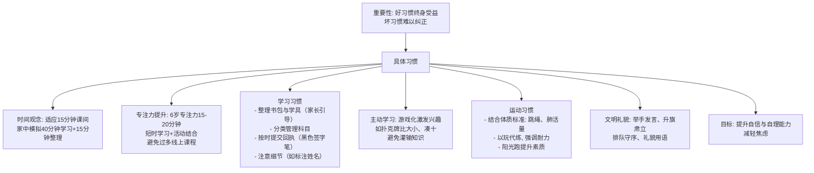

---

### 结构化输出（文本形式）
```
习惯培养要做的事情
├── 1. 时间观念
│   ├── 目标: 适应小学课间和大课间节奏，提升时间管理能力
│   ├── 1.1 适应15分钟课间
│   │   ├── 内容: 家中模拟40分钟学习+15分钟整理，计时练习
│   │   └── 目的: 理解15分钟用途，适应课间节奏
│   └── 1.2 参与大课间活动
│       ├── 内容: 鼓励参与阳光跑等活动
│       └── 目的: 增强时间观念，提升身体素质
├── 2. 专注力提升
│   ├── 目标: 提升6岁儿童15-20分钟专注力，避免焦虑
│   ├── 2.1 短时学习结合活动
│   │   ├── 内容: 15分钟学习+5分钟活动，循环进行
│   │   └── 目的: 符合专注规律，保持兴趣
│   └── 2.2 减少线上课程
│       ├── 内容: 避免过多网课，减少短暂刺激
│       └── 目的: 防止专注力缩短，确保课堂专注
├── 3. 学习习惯
│   ├── 目标: 培养自理和条理性，提升学习效率和自信
│   ├── 3.1 整理书包与学具
│   │   ├── 内容: 按课表引导孩子整理，带齐学具
│   │   └── 目的: 培养独立性，避免遗漏
│   ├── 3.2 分类管理科目
│   │   ├── 内容: 用网格或标签区分科目物品
│   │   └── 目的: 便于查找，提升条理性
│   ├── 3.3 按时提交回执
│   │   ├── 内容: 检查通知，用黑色签字笔签名提交
│   │   └── 目的: 养成责任感，避免干扰教学
│   └── 3.4 注意细节
│       ├── 内容: 标注姓名，督促找回丢失物品
│       └── 目的: 减少丢三落四，培养细心
├── 4. 主动学习
│   ├── 目标: 通过游戏激发兴趣，保持好奇心
│   ├── 4.1 游戏化学习
│   │   ├── 内容: 用扑克牌凑十、比大小，或图文材料
│   │   └── 目的: 在玩中学，建立兴趣
│   └── 4.2 正向激励
│       ├── 内容: 用印章、贴画奖励，建立成长手册
│       └── 目的: 增强自信，变被动为主动
├── 5. 运动习惯
│   ├── 目标: 提升身体素质和耐力，支持学习
│   ├── 5.1 结合体质标准练习
│   │   ├── 内容: 吹气球、跳绳、跑步等玩中学
│   │   └── 目的: 提升体质，增强耐力
│   ├── 5.2 坚持阳光跑
│   │   ├── 内容: 鼓励参与学校阳光跑
│   │   └── 目的: 增加阳光接触，改善近视
│   └── 5.3 家庭运动
│       ├── 内容: 爬山、乒乓球、拉伸等亲子活动
│       └── 目的: 增进关系，锻炼眼球和耐力
├── 6. 文明礼貌
│   ├── 目标: 培养规则意识和社交能力，赢得认可
│   ├── 6.1 举手发言
│   │   ├── 内容: 训练孩子举手表达
│   │   └── 目的: 维护秩序，培养规则感
│   ├── 6.2 升旗肃立
│   │   ├── 内容: 遇升旗停下肃立，灌输国家意识
│   │   └── 目的: 树立榜样，提升格局
│   ├── 6.3 排队守序
│   │   ├── 内容: 在家练习排队礼让
│   │   └── 目的: 增强集体意识，减少冲突
│   └── 6.4 礼貌用语
│       ├── 内容: 教“请”“谢谢”，轻声交流
│       └── 目的: 增加好感，提升社交能力
└── 7. 总体目标
    ├── 内容: 通过习惯培养提升自信、自理能力和适应力
    └── 目的: 减轻入学焦虑，奠定小学基础
```

---

### Mermaid 格式（流程图）
以下是将上述内容转化为 Mermaid 格式的流程图，展示层级关系：

```mermaid
graph TD
    A[习惯培养要做的事情] --> B[1. 时间观念]
    A --> C[2. 专注力提升]
    A --> D[3. 学习习惯]
    A --> E[4. 主动学习]
    A --> F[5. 运动习惯]
    A --> G[6. 文明礼貌]
    A --> H[7. 总体目标]

    %% 1. 时间观念
    B --> B0[目标: 适应课间和大课间节奏<br>提升时间管理能力]
    B --> B1[1.1 适应15分钟课间]
    B1 --> B1a[内容: 家中模拟40分钟学习+15分钟整理]
    B1 --> B1b[目的: 理解15分钟用途，适应节奏]
    B --> B2[1.2 参与大课间活动]
    B2 --> B2a[内容: 鼓励参与阳光跑]
    B2 --> B2b[目的: 增强时间观念，提升素质]

    %% 2. 专注力提升
    C --> C0[目标: 提升6岁儿童15-20分钟专注力<br>避免焦虑]
    C --> C1[2.1 短时学习结合活动]
    C1 --> C1a[内容: 15分钟学习+5分钟活动]
    C1 --> C1b[目的: 符合专注规律，保持兴趣]
    C --> C2[2.2 减少线上课程]
    C2 --> C2a[内容: 避免过多网课，减少刺激]
    C2 --> C2b[目的: 防止专注力缩短，确保课堂专注]

    %% 3. 学习习惯
    D --> D0[目标: 培养自理和条理性<br>提升效率和自信]
    D --> D1[3.1 整理书包与学具]
    D1 --> D1a[内容: 按课表引导孩子整理]
    D1 --> D1b[目的: 培养独立性，避免遗漏]
    D --> D2[3.2 分类管理科目]
    D2 --> D2a[内容: 用网格区分科目物品]
    D2 --> D2b[目的: 便于查找，提升条理性]
    D --> D3[3.3 按时提交回执]
    D3 --> D3a[内容: 检查通知，黑笔签名提交]
    D3 --> D3b[目的: 养成责任感，避免干扰]
    D --> D4[3.4 注意细节]
    D4 --> D4a[内容: 标注姓名，督促找回物品]
    D4 --> D4b[目的: 减少丢三落四，培养细心]

    %% 4. 主动学习
    E --> E0[目标: 通过游戏激发兴趣<br>保持好奇心]
    E --> E1[4.1 游戏化学习]
    E1 --> E1a[内容: 用扑克牌凑十、比大小]
    E1 --> E1b[目的: 在玩中学，建立兴趣]
    E --> E2[4.2 正向激励]
    E2 --> E2a[内容: 用印章奖励，建立成长手册]
    E2 --> E2b[目的: 增强自信，变被动为主动]

    %% 5. 运动习惯
    F --> F0[目标: 提升身体素质和耐力<br>支持学习]
    F --> F1[5.1 结合体质标准练习]
    F1 --> F1a[内容: 吹气球、跳绳、跑步]
    F1 --> F1b[目的: 提升体质，增强耐力]
    F --> F2[5.2 坚持阳光跑]
    F2 --> F2a[内容: 鼓励参与阳光跑]
    F2 --> F2b[目的: 增加阳光，改善近视]
    F --> F3[5.3 家庭运动]
    F3 --> F3a[内容: 爬山、乒乓球、拉伸]
    F3 --> F3b[目的: 增进关系，锻炼耐力]

    %% 6. 文明礼貌
    G --> G0[目标: 培养规则意识和社交能力<br>赢得认可]
    G --> G1[6.1 举手发言]
    G1 --> G1a[内容: 训练孩子举手表达]
    G1 --> G1b[目的: 维护秩序，培养规则感]
    G --> G2[6.2 升旗肃立]
    G2 --> G2a[内容: 遇升旗停下肃立]
    G2 --> G2b[目的: 树立榜样，提升格局]
    G --> G3[6.3 排队守序]
    G3 --> G3a[内容: 在家练习排队礼让]
    G3 --> G3b[目的: 增强集体意识，减少冲突]
    G --> G4[6.4 礼貌用语]
    G4 --> G4a[内容: 教“请”“谢谢”，轻声交流]
    G4 --> G4b[目的: 增加好感，提升社交]

    %% 7. 总体目标
    H --> H1[内容: 提升自信、自理能力和适应力]
    H --> H2[目的: 减轻入学焦虑，奠定基础]
```

---

### 4. 同伴交往
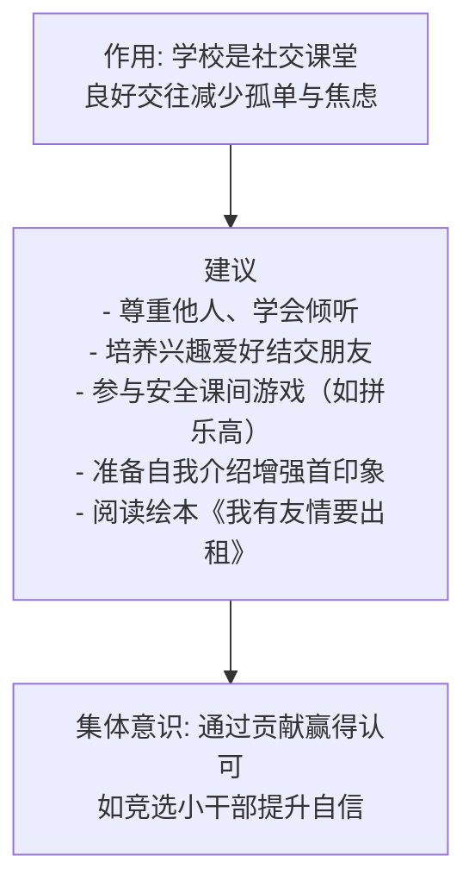

### 结构化输出（文本形式）
```
同伴交往要做的事情
├── 1. 总体目标
│   ├── 内容: 通过社交培养减少孤单感和焦虑，建立归属感
│   └── 目的: 将学校变为社交课堂，促进成长催化剂
├── 2. 具体建议
│   ├── 目标: 培养社交技能和集体意识，提升同伴关系
│   ├── 2.1 尊重他人，学会倾听
│   │   ├── 内容: 教孩子不打断他人，耐心倾听
│   │   └── 目的: 建立尊重基础，赢得好感
│   ├── 2.2 培养兴趣爱好
│   │   ├── 内容: 引导发展兴趣（如拼乐高、军事知识）
│   │   └── 目的: 增加共同话题，便于交友
│   ├── 2.3 参与安全课间游戏
│   │   ├── 内容: 鼓励参与合作游戏（如拼乐高大板）
│   │   └── 目的: 增进友谊，减少孤单感
│   ├── 2.4 准备自我介绍
│   │   ├── 内容: 开学前准备并练习自我介绍
│   │   └── 目的: 增强首次印象，提升自信
│   └── 2.5 阅读相关绘本
│       ├── 内容: 共读《我有友情要出租》，讨论友谊
│       └── 目的: 理解交往价值，建立关系意识
└── 3. 培养集体意识
    ├── 目标: 通过贡献和表现赢得认可，提升自信
    ├── 3.1 鼓励为集体做贡献
    │   ├── 内容: 支持参与班级活动（如竞选小干部）
    │   └── 目的: 增强归属感，获得认可
    └── 3.2 关注积极品质
        ├── 内容: 培养爱读书、爱劳动、集体意识，记录成就
        └── 目的: 提升自尊，为社交打基础
```

---

### Mermaid 格式（流程图）
以下是将上述内容转化为 Mermaid 格式的流程图，展示层级关系：

```mermaid
graph TD
    A[同伴交往要做的事情] --> B[1. 总体目标]
    A --> C[2. 具体建议]
    A --> D[3. 培养集体意识]

    %% 1. 总体目标
    B --> B1[内容: 通过社交培养减少孤单感和焦虑<br>建立归属感]
    B --> B2[目的: 将学校变为社交课堂<br>促进成长催化剂]

    %% 2. 具体建议
    C --> C0[目标: 培养社交技能和集体意识<br>提升同伴关系]
    C --> C1[2.1 尊重他人，学会倾听]
    C1 --> C1a[内容: 教孩子不打断他人，耐心倾听]
    C1 --> C1b[目的: 建立尊重基础，赢得好感]
    
    C --> C2[2.2 培养兴趣爱好]
    C2 --> C2a[内容: 引导发展兴趣<br>如拼乐高、军事知识]
    C2 --> C2b[目的: 增加共同话题，便于交友]
    
    C --> C3[2.3 参与安全课间游戏]
    C3 --> C3a[内容: 鼓励参与合作游戏<br>如拼乐高大板]
    C3 --> C3b[目的: 增进友谊，减少孤单感]
    
    C --> C4[2.4 准备自我介绍]
    C4 --> C4a[内容: 开学前准备并练习自我介绍]
    C4 --> C4b[目的: 增强首次印象，提升自信]
    
    C --> C5[2.5 阅读相关绘本]
    C5 --> C5a[内容: 共读《我有友情要出租》<br>讨论友谊]
    C5 --> C5b[目的: 理解交往价值，建立关系意识]

    %% 3. 培养集体意识
    D --> D0[目标: 通过贡献和表现赢得认可<br>提升自信]
    D --> D1[3.1 鼓励为集体做贡献]
    D1 --> D1a[内容: 支持参与班级活动<br>如竞选小干部]
    D1 --> D1b[目的: 增强归属感，获得认可]
    
    D --> D2[3.2 关注积极品质]
    D2 --> D2a[内容: 培养爱读书、爱劳动<br>集体意识，记录成就]
    D2 --> D2b[目的: 提升自尊，为社交打基础]
```


---

### 5. 家长行动建议
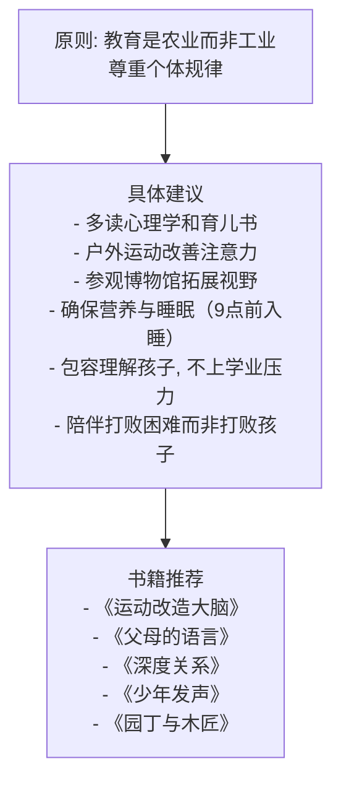

### Mermaid 格式（简洁流程图）
以下是简化的 Mermaid 流程图，仅列关键点：

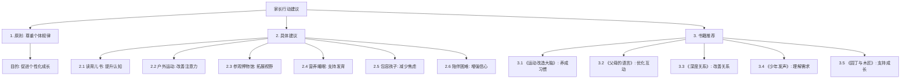


---

### 6. 教育理念与总结
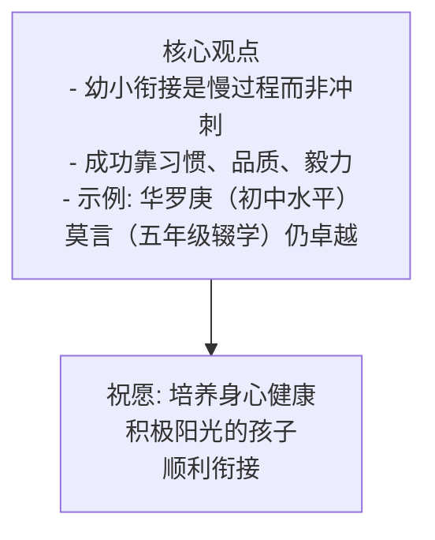

### 结构化输出（文本形式）
```
家长行动指南
├── 1. 核心原则
│   ├── 行动: 以农业而非工业心态教育孩子
│   └── 要点: 尊重个体规律，避免统一标准
├── 2. 具体行动
│   ├── 2.1 学习育儿知识
│   │   ├── 行动: 每周读1小时心理学或育儿书籍
│   │   └── 要点: 了解成长规律，减少焦虑
│   ├── 2.2 增加户外运动
│   │   ├── 行动: 每周带孩子户外活动2次（如跑步、爬山）
│   │   └── 要点: 增强注意力，改善关系
│   ├── 2.3 参观博物馆
│   │   ├── 行动: 每月参观1次博物馆，记录心得
│   │   └── 要点: 开阔视野，培养见识
│   ├── 2.4 保障营养与睡眠
│   │   ├── 行动: 每天准备营养早餐，9点前入睡，避免晚接
│   │   └── 要点: 支持身心健康，避免疲劳
│   ├── 2.5 理解与包容
│   │   ├── 行动: 每天平等交流10分钟，不提学业要求
│   │   └── 要点: 减轻压力，促进适应
│   └── 2.6 共同面对挑战
│       ├── 行动: 每周一起解决1个小困难（如整理书包）
│       └── 要点: 增强信心，建积极关系
└── 3. 推荐阅读
    ├── 行动: 每月读1本以下书籍
    │   ├── 3.1 《运动改造大脑》 - 理解运动益处
    │   ├── 3.2 《父母的语言》 - 改善早期交流
    │   ├── 3.3 《深度关系》 - 提升亲子关系
    │   ├── 3.4 《少年发声》 - 倾听孩子需求
    │   └── 3.5 《园丁与木匠》 - 学习园丁式教育
    └── 要点: 提升认知，做支持型家长
```

---

### Mermaid 格式（流程图）
以下是以简洁流程图形式呈现的 Mermaid 代码：

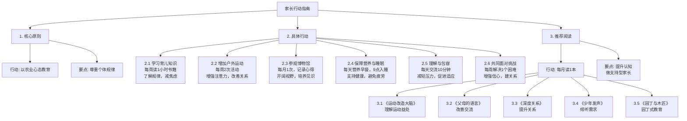

