# 文档标题：大型语言模型（LLMs）实用指南与高级应用

## 引言

本简报旨在介绍大型语言模型（LLMs）的实际应用，并通过具体案例讲解如何有效利用这些工具来提升工作效率和解决实际问题。 本文件基于实际操作演示和经验总结，旨在为读者提供一个全面而深入的LLM使用指南。

### 1. LLM生态系统概述

发展历程：
ChatGPT 是由 OpenAI 在 2022 年推出的，首次允许用户通过文本界面与 LLM 进行交互，并迅速在互联网上走红。“chpt it was developed by openai and deployed in 2022 so this was the first time that people could actually just kind of like talk to a large language model through a text interface and this went viral”。
当前生态系统日益丰富，涌现出许多类似 ChatGPT 的应用，尽管 ChatGPT 仍是功能最丰富且最受欢迎的。
主要参与者：
大型科技公司：Google (Gemini), Meta (co-pilot), Microsoft (co-pilot)。
初创公司：Anthropic (Claud), xAI (Grok)。
国际公司：Deepseek (中国), Mistral (法国)。
模型追踪与评估：
Chatbot Arena:提供不同模型的排名和ELO评分。“chatbot arena is one of them so here you can come to some ranking of different models and you can see sort of their strength or ELO score”。
Scale AI Leaderboard:展示各种评估指标下模型的表现。“seal Le leaderboard from scale and so here you can also see different kinds of eval and different kinds of models and how well they rank and you can also come here to see which models are currently performing the best on a wide variety of tasks”。


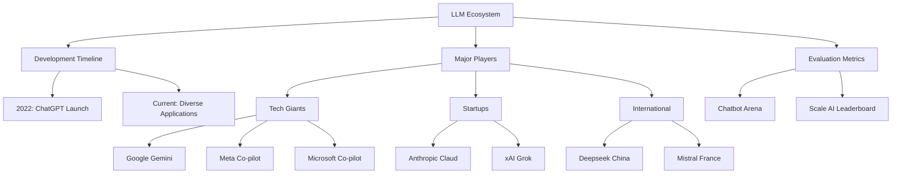

### 2. 与LLM的基本交互方式

**核心类比**：想象LLM是个记忆力超群的图书管理员📚
- **基本能力**：大脑存储海量书籍（预训练数据）
- **交互限制** => 每次对话只能带1本笔记本（上下文窗口）

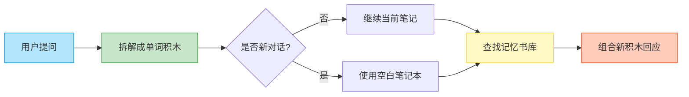
示例：要求 LLM 创作一首关于 LLM 体验的俳句。
# "你好!" 拆解为：
tokens = ["你", "好", "!"]
# 英文 "Hello!" 拆解为：
tokens = ["Hello", "!"]
Token化：
用户输入和模型输出都被分解成称为 “tokens” 的文本块。“this sequence of text is under the hood a token sequence onedimensional token sequence”。
Tokenizer 等工具可用于查看文本的 token 序列。“we can use an app like for example Tik tokenizer so making sure that GPT 40 is selected I can paste my text here and this is actually what the model sees Under the Hood”。
Token 数量影响模型处理速度和成本。
会话格式：
LLM 的 “记忆” 通过上下文窗口（context window）实现，该窗口保存了对话中的 token 序列。“the context window is kind of like this working memory of tokens and anything that is inside this context window is kind of like in the working memory of this conversation and is very directly accessible by the model”。


当开启新的聊天时，上下文窗口会被清除，token 计数重置。“when I click new chat here that wipes the token window that resets the tokens to basically zero again and restarts the conversation from scratch”。

### 3. LLM的内部运作机制

- 训练阶段：
预训练（Pre-training）： LLM 通过压缩互联网上的大量文本数据学习世界知识。“the pre-training stage is kind of like taking all of Internet chopping it up into tokens and then compressing it into a single kind of like zip file but the zip file is not exact the zip file is lossy and probabilistic zip file”。预训练成本高昂，因此模型知识存在 
“知识截断”（knowledge cutoff）。

- 后训练阶段：
后训练（Post-training）： LLM 通过人类对话数据集进行训练，学习如何以助手的身份回应用户查询。“post-training Stage is really attaching a smiley face to this ZIP file because we don't want to generate internet documents we want this thing to take on the Persona of an assistant that responds to user queries and that's done in a process of post training where we swap out the data set for a data set of conversations that are built out by humans”。

- LLM的本质：
LLM 本质上是一个大型 “zip 文件”，包含数十亿个参数，用于预测序列中的下一个 token。“what you are talking to to is a fully self-contained entity by default this language model think of it as a one tbte file on a dis secretly that represents one trillion parameters and their precise settings inside the neural network that's trying to give you the next token in the sequence”。
默认情况下，LLM 是一个独立的实体，不具备计算器、Python 解释器或互联网浏览器等工具。“you're talking to a zip file if you stream tokens to it it will respond with tokens back and this ZIP file has the knowledge from pre-training and it has the style and form from posttraining”。

- LLM适用场景举例
查询咖啡因含量，确认药品成分。“this morning I asked Chachi the following how much caffeine is in one shot of Americana and I was curious because I was com... conversations of DayQuil and NyQuil these are very common meds...”.

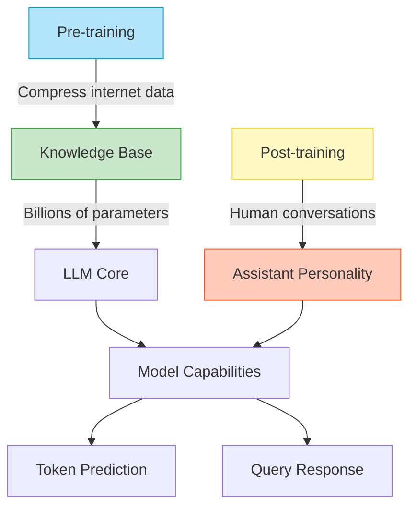

### 4. LLM使用技巧

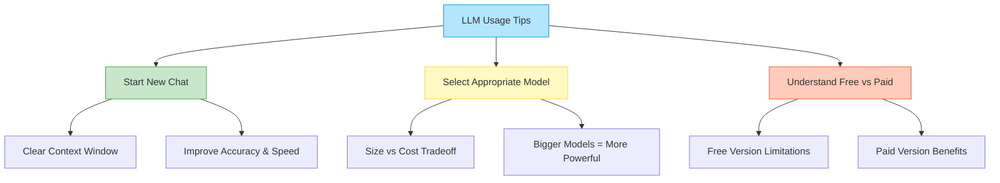

- 及时新建会话：
当切换话题时，建议开启新的聊天，以清除上下文窗口中不相关的 token，提高模型准确性和速度。“anytime you are switching topic I encourage you to always start a new chat when you start a new chat as we talked about you are wiping the context window of tokens and resetting it back to zero”。

- 选择合适的模型：
不同的 LLM 提供商 提供不同定价层级的模型。 大型模型功能更强大，但成本更高。“be mindful of the models that you're using typically with these companies the bigger models are more expensive to uh calculate and so therefore uh the companies charge more for the bigger models and so make those tradeoffs for yourself depending on your usage of llms”。

- 注意区分免费和付费版本的功能差异，付费用户通常可以访问更强大的模型。“plus users get 80 messages every 3 hours for GPT 40 so that's the flagship biggest model that's currently available as of today”。

### 5. 思考型模型(Thinking Models)

**核心类比**：想象LLM是个解题高手🧠
- **基础能力**：记忆题库（预训练）
- **强化训练** => 参加解题竞赛（强化学习）

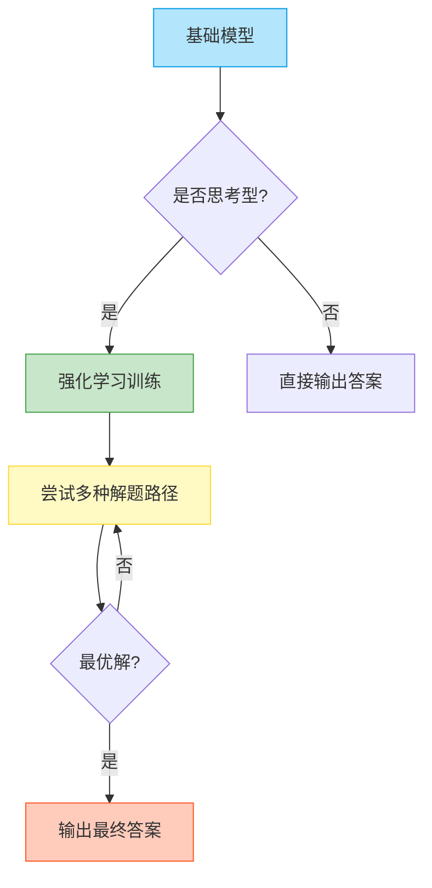
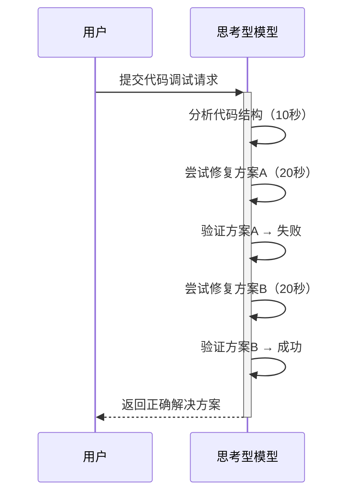

- 训练过程：
思考型模型通过强化学习进行训练，学习解决问题的策略。“we saw in the previous video that there are multiple stages of training pre-training goes to supervised fine tuning goes to reinforcement learning and reinforcement learning is where the model gets to practice”。 强化学习让模型能够尝试各种方法，找到最佳的思考过程。

- 特点：
相比普通模型，思考型模型会进行更多的 “思考”，在解决数学、代码等复杂问题时表现更佳。“the model will do a lot more thinking and what you can expect is that you will get higher accuracies especially on problems that are for example math code and things that require a lot of thinking”。
思考过程可能需要较长时间，模型会输出大量的 token。
- 案例分析：
使用思考型模型解决代码调试问题，相比普通模型能更快找到解决方案。“when I gave the same model the same prompt to 01 Pro which is the best at reasoning model and you have to pay $200 per month for this one then the exact same prompt it went off and it thought for 1 minute and it went through a sequence of thoughts...then it actually came to get came back with the correct solution”。

### 6. 工具使用(Tool Use)

**核心类比**：想象LLM是个信息侦探🕵️
- **基本能力**：记忆档案库（预训练数据）
- **搜索工具** => 实时获取最新情报（突破知识截止日期）

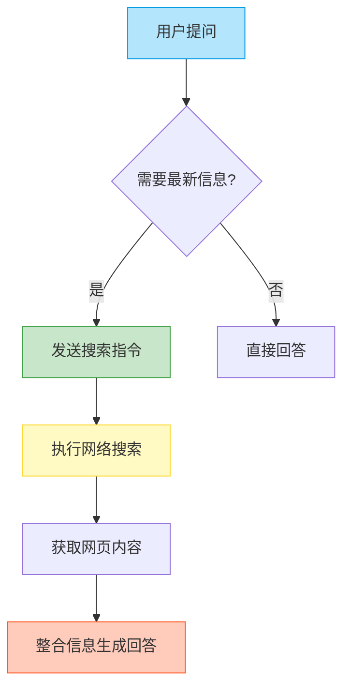


- 互联网搜索：
LLM 可以通过互联网搜索获取最新信息，解决知识截断问题。“we introduce a mechanism for for the model to emit a special token that is some kind of a searchy internet token and when the model emits the searchd internet token the Chach PT application or whatever llm application it is you're using will stop sampling from the model and it will take the query that the model model gave it goes off it does a search”。


模型发出特定的 token，指示应用程序进行互联网搜索，并将搜索结果插入到上下文窗口中。“so now you have this internet search tool that itself can also contribute tokens into our context window and in this case it would be like lots of internet web pages and maybe there's 10 of them and maybe it just puts it all together and this could be thousands of tokens coming from these web pages”。


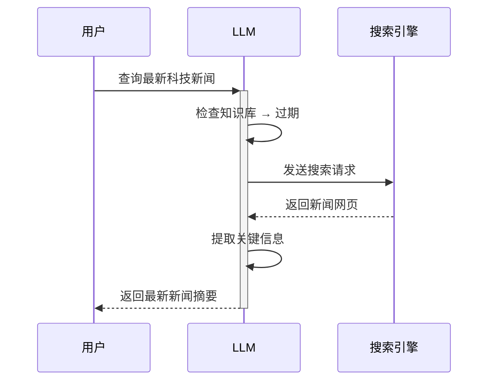

### 6. 工具使用(Tool Use)

**核心类比**：想象LLM是个信息侦探🕵️
- **基本能力**：记忆档案库（预训练数据）
- **搜索工具** => 实时获取最新情报（突破知识截止日期）


搜索机制详解 ：

1. 触发信号 （侦探的搜索令）：
   
   - 特殊token： [SEARCH]
   - 示例：
     ```python
     # 模型输出
     tokens = ["根据", "最新", "数据", "[SEARCH]"]
     ```
2. 信息整合 （侦探的报告）：
   
   ```示例
   用户问："2023年诺贝尔经济学奖得主是谁？"
   
   LLM处理过程：
   1. 检查记忆 → 知识截止2023.10
   2. 发送搜索指令 → 获取最新网页
   3. 提取关键信息 → 组织成自然语言
   4. 标注来源：「根据诺贝尔官网2023年更新...」
   ```
3. 性能对比 ：
    信息类型 处理方式 响应时间 准确性 截止日期前
   
   直接回答
   
   1-2秒
   
   100% 最新信息
   
   网络搜索
   
   3-5秒
   
   95%+

- 适用场景：
查询最新信息，如 White Lotus 第三季的播出时间。“I was curious when the episode two was coming out”。
研究特定主题，如 Brian Johnson 的牙膏成分。“this can potentially change over time and then I saw a bunch of stuff on Twitter about a USA ID and I wanted to know kind of like what's the deal”。

### 7. 深度研究(Deep Research)

**核心类比**：想象LLM是个研究助理👨‍🔬
- **基本能力**：快速阅读（信息处理）
- **研究工具** => 文献检索+深度分析（突破人类研究速度）

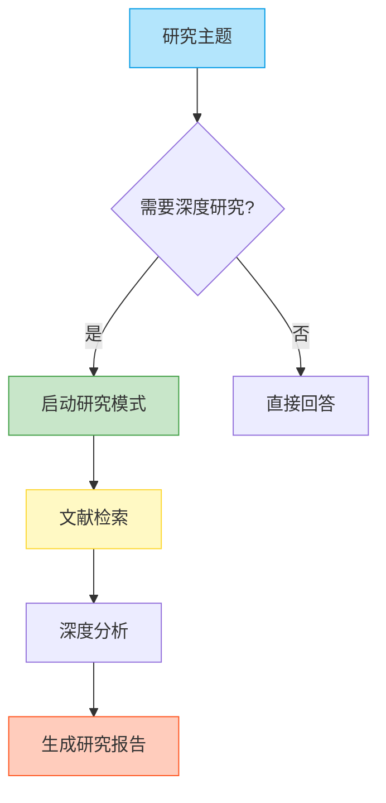

- 行业应用：
Perplexity 和 Grok 也提供了类似的深度研究功能。“perplexity when you go to the model drop down has something called Deep research and so you can issue the same queries here and we can give this to perplexity and then grock as well has something called Deep search instead of deep research”。

用户问："请分析量子计算的最新进展"

LLM处理过程：
1. 确定研究范围 → 量子计算
2. 检索最新文献 → 获取相关论文
3. 深度分析内容 → 提取关键信息
4. 组织研究报告 → 生成结构化输出


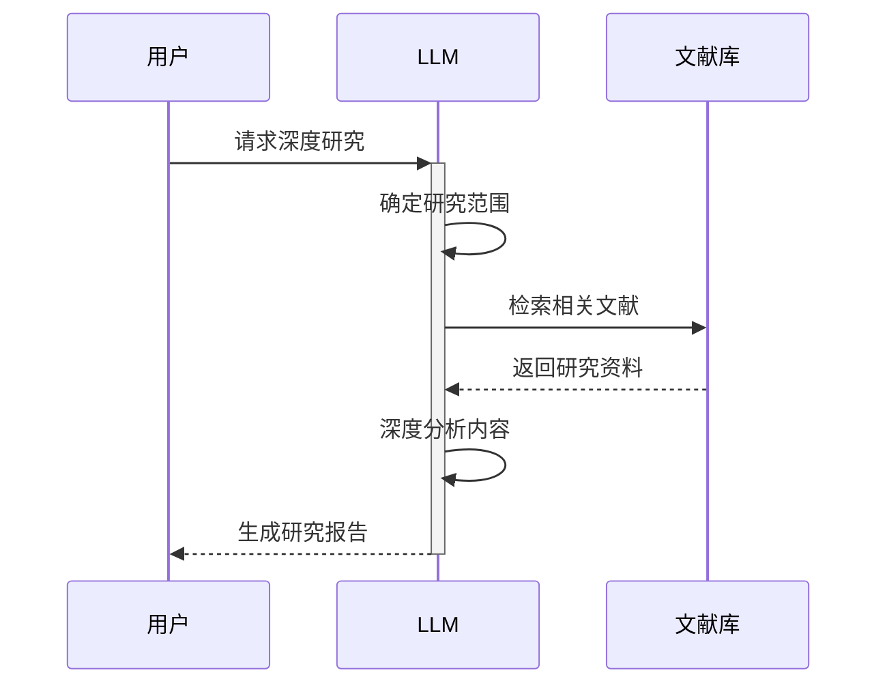

- 注意事项：
深度研究报告可能存在 “幻觉”，用户需要仔细核对信息来源。“even though it is doing research and it's pulling in there are no guarantees that there are no hallucinations here”。
引用文献应该要自行确认。

### 8. 文档上传与分析

**核心类比**：想象LLM是个智能扫描仪📄
- **基本能力**：快速阅读（信息处理）
- **文档工具** => 将纸质文档数字化（突破传统阅读方式）

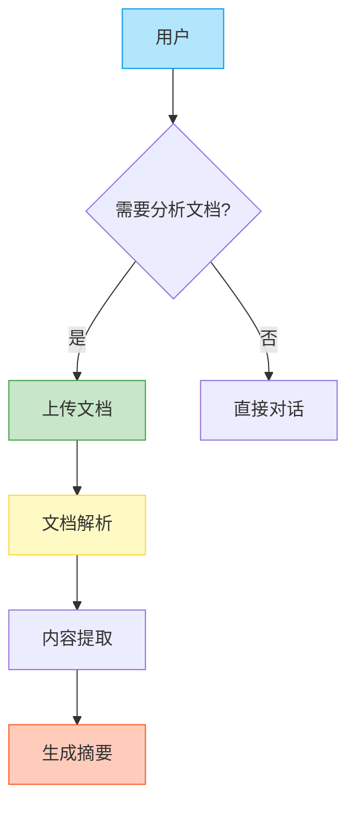
用户上传："2023年公司财报.pdf"

LLM处理过程：
1. 文档解析 → 提取文本内容
2. 关键信息提取 → 财务数据
3. 生成摘要 → 总结主要财务指标
4. 支持问答 → 回答具体问题

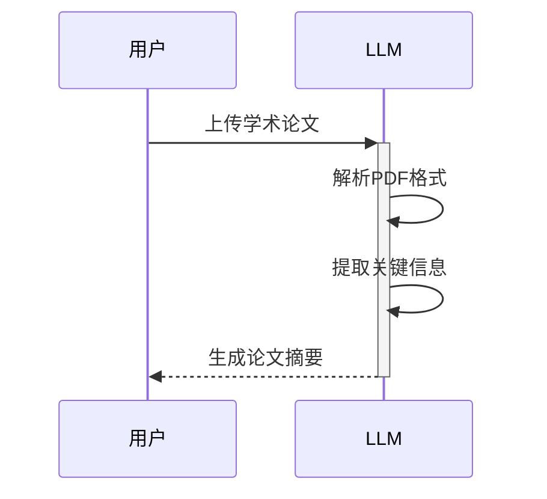

- 适用场景：
* 阅读学术论文，快速获取论文摘要和关键信息。“so typically when I start reading papers together with any of these llms I just ask for can you uh give me a summary uh summary of this paper let's see what cloud 3.7 says”。
* 阅读书籍，加深对内容的理解。“way I read books now as an example is uh you basically pull up the book and you have to get uh access to like the raw content of that information”。


### 9. 代码解释器(Python Interpreter)

**核心类比**：想象LLM是个编程助手💻
- **基本能力**：编写代码（代码生成）
- **解释器工具** => 执行代码并返回结果（突破纯文本限制）

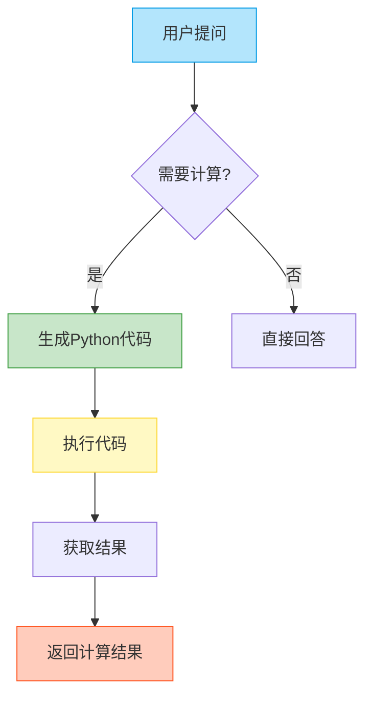

LLM 可以使用 Python 解释器执行代码，解决复杂的数学计算和数据分析问题。“instead of the llm giving you an answer directly it has the ability now to write a computer program and to emit special tokens that the chpt application recognizes as hey this is not for the human this is uh basically saying that whatever I output it here uh is actually a computer program please go off and run it and give me the result of running that computer program”。

用户问："计算1到100的和"

LLM处理过程：
1. 生成Python代码 → sum(range(1, 101))
2. 执行代码 → 5050
3. 返回结果 → "1到100的和是5050"

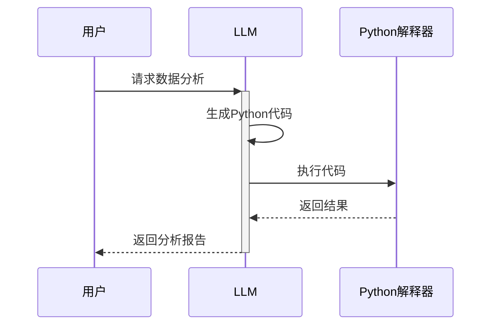


高级数据分析：
ChatGPT 结合高级数据分析功能，可以充当初级数据分析师，进行数据可视化和趋势分析。“this is where this gets powerful Chachi PT goes off and writes a program that plots the data over here so it cre a little figure for us and it uh sort of uh ran it and showed it to us”。


**注意：**需要仔细审查代码和分析结果，避免模型产生错误。“you have to be careful and scrutinize it and make sure that you are really watching very closely because your Junior analyst is a little bit uh absent minded and uh not quite right all the time”。

### 10. 云端 Artifacts(Cloud Artifacts)

**核心类比**：想象Claude是个全栈开发者👨‍💻
- **基本能力**：编写代码（代码生成）
- **Artifacts工具** => 生成可交互Web应用（突破纯文本限制）

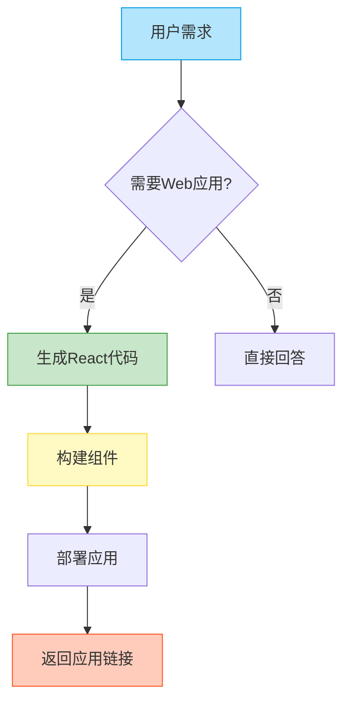

用户需求："创建一个Flashcard应用"

Claude处理过程：
1. 生成React代码 → 创建组件
2. 构建应用 → 部署到云端
3. 返回链接 → 用户可直接访问

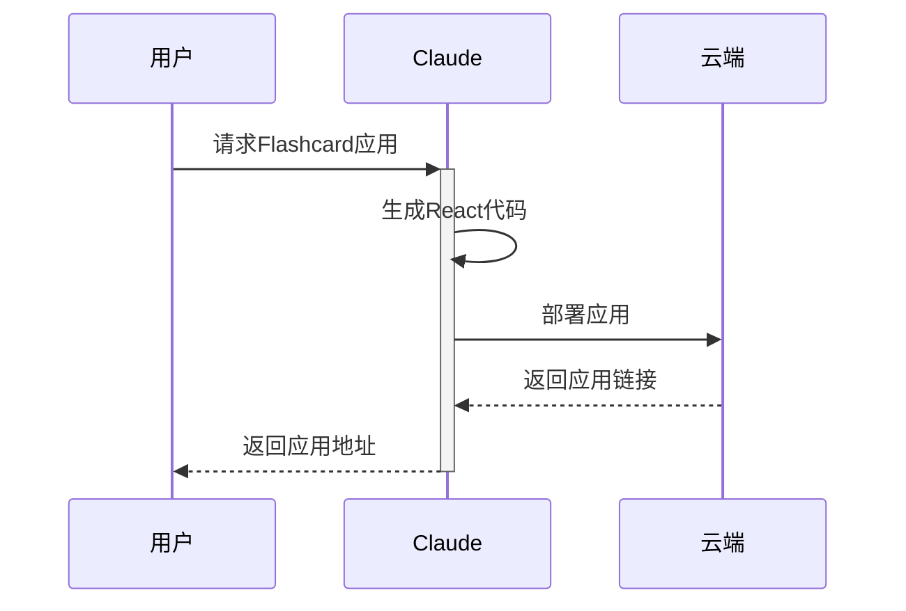


思维可视化
用图表分析文本内容，加深理解。
“I'm attaching chapter 3 and book one please create a conceptual diagram of this chapter”。

### 11. 代码辅助开发

**核心类比**：想象Cursor是个代码管家🤖
- **基本能力**：执行命令（命令响应）
- **Vibe Coding** => 自动化代码开发（突破手动编码限制）

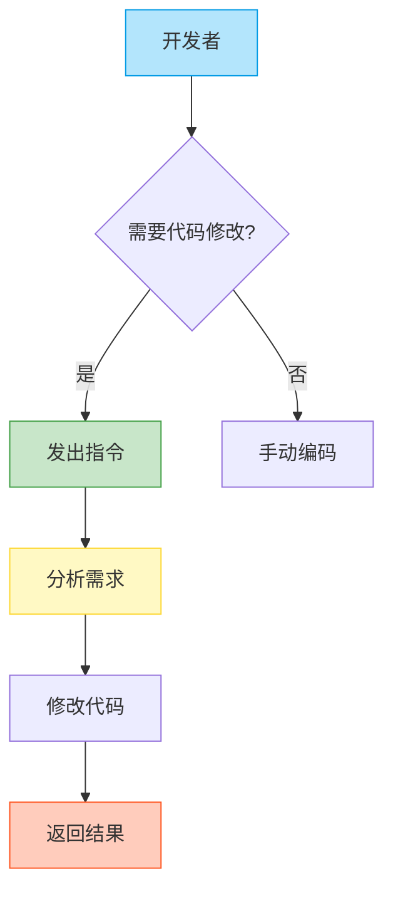
开发者指令："将所有按钮颜色改为蓝色"

Cursor处理过程：
1. 分析代码 → 定位所有按钮
2. 修改代码 → 更新样式
3. 返回结果 → 显示修改后的代码


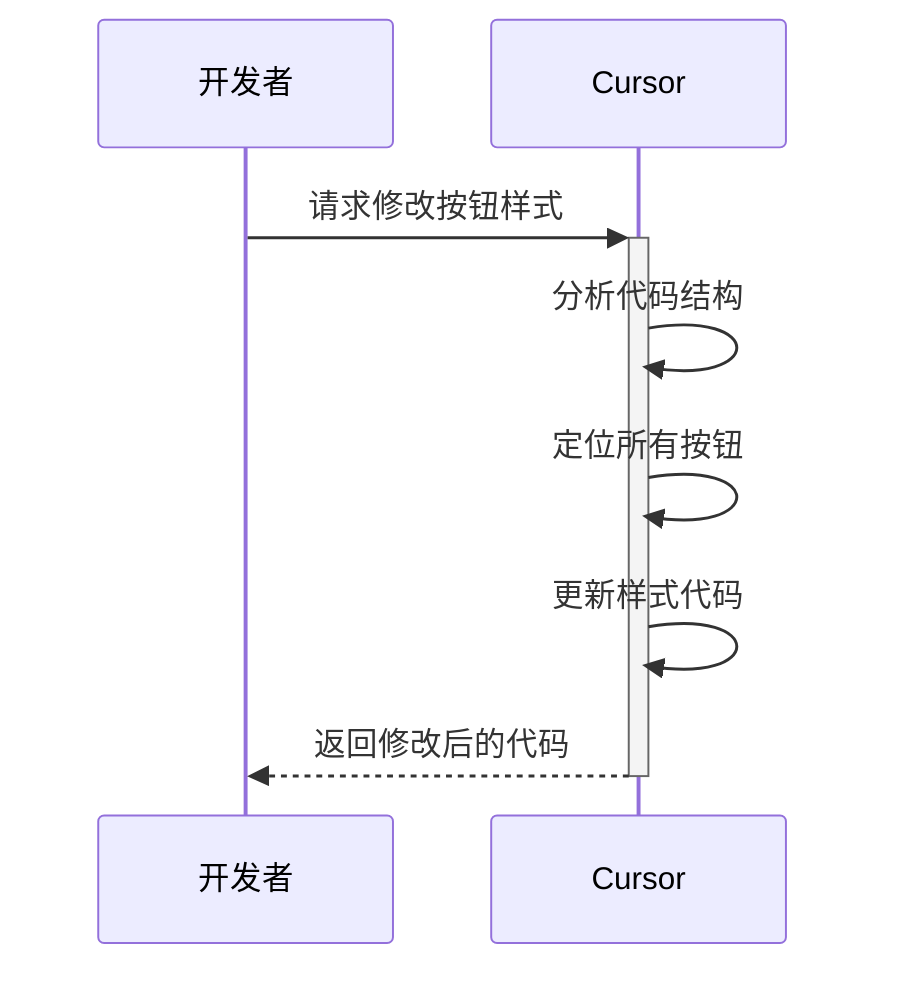
### 12. 多模态交互

**核心类比**：想象LLM是个语音助手🎙️
- **基本能力**：文本交互（传统模式）
- **语音模式** => 直接音频输入输出（突破文本限制）

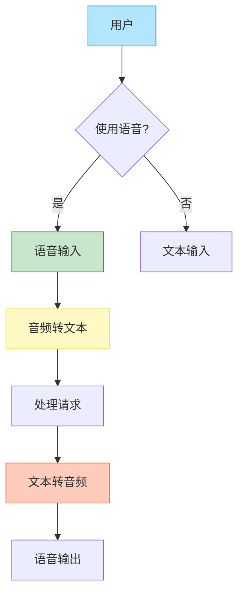
语音输入
“what I use all the time on my MacBook is I basically fall back on some of these apps that um allow you that functionality but it's not specific to chat GPT it is a systemwide functionality of taking your audio and transcribing it into text”。
通过语音方式能够更快速完成指令输入，更自然地交互。

高级语音模式(Advanced Voice Mode)

高级语音模式(True audio)支持真正意义上的音视频输入输出。
“Advanced voice mode is referring to True audio what that means is that the voice is handled natively inside the language model the model can understand audio chunks and predict audio chunks so it can hear and speak directly in audio there's no text involve d whatsoever”。

Grok可以开启无拘束模式尽情对话，并提供APP端支持。“grock will just uh do stuff you know grock will grock will go there so if you prefer lot of entertainment I do think that the grock app is better set up for that”。
根据文本内容生成定制podcast

notebook LM可以将文本转换成音频。
“on the right they have this uh Deep dive podcast so there's a generate button you can press it and wait like a few minutes and it will generate a custom podcast on whatever sources of information you put in here”。

### 13. 图像模式

**核心类比**：想象LLM是个图像处理专家🖼️
- **基本能力**：文本理解（传统模式）
- **图像模式** => 视觉信息处理（突破纯文本限制）

```mermaid
flowchart TD
    A[用户] --> B{使用图像?}
    B -- 是 --> C[图像输入]
    B -- 否 --> D[文本输入]
    C --> E[图像token化]
    E --> F[视觉信息处理]
    F --> G[生成响应]
    
    style A fill:#B3E5FC,stroke:#039BE5
    style C fill:#C8E6C9,stroke:#43A047
    style E fill:#FFF9C4,stroke:#FDD835
    style G fill:#FFCCBC,stroke:#FF5722
```

多模态大模型
对图像token化，并应用和文本一样的数据模型方式。
“you can re-represent images in tokens and we can represent images as token streams and we can get language models to model them in the same way as we've modeled text and audio before”。
图像输入
上传图片，进行分析，并且提供理解图片的功能。
“if you go to your favorite chasht or other llm app you can upload images usually and ask questions of them”。
图片输出
使用图片生成模型，如DALL-E 3，通过文本生成图片。
“open AI offering of this is called DOI and we're on the third version and it can generate really beautiful images on basically given arbitrary prompts”。
视频能力
GPT具备视频理解能力。

```mermaid
sequenceDiagram
    用户->>+LLM: 上传产品设计图
    LLM->>LLM: 图像token化
    LLM->>LLM: 视觉特征提取
    LLM->>LLM: 生成设计建议
    LLM-->>-用户: 返回优化方案
```

### 14. 质量功能

**核心类比**：想象LLM是个私人助理📝
- **基本能力**：即时响应（默认模式）
- **记忆功能** => 个性化服务（突破单次对话限制）

```mermaid
flowchart TD
    A[用户] --> B{需要记忆?}
    B -- 是 --> C[存储偏好]
    B -- 否 --> D[直接响应]
    C --> E[保存信息]
    E --> F[后续调用]
    F --> G[个性化响应]
    
    style A fill:#B3E5FC,stroke:#039BE5
    style C fill:#C8E6C9,stroke:#43A047
    style E fill:#FFF9C4,stroke:#FDD835
    style G fill:#FFCCBC,stroke:#FF5722
```


记忆功能
让GPT记住你的一些喜好，从而进行个性化反馈。
“chat GPT does have an ability to save information from chat to chat but but it has to be invoked so sometimes chat GPT will trigger it automatically but sometimes you have to ask for it so basically say something along the lines of uh can you please remember this or like remember my preference or whatever something like that”。

```mermaid
sequenceDiagram
    用户->>+LLM: 设置偏好："喜欢详细解释"
    LLM->>LLM: 识别记忆指令
    LLM->>LLM: 存储用户偏好
    用户->>+LLM: 后续提问
    LLM->>LLM: 调用记忆
    LLM-->>-用户: 提供详细解释
```

自定义指令
自定义指令可以让 GPT 更加符合你的个性。
“you can come to settings um customize chpt and you see here it says what traes should chpt have and I just kind of like told it just don't be like an HR business partner just talk to me normally and also just give me I just lot explanations educations insights Etc so be educational whenever you can”。
自定义GPTs
利用Few-shot让GPT完成特定任务
“If there's a certain prompt that you keep reusing then instead of reusing that prompt and copy pasting it over and over again just create a custom chat custom GPT save that prompt a single time and then what's changing per sort of use of it is the different sentence”。

## 结论
大型语言模型正在快速发展，为我们提供了强大的工具来解决各种问题。 通过了解 LLM 的工作原理和各种功能，我们可以更有效地利用它们来提高工作效率和创造力。


