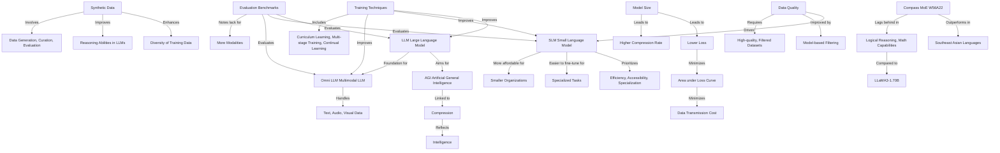

# 压缩及智能（Compression for AGI）

这段文字描述了信息论中的一个核心概念——**信息熵（Entropy）**，特别是离散随机变量 \(X\) 的信息含量 \(H(X)\)。以下是逐步解释其含义：

### 1. **信息熵的定义**
信息熵 \(H(X)\) 是一个衡量随机变量 \(X\) 不确定性的量度。它通过随机变量 \(X\) 的概率分布 \(P(x)\) 计算，其中 \(x\) 是 \(X\) 可能取值的集合（词汇表 \(X\)）。公式为：

- $$
  [
  H(X) = -\sum_{x \in X} P(x) \log P(x)
  ]
  
  -
  $$

  \(P(x)\) 是 \(X\) 取值为 \(x\) 的概率。
- \(\log\) 通常以 2 为底（即使用比特作为单位），因为信息论中常用二进制来表示信息量。
- 信息熵的单位是“比特”，表示需要多少比特来编码或表示随机变量 \(X\) 的值。

### 2. **直观含义**
- 信息熵反映了随机变量的不确定性或随机性：如果 \(X\) 的所有可能值几乎等可能（均匀分布），那么不确定性最大，熵值也最大；如果某些值出现的概率极高而其他值极低（分布不均匀），不确定性较小，熵值也较小。
- 熵的高低与数据压缩密切相关：如果熵低（分布不均匀），可以用更少的比特来有效编码数据，从而实现压缩；如果熵高（均匀分布），需要更多的比特来表示所有可能值。

### 3. **例子：256 字节的均匀分布**
文中给出了一个具体的例子：
- 假设 \(X\) 是一个字节（8 位二进制数），其可能取值是 \(0\) 到 \(255\)（共 256 个值）。
- 如果每个值出现的概率相等（均匀分布），即 \(P(x) = \frac{1}{256}\) 对所有 \(x \in \{0, 1, 2, ..., 255\}\)，那么：

$$
\[
H(X) = -\sum_{x \in X} \frac{1}{256} \log \frac{1}{256}
\]
$$

由于 \(\frac{1}{256}\) 是常数，可以将其从求和中提取出来：

$$
\[
H(X) = -256 \times \frac{1}{256} \log \frac{1}{256} = -\log \frac{1}{256}
\]
$$
因为 \(\log \frac{1}{256} = \log 2^{-8} = -8 \log 2\)（以 2 为底），所以：

$$
\[
H(X) = -(-8 \log 2) = 8 \text{ 比特}
\]
$$
这意味着，当字节的每个值（0 到 255）都等可能出现时，需要 8 比特来表示一个字节，这是最大熵值。

### 4. **非均匀分布与压缩**
- 如果 \(P(x)\) 不均匀（某些值出现的概率更高），\(H(X)\) 会小于 8 比特。这是因为我们可以用更少的比特来表示高概率的值，从而实现数据压缩。
- 这种特性是数据压缩（如 ZIP 文件或视频编码）的基础：通过利用数据的不均匀分布，减少所需的存储或传输比特数。

### 5. **总结**
- 信息熵 \(H(X)\) 量化了随机变量 \(X\) 的不确定性。
- 在均匀分布的情况下，熵达到最大（例如 256 个等可能值的字节需要 8 比特）。
- 在非均匀分布的情况下，熵降低，可以通过编码技术（如霍夫曼编码）实现压缩，节省存储空间。
- 这个概念广泛应用于信息论、通信、数据压缩和机器学习等领域。

## 信息传输

这段文字描述了一种基线数据传输方法，涉及如何用二进制编码和传输数据，特别是在一个有 256 个可能值的场景中（例如字节）。以下是逐步解释其含义：

### 1. **基线传输方法的核心思想**
- **256 个可能值（\(m=256\)）**：这里假设有一个随机变量 \(x_{t+1}\)（或 \(z_{t+1}\)），它的可能取值有 256 个（例如，0 到 255，恰好是一个 8 位字节所能表示的范围）。
- **用 8 位整数表示**：由于有 256 个可能值，理论上需要 \(\lceil \log_2 256 \rceil = 8\) 比特来唯一表示这些值（因为 \(2^8 = 256\)）。因此，每个值可以用一个 8 位二进制数（一个字节）来表示。

### 2. **具体例子**
- 当 \(x_{t+1} = 7\) 时，\(z_{t+1} = 00000111\)。这里用 8 位二进制数表示 7，符合上述规则：7 在二进制下是 00000111（从低位到高位，补齐 8 位）。

### 3. **传输的比特数**
- 公式 \(\lvert z_{t+1} \rvert = \log m = \log 256 = 8\) 表示每个值需要传输 8 比特。这是因为 256 个等可能值的最大熵（信息量）是 8 比特，正如信息论中 Shannon 熵的计算（见你的上一张图片中的例子）。
- 这里假设分布是均匀的，每种值出现的概率相等，因此需要 8 比特来确保无损传输。

### 4. **Alice 和 Bob 的角色**
- **Alice 需要编写代码 \(f_0\)**：Alice 编写一个程序或方法 \(f_0\)，用于将 \(x_{t+1}\) 编码成 8 位二进制数 \(z_{t+1}\)，然后传输给 Bob。
- **传输给 Bob**：Alice 将编码后的数据（以及可能包括 \(f_0\) 的描述或实现）发送给 Bob，以便 Bob能够解码并恢复原始数据。

### 5. **传输数据集的成本**
- 数据集 \(D_n = \{x_1, x_2, ..., x_n\}\) 包含 \(n\) 个值，每个值需要用 8 比特表示。
- 传输的总成本（以比特为单位）包括：
  - \(|f_0|\)：编码方法 \(f_0\) 本身的描述长度（假设以比特计）。
  - \(\sum_{i=1}^n \lvert z_i \rvert\)：每个数据点 \(x_i\) 编码后的比特数之和。
- 由于每个 \(z_i\) 需要 8 比特（因为 \(m=256\)），所以：

- $$
  \[
  \sum_{i=1}^n \lvert z_i \rvert = n \times 8 = n \log m
  \]
  
  -
  $$

  因此，总成本为：

$$
\[
S_0 = |f_0| + n \log m
\]
$$

- 这里 \(|f_0|\) 是固定的开销（编码方法的描述长度），而 \(n \log m\) 是传输 \(n\) 个数据点所需的动态成本。

### 6. **意义与应用**
- 这个基线方法是一个简单的、无损传输方案，适用于均匀分布的数据。如果数据分布不均匀，可以使用更复杂的编码（如霍夫曼编码）来减少平均比特数，从而降低传输成本。
- 它反映了信息论中的基本原理：均匀分布的数据需要最大比特数来表示，而非均匀分布可以通过压缩技术减少比特数。
- 这种方法在通信、数据存储和网络传输中有广泛应用，例如文件传输协议或数字通信系统。

### 7. **总结**
- 基线方法假设有 256 个等可能值，每个值用 8 比特表示。
- Alice 编写编码方法 \(f_0\)，将数据编码为 8 位二进制数，传输给 Bob。
- 传输 \(n\) 个数据点的总成本是编码方法长度 \(|f_0|\) 加上 \(n \times 8\) 比特。
- 这是一个基础的、无损传输模型，适用于没有利用数据分布特性的场景。

## 解释一下为什么压缩是智能

> - **Compression for AGI**: The source material includes sections specifically titled "Compression for AGI".
> - **Information content**: The information content of a discrete random variable *X* with probability distribution *P* and vocabulary χ is *H(X)*, which is expressed mathematically as  H(X) = -∑ P(x)logP(x). The basic idea is that if *P(X)* is uniformly distributed, *H(X)* is the largest, and when *P(X)* is uneven, we can use less than 8 bits to represent a byte, which is the basis for "compression".
> - **Neural network transmission**: The source describes a neural network transmission method where Alice sends a training code *f* of an Auto-Regressive (such as GPT) neural network to Bob. The model inputs {x₁, x₂, ..., xₜ} and outputs a probability distribution *P*(xₜ₊₁|x₁:t, *f*) of xₜ₊₁. Both parties train the network and have the same model, resulting in the same modeling of the probability distribution *P*(xₜ₊₁|x₁:t, *f*) of xₜ₊₁.
> - **Lossless compression**: The training process of GPT is essentially a lossless compression of the entire dataset *D*.
> - **Model size, loss, and compression**: The source notes relationships between model size, loss, compression rate, and model intelligence: The larger the model, the lower the loss, the higher the compression rate, and the smarter the model.

---

### 1. **从基本问题开始：压缩是什么？**
想象你有一大堆书（比如一本百科全书），但你需要把它们塞进一个小箱子里。你可以：
- 直接把书一页页叠起来（原始数据，大而浪费空间）。
- 或者找到规律，把重复的部分去掉，或者用更紧凑的方式记录（比如只记录关键信息），这就是“压缩”。

在计算机中，压缩就是用更少的比特（0 和 1）来存储或传输数据，同时保证能完整恢复原数据（无损压缩）或在一定范围内恢复（有损压缩）。比如，ZIP 文件就是一种压缩技术。

---

### 2. **压缩如何与智能相关？**
文中提出，压缩能力可以反映智能，尤其是通用人工智能（AGI）的智能水平。为什么呢？让我们逐步分解：

#### **a. 信息熵：数据的不确定性**
- 考虑一个随机变量 \(X\)，比如一个字节（0 到 255，256 个可能值）。它的“信息含量”用熵 \(H(X)\) 表示，公式是：

$$
\[
H(X) = -\sum_{x \in X} P(x) \log P(x)
\]
$$

- \(P(x)\) 是 \(X\) 取某个值 \(x\) 的概率。
- 如果每个值都一样可能（均匀分布），
- \(
  $$
  P(x) = \frac{1}{256}\)，熵最大，为 8 比特（需要 8 比特表示一个字节）。
  $$
- 如果某些值更常见（分布不均匀），熵会降低，比如只需要 3 比特（见算术编码例子）。这就是压缩的基础：利用数据的模式或规律，用更少的比特表示。

- **类比**：如果书里有很多重复的句子（比如“the”出现很多次），你可以用一个简短的代码代替重复部分，节省空间。

- 智能系统能发现这些规律，就能更好地压缩数据。

#### **b. 压缩与预测能力**
- 智能（包括人类和 AGI）的一个关键特征是预测能力：基于过去的数据，预测未来的数据。
- 比如，你读了一本书的前几页，可能会猜出接下来会发生什么。同样，AGI 可以通过观察数据序列（如文字、图像或动作），预测下一个可能的值（比如 \(x_{t+1}\)）。
- 压缩本质上也是预测：如果一个系统能很好地预测数据模式，就能用更少的比特编码这些数据（因为高概率值需要更少的比特）。因此，压缩能力反映了预测能力，而预测能力是智能的核心。

---

### 3. **神经网络传输与压缩**
文中提到 Alice 和 Bob 使用一个自回归神经网络（如 GPT）来压缩和传输数据。以下是详细解释：

#### **a. 神经网络的工作**
- Alice 训练一个神经网络（比如 GPT 模型），输入过去的序列 \(\{x_1, x_2, ..., x_t\}\)，输出一个概率分布 \(P(x_{t+1} | x_{1:t}, f)\)。这个分布告诉我们，\(x_{t+1}\) 可能是哪个值（比如 0、1、2 或 3），以及每个值的概率。
- Bob 也训练同样的模型 \(f\)（用同样的数据和方法），所以两人都能生成相同的概率分布 \(P(x_{t+1} | x_{1:t}, f)\)。
- 这个过程本质上是在“建模”数据：神经网络学会了数据的模式和规律。

#### **b. 压缩的过程**
- Alice 用这个概率分布（比如 \(x_{t+1}\) 的概率分布）通过算术编码（或类似方法）将 \(x_{t+1}\) 编码成一个更短的二进制序列 \(z_{t+1}\)（见前文的算术编码例子）。
- 比如，原始可能需要 8 比特表示一个字节，但通过利用概率分布（某些值更常见），可以用 3 比特表示，实现了无损压缩。
- Alice 发送 \(z_{t+1}\) 和模型 \(f\)（或 \(f\) 的描述）给 Bob。
- Bob 用相同的模型 \(f\) 和概率分布解码 \(z_{t+1}\)，恢复出 \(x_{t+1}\)。这是无损的，因为数据完全恢复。

#### **c. GPT 的训练是压缩**
- 训练 GPT（或类似自回归模型）本质上是在压缩整个数据集 \(D\)。模型学习数据的规律和模式，然后用概率分布预测未来数据。
- 比如，GPT 可以预测下一个单词是什么。如果它能非常准确地预测（概率分布集中），就说明它很好地压缩了数据，因为高概率值需要更少的比特表示。

---

### 4. **模型大小、损失、压缩率与智能的关系**
文中提到几个关键关系，反映了压缩与智能的联系：

#### **a. 模型越大，损失越低**
- “模型”是指神经网络的大小（比如参数数量）。更大的模型（如更大的 GPT）能捕捉更多数据模式，预测更准确。
- “损失”（Loss）是模型预测错误的度量。如果损失低，说明模型预测得很好，能更准确地建模数据分布。

#### **b. 损失越低，压缩率越高**
- 如果模型能很好地预测数据（损失低），它就能利用概率分布进行更高效的压缩（用更少的比特表示数据）。
- 比如，预测某个值概率为 90%，可以用 1 比特表示；如果概率均匀分布，可能需要 8 比特。

#### **c. 压缩率越高，模型越聪明**
- 更高的压缩率意味着模型能更高效地表示数据，捕捉更多规律。这反映了更高的“智能”：一个智能系统能发现数据中的深层模式，并用最少的资源（比特）表示这些模式。
- 在 AGI 上下文中，这意味着一个智能系统（如人类大脑或 AGI）能够压缩和理解复杂世界中的数据，从而做出更好的预测和决策。

---

### 5. **为什么压缩与 AGI 智能相关？**
- **类比：人类大脑的智能**：人类大脑非常擅长压缩信息。比如，你看到“猫”这个词，可能直接想到一个概念（有毛、会喵叫、喜欢玩），而不是记住所有细节（每只猫的毛色、行为等）。这是一种自然的压缩，反映了智能。
- **AGI 的目标**：AGI 希望像人类一样理解和处理复杂数据。它需要学习数据模式、预测未来，并高效存储/传输这些信息。压缩能力是衡量 AGI 智能的重要指标，因为它反映了系统理解和建模世界的能力。
- **实际应用**：在 AGI 中，压缩可以减少计算资源需求（比如训练和运行大模型），提高效率，同时保持对环境的建模能力。这对机器人、自动驾驶和自然语言处理等应用至关重要。

---

### 6. **简单总结**
- 压缩是通过利用数据模式，用更少的比特表示信息。智能系统（包括 AGI）能发现这些模式，从而实现高效压缩。
- 信息熵 \(H(X)\) 衡量数据的不确定性，分布不均匀时能压缩（用少于 8 比特表示字节）。
- 神经网络（如 GPT）通过训练学习数据分布，预测未来值，实现无损压缩。模型越大、损失越低，压缩率越高，智能也越高。
- 压缩能力是 AGI 智能的体现，因为它反映了系统理解和预测世界的能力。

## 算术编码（Arithmetic Coding）

### 1. **从基本问题开始：什么是编码？**
想象你想通过邮件发送一个数字（比如 0、1、2 或 3）给朋友 Bob，但你只能用 0 和 1（二进制）来表示这些数字。你可以：
- 用固定的长度编码，比如用 2 比特表示每个数字：
  - 0 = 00
  - 1 = 01
  - 2 = 10
  - 3 = 11
  这叫“固定长度编码”，每个数字用 2 比特，无论它有多常见。
- 但如果某些数字（比如 3）比其他数字更常见，你希望用更少的比特表示它，节省空间。这就是算术编码的核心思想：根据概率分配比特，让高概率值用更少的比特表示。

---

### 2. **算术编码的基本思想**
算术编码是一种高效的压缩技术，它不给每个符号（比如数字）固定长度的代码，而是把整个数据序列（或单个值）映射到一个实数区间（通常是 [0, 1)），然后用二进制表示这个区间内的某个点。概率更高的值会占据更大的区间，因此需要更少的比特来表示。

- **核心原则**：
  - 每个符号（或值）根据其概率分配一个区间大小。
  - 高概率值占更大的区间，低概率值占较小的区间。
  - 通过不断缩小区间（类似二分法），最终用一个二进制数表示整个序列或值。

- **为什么高效？** 因为高概率值的区间更大，编码时需要的比特数更少，平均比特数减少，从而实现压缩。

---

### 3. **如何工作？（编码过程）**
让我们用文中提供的例子逐步讲解。假设 \(x_{t+1}\) 有 4 个可能值（0, 1, 2, 3），它们的概率分别是：
- 0: 0.2
- 1: 0.25
- 2: 0.22
- 3: 0.175

Alice 想编码 \(x_{t+1} = 3\)，并发送给 Bob。

#### **步骤 1：划分区间**
- 从 [0, 1) 开始，根据概率将区间分成 4 部分：
  - 值 0：区间 [0, 0.2)（概率 0.2）
  - 值 1：区间 [0.2, 0.45)（概率 0.25，0.2 + 0.25 = 0.45）
  - 值 2：区间 [0.45, 0.67)（概率 0.22，0.45 + 0.22 = 0.67）
  - 值 3：区间 [0.67, 0.845)（概率 0.175，0.67 + 0.175 = 0.845）

因为 \(x_{t+1} = 3\)，Alice 聚焦在 [0.67, 0.845) 区间。

#### **步骤 2：进一步缩小区间**
- 现在，Alice 需要用二进制（0 和 1）表示 [0.67, 0.845)。她用类似二分搜索的方法，逐步缩小区间：
  - 检查中点（比如 0.75）：0.67 < 0.75 < 0.845，所以区间仍在 [0.67, 0.845)。
  - 决定用“1”表示区间仍在上半部分（或用“0”表示下半部分）。假设用 1 表示。
  - 继续缩小区间：比如中点 0.7575，仍在 [0.67, 0.845)，用另一个“0”表示。
  - 重复这个过程，直到用足够少的比特唯一标识这个区间。

- 文中提到，最终编码为 \(z_{t+1} = 101\)（3 比特）。这意味着通过几次二分（类似“1”或“0”的选择），Alice 找到一个二进制序列，表示 [0.67, 0.845) 内的某个点（比如 0.6875）。

#### **结果**：Alice 发送 \(z_{t+1} = 101\)（3 比特）给 Bob。

---

### 4. **解码过程（Bob 端）**
Bob 收到 \(z_{t+1} = 101\)，需要解码回 \(x_{t+1} = 3\)：

- **步骤 1：将二进制转换为实数**
  - \(z_{t+1} = 101\) 表示一个二进制小数 0.101（以 2 为底）。
  - 转换过程：0.101₂ = 0.5 + 0.0 + 0.25 = 0.75（或根据具体二分规则，可能为 0.6875，取决于精度的定义）。

- **步骤 2：找到区间**
  - Bob 用 Alice 提供的概率分布（0.2, 0.25, 0.22, 0.175）重复二分搜索过程。
  - 检查 0.75（或 0.6875）落在哪个区间：
    - [0, 0.2) → 值 0
    - [0.2, 0.45) → 值 1
    - [0.45, 0.67) → 值 2
    - [0.67, 0.845) → 值 3
  - 0.75（或 0.6875）落在 [0.67, 0.845)，对应 \(x_{t+1} = 3\)。

- **结果**：Bob 解码出 \(x_{t+1} = 3\)。

---

### 5. **为什么叫“无损压缩”？**
- 算术编码确保编码和解码后数据完全一致（无损）。Alice 发送的 \(z_{t+1} = 101\) 包含足够的信息，Bob 能精确恢复 \(x_{t+1} = 3\)。
- 在文中例子中，原始可能需要 8 比特（因为有 256 个可能值），但由于概率分布不均匀，算术编码只用了 3 比特，实现了压缩。

---

### 6. **与二分搜索的结合**
- 文中提到算术编码与二分搜索一起使用。二分搜索像“猜数字游戏”：每次将区间分成两半（0 或 1），逐步缩小范围，直到找到目标值。
- 在算术编码中，二分搜索用于确定二进制序列（0 或 1），表示某个区间内的点。这使得编码和解码过程高效且系统化。

---

### 7. **简单类比：邮寄包裹的优化**
想象 Alice 邮寄颜色球给 Bob，颜色有 4 种（红、黄、蓝、绿），但红色最常见（概率 0.25）。固定编码像：
- 给每个球用一个固定大小的标签（比如 2 比特：00=红，01=黄，10=蓝，11=绿）。
- 算术编码像：
  - 用一个大包裹（[0, 1) 区间）表示所有球。
  - 红色占大半空间（概率 0.25），所以用很少的比特（比如 1 比特）表示。
  - 对于不常见的颜色（概率低），需要更多比特，但整体平均比特数减少。

---

### 8. **算术编码的优势与限制**
- **优势**：
  - 高效：根据概率分布，平均比特数接近理论最小值（Shannon 熵）。
  - 无损：数据完整恢复。
  - 适合 AGI：可以压缩复杂数据（如动作序列或预测分布），减少计算和传输成本。
- **限制**：
  - 计算复杂：需要知道概率分布，并且编码/解码需要多次迭代。
  - 精度要求：需要有限精度的实数表示，可能引入微小误差（但无损版本可避免）。

---

### 9. **与 AGI 压缩的关系**
- 在 AGI 上下文中，算术编码用于压缩神经网络输出（如概率分布 \(P(x_{t+1} | x_{1:t}, f)\)）或动作序列 \(x_{t+1}\)。
- 它反映了智能的本质：AGI 通过学习数据模式（概率分布），预测未来并高效压缩数据。压缩能力越高，说明模型越能理解和建模世界。

---

### 10. **总结**
- 算术编码利用概率分布，将数据映射到 [0, 1) 区间，用二进制序列表示高概率值，实现在不均匀分布下高效、无损压缩。
- 在文中例子中，\(x_{t+1} = 3\) 的概率为 0.175，用 3 比特（101）表示，远少于固定 8 比特。
- 它结合二分搜索，高效编码和解码，适合 AGI 的数据压缩需求，反映了智能与压缩之间的深层联系。

## 损失和压缩的关系

   >  **Loss and compression**: The training process of GPT is essentially a **lossless compression** of the entire dataset *D*.
   >
   > **Area under the loss curve**: The sum of -log*P*(xₜ₊₁|x₁:t) is actually **the area under the loss curve**.
   >
   > **Cost of transmitting data**: The cost of transmitting a data set *D*ₙ is *S*₁ = |*f*₁| + Σ |zₜ₊₁|, which is less than |*f*₁| + Σ [-log *P*(xₜ₊₁|x₁:t, *f*) + 1] = |*f*₁| + *n* + Σ -log *P*(xₜ₊₁|x₁:t, *f*₁).
   >
   > **Implications**: This means that minimizing the area under the loss curve is equivalent to minimizing the cost of transmitting the data, thus achieving better compression. In other words, the loss reflects how well the model is predicting the next token, and minimizing this loss results in a more efficient representation of the data.
   >
   > **Relationship between model size, loss, and compression**: The larger the model, the lower the loss, and the higher the compression rate.

好的！以下是用简单、直观的方式解释文中提到的“损失曲线下的面积”与 GPT 模型训练期间的压缩成本之间的关系，采用类似费曼方法的逐步讲解，假设你对这个主题没有太多背景知识。我会用类比和例子帮助理解，同时基于你提供的信息进行详细解析。

---

### 1. **从基本问题开始：什么是损失和压缩？**
想象你在学习一门课（比如语言），你希望尽可能准确地预测老师会说下一句话是什么。你犯的错误越多（预测不准），你的“损失”就越大。损失是衡量模型预测错误程度的指标。

- 在 GPT（像 ChatGPT 这样的语言模型）训练中，损失反映模型预测下一个词或符号（比如 \(x_{t+1}\)）的准确性。目标是让损失尽可能小，这样模型能更好地“理解”数据。
- 压缩则是用更少的比特（0 和 1）表示数据，同时保证能完整恢复原数据（无损压缩）。在 GPT 训练中，压缩本质上是模型学习数据的模式，从而用更高效的方式表示数据。

---

### 2. **损失曲线下的面积是什么？**
- 在训练 GPT 时，模型根据过去的序列 \(\{x_1, x_2, ..., x_t\}\) 预测下一个值 \(x_{t+1}\)，输出一个概率分布 \(P(x_{t+1} | x_{1:t}, f)\)。这里 \(f\) 是模型的参数。
- 损失通常用“负对数 likelihood”（-log \(P(x_{t+1} | x_{1:t}, f)\)) 表示：
  - 如果模型预测某个值（比如 \(x_{t+1} = 3\)) 的概率很高（接近 1），损失很小（接近 0）。
  - 如果预测概率很低（接近 0），损失很大（负对数很大）。
- 在训练过程中，损失随着时间（或训练步数）变化，形成一个“损失曲线”。曲线下的面积是所有时间步的损失总和，即：

$$
\[
\text{面积} = \sum_{t} -\log P(x_{t+1} | x_{1:t}, f)
\]
$$

- 这个面积本质上是模型预测整个数据集 \(D\)（或数据集 \(D_n = \{x_1, x_2, ..., x_n\}\)）的不确定性总和。它衡量模型需要多少“信息”来表示数据。

---

### 3. **压缩成本与损失的关系**
- 压缩成本是指用比特表示和传输数据所需的总成本。文中提到，传输数据集 \(D_n\) 的成本 \(S_1\) 是：

$$
\[
S_1 = |f_1| + \sum |z_{t+1}|
\]
$$

  - \(|f_1|\) 是模型 \(f_1\)（或其他编码方法）的描述长度（以比特计）。
  - \(\sum |z_{t+1}|\) 是所有 \(x_{t+1}\) 编码后的比特数总和（用算术编码或其他方法编码）。

- 同时，另一个表达方式是：

$$
\[
|f_1| + n + \sum -\log P(x_{t+1} | x_{1:t}, f_1)
\]
$$

  - 这里 \(n\) 是数据集中的数据点数。
  - \(\sum -\log P(x_{t+1} | x_{1:t}, f_1)\) 正是损失曲线下的面积。

- 关键点：\(S_1\)（实际压缩成本）小于或等于 \(|f_1| + n + \sum -\log P(x_{t+1} | x_{1:t}, f_1)\)。这意味着，损失曲线下的面积（\(\sum -\log P(x_{t+1} | x_{1:t}, f_1)\)) 直接影响压缩成本：
  - 面积越小（损失越低），模型预测更准确，\(x_{t+1}\) 的概率分布更集中（高概率值更常见），可以用更少的比特编码（\(|z_{t+1}|\) 减少），从而压缩成本更低。
  - 面积越大（损失越高），模型预测不准，数据分布更均匀（需要更多比特表示），压缩成本更高。

---

### 4. **为什么损失曲线下的面积反映压缩成本？**
- **直观理解**：损失曲线下的面积是模型对数据不确定性的度量。如果模型能很好地预测数据（损失低），它能找到数据的规律，用更少的比特表示这些规律（压缩）。反之，如果模型预测很差（损失高），数据看起来更随机，压缩效果差，需要更多比特。
- **类比：邮寄包裹**：
  - 假设你邮寄一堆物品给朋友。如果你知道物品的模式（比如大部分是书，而不是杂物），你可以压缩包装（用更小的盒子）。但如果物品完全随机（没有规律），你需要更大的盒子（更多比特）。
  - 损失曲线下的面积就像“随机性总和”：面积小，模式明显，压缩容易；面积大，模式模糊，压缩困难。

- **数学联系**：\(\sum -\log P(x_{t+1} | x_{1:t}, f)\) 是 Shannon 熵的近似（平均信息量），表示需要多少比特来无损编码数据。最小化这个值（降低损失）就等价于最小化压缩成本。

---

### 5. **GPT 训练是无损压缩**
- 文中提到，训练 GPT 过程本质上是整个数据集 \(D\) 的“无损压缩”。这是因为：
  - GPT 学习数据的概率分布，预测下一个符号（\(x_{t+1}\)），从而用概率分布表示数据。
  - 通过算术编码（或类似方法），利用这个分布压缩数据，用更少的比特表示高概率值，确保解码时完全恢复原数据（无损）。
- 损失曲线下的面积直接反映了压缩效率：面积越小，压缩率越高。

---

### 6. **模型大小、损失和压缩的关系**
- **模型越大，损失越低**：更大的 GPT 模型（更多参数）能捕捉更多数据模式，预测更准确，损失
  $$
  （\(\sum -\log P(x_{t+1} | x_{1:t}, f)\))
  $$
  更低。
- **损失越低，压缩率越高**：低损失意味着概率分布更集中（高概率值更常见），可以用更少的比特编码数据（压缩率高）。
- **压缩率越高，模型越聪明**：更高的压缩率反映模型更能理解数据模式，这被认为是智能的表现。在 AGI 上下文中，这意味着模型更接近通用智能。

---

### 7. **简单总结**
- 损失曲线下的面积
  $$
  （\(\sum -\log P(x_{t+1} | x_{1:t}, f)\))
  $$
   是 GPT 训练中模型对数据不确定性的总和。
- 面积越小，模型预测越准确，数据压缩成本越低（需要更少的比特表示和传输）。
- 最小化损失（减少面积）就等价于优化压缩，反映了模型的智能水平：更大的模型、较低的损失、较高的压缩率，表明模型更聪明。
- 这与 AGI 的目标相关，因为压缩能力反映了理解和建模复杂数据的智能。

## 关系图

