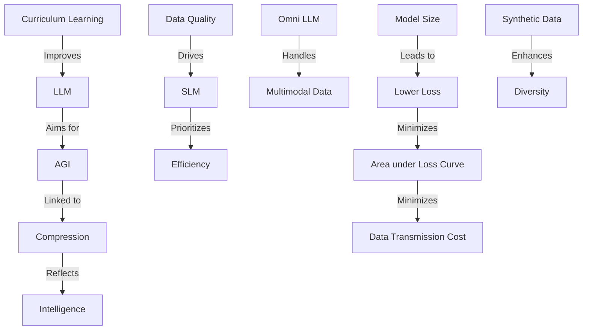

# 技术分享：语言模型与 AGI 的压缩与智能关系

## 摘要
本文探讨了语言模型（LLMs、SLMs、Omni LLMs）与通用人工智能（AGI）之间的技术关系，重点分析压缩、损失、模型训练和数据处理如何驱动智能的提升。我们从信息熵、数据传输、算术编码、Curriculum Learning 等核心概念入手，深入探讨其在优化模型性能和实现 AGI 目标中的作用，并引入 NormHead 和 Tie Embedding 等高级技术。文档提供理论基础、实现细节和应用场景，适合 AI 研究人员、工程师和学生参考。

---

## 1. 介绍

在人工智能领域，语言模型（Large Language Models, LLMs）和通用人工智能（Artificial General Intelligence, AGI）的研究正推动技术边界扩展。压缩作为连接模型性能和智能的关键技术，能够减少数据表示和传输的成本，同时反映模型对数据模式和规律的理解能力。本文基于一系列技术问题的讨论，系统总结以下核心主题：

- 信息熵与数据压缩的基础（基线传输和算术编码）。
- 压缩与 AGI 智能的因果关系，包括损失曲线和模型训练。
- 训练优化策略（如 Curriculum Learning）和嵌入技术（如 NormHead、Tie Embedding）。
- 语言模型（LLMs、SLMs、Omni LLMs）与合成数据、评估基准的关系。

本文采用科学方法，结合理论、数学公式和实践示例，旨在为开发者提供可操作的见解。

---

## 2. 核心概念与技术

### 2.1 信息熵与压缩基础

#### 2.1.1 信息熵 \(H(X)\)
信息熵是衡量离散随机变量 \(X\) 不确定性的指标，公式为：

$$
\[
H(X) = -\sum_{x \in X} P(x) \log P(x)
\]
$$


- \(P(x)\) 是 \(X\) 取值 \(x\) 的概率，单位通常为比特（以 2 为底）。
- 均匀分布（如 256 个等可能字节）熵最大，为 8 比特；非均匀分布熵降低，可实现压缩。

#### 2.1.2 基线传输方法
基线传输假设 256 个字节值（0-255）均匀分布，每个值用 8 比特表示。传输成本为：

$$
\[
S_0 = |f_0| + n \log 256 = |f_0| + 8n
\]
$$
其中 \(|f_0|\) 是编码方法长度，\(n\) 是数据点数。此方法简单但效率低，未利用分布不均匀性。

#### 2.1.3 算术编码
算术编码利用概率分布压缩数据，映射到 [0, 1) 区间。示例：\(x_{t+1}\) 有值 0-3，概率分别为 0.2、0.25、0.22、0.175，编码 \(x_{t+1} = 3\) 为 \(z_{t+1} = 101\)（3 比特），远少于 8 比特。解码通过二分搜索恢复原值，实现无损压缩。

---

### 2.2 压缩与 AGI 智能

#### 2.2.1 压缩与智能的关系
压缩能力反映智能：高效压缩表明模型能发现数据模式。GPT 训练本质上是数据集 \(D\) 的无损压缩，损失曲线下的面积（\(\sum -\log P(x_{t+1} | x_{1:t}, f)\)) 直接影响传输成本：

$$
\[
S_1 = |f_1| + \sum |z_{t+1}| \leq |f_1| + n + \sum -\log P(x_{t+1} | x_{1:t}, f_1)
\]
$$
最小化损失等价于优化压缩。

#### 2.2.2 模型大小、损失和压缩
- 模型越大，损失越低，压缩率越高。
- 例如，LLaMA3-1.70B 较 Compass MoE W56A22 在逻辑推理上表现更好，但后者在东南亚语言生成上优异。

---

### 2.3 训练优化：Curriculum Learning

Curriculum Learning 按难度排序训练数据，从简单到复杂。例如，LLM 训练可先用短句，后用长段落。优点：
- 加速学习，降低训练时间。
- 提高泛化能力，防止过拟合。
挑战：难度定义复杂，动态调整增加计算成本。

---

### 2.4 嵌入技术：NormHead 与 Tie Embedding

#### 2.4.1 NormHead
NormHead 可能指输出层结合规范化的技术（如 L2 归一化），限制嵌入向量的范数，稳定训练并支持压缩。例如：

```python
import torch
import torch.nn as nn

class NormHead(nn.Module):
    def __init__(self, embed_dim, vocab_size, max_norm=1.0):
        super().__init__()
        self.linear = nn.Linear(embed_dim, vocab_size)
        self.max_norm = max_norm
    
    def forward(self, x):
        x = self.linear(x)
        # 规范化嵌入向量
        norm = x.norm(dim=-1, keepdim=True)
        x = x / norm.clamp(min=self.max_norm)
        return x
```

#### 2.4.2 Tie Embedding
Tie Embedding 绑定输入和输出嵌入权重，减少参数量。例如：

```python
class TiedEmbeddingModel(nn.Module):
    def __init__(self, vocab_size, embed_dim):
        super().__init__()
        self.embedding = nn.Embedding(vocab_size, embed_dim)
        # 绑定权重
        self.output_layer = nn.Linear(embed_dim, vocab_size, bias=False)
        self.output_layer.weight = self.embedding.weight
    
    def forward(self, x):
        embed = self.embedding(x)
        output = self.output_layer(embed)
        return output
```

Tie Embedding 降低模型大小，提升压缩率，与 AGI 智能相关。

---

## 3. 模型分类与比较

### 3.1 LLMs、SLMs 与 Omni LLMs
- **LLM**：大语言模型，基础 AI 任务，支持 AGI 目标。
- **SLM**：小语言模型，资源高效，适合小型组织和设备。
- **Omni LLM**：多模态 LLM，处理文本、音频、视觉数据。

比较：
- LLM 追求 AGI，SLM 注重效率。
- Omni LLM 扩展模态，超越文本 LLM。
- SLM 更易微调，成本低。

---

## 4. 数据与评估

### 4.1 合成数据
合成数据通过生成、整理、评估增强训练数据多样性，提升 LLM 推理能力。挑战：质量控制和偏见风险。

### 4.2 评估基准
使用基准（如 MMLU、GLUE）评估 LLMs、SLMs 和 Omni 模型。多模态评估基准不足。

### 4.3 数据质量
高质量数据集（如过滤后数据）推动 SLM 进步，模型过滤技术（如 Model-based Filtering）优化数据。

---

## 5. 关系图

使用 Mermaid 语法展示关系：



---

## 6. 实现与实践

### 6.1 算术编码实现
```python
def arithmetic_encode(value, probabilities, precision=10):
    low, high = 0, 1
    for v, p in enumerate(probabilities):
        if v == value:
            break
        low += p
        high = low + p
    # 二分搜索模拟
    code = ""
    while precision > 0:
        mid = (low + high) / 2
        if mid > low:
            code += "1"
            low = mid
        else:
            code += "0"
            high = mid
        precision -= 1
    return code
```

### 6.2 Curriculum Learning 实现
```python
class CurriculumDataset:
    def __init__(self, data, difficulty):
        self.data = sorted(data, key=difficulty)  # 按难度排序
    
    def get_batch(self, step, batch_size):
        # 初期用简单数据，逐步增加难度
        max_idx = min(int(step * 0.1 * len(self.data)), len(self.data))
        return self.data[:max_idx][:batch_size]
```

---

## 7. 结论

压缩、损失和智能在语言模型和 AGI 研究中紧密相连。信息熵、算术编码、Curriculum Learning 和嵌入技术（如 NormHead、Tie Embedding）优化模型性能，推动 AGI 发展。未来研究应聚焦多模态评估、合成数据质量和高效训练策略。

---

## 8. 参考资料
- Shannon, C. E. (1948). "A Mathematical Theory of Communication."
- Press, O., & Wolf, L. (2016). "Using the Output Embedding to Improve Language Models."
- Related Google AI Research on LLMs and Compression.
