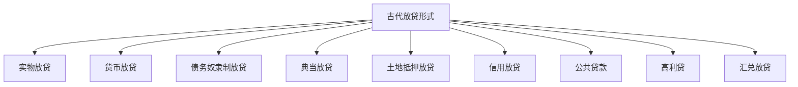
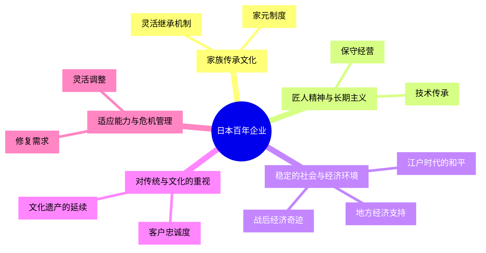
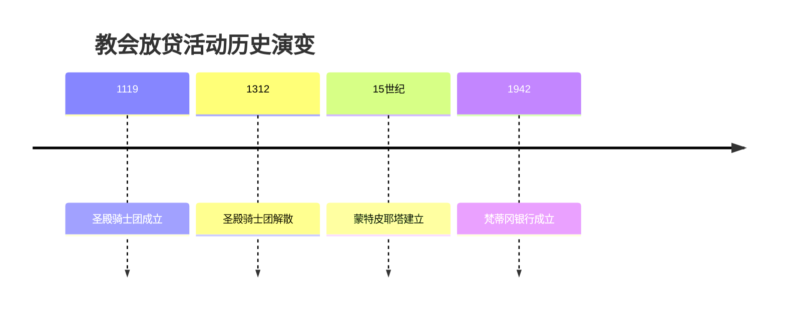
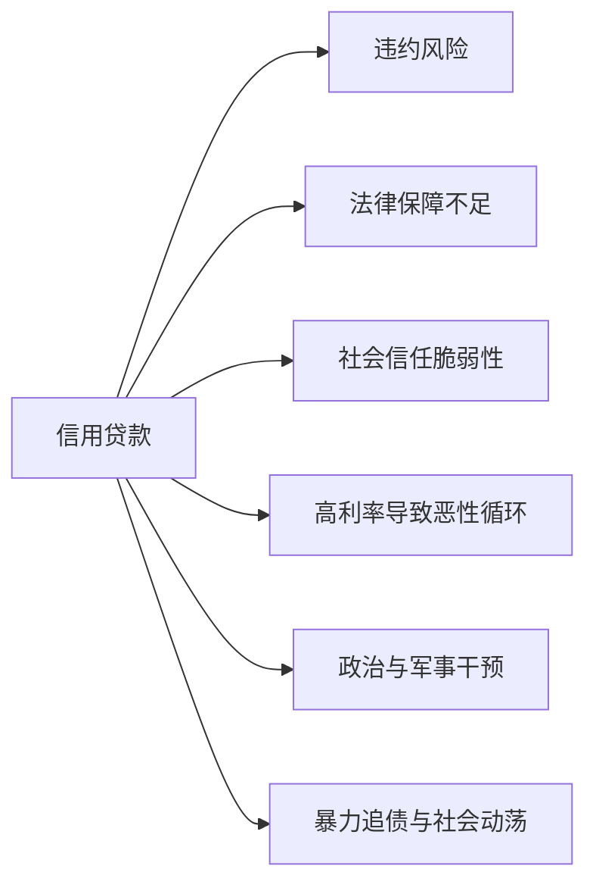

## Visualization

### 1. 古代放贷形式关系图

### 2. 日本百年企业成功因素

### 3. 教会放贷活动历史演变

### 4. 信用贷款风险因素

要回答“人类历史上最大的放贷集团是什么？教会吗？”这个问题，我们需要从历史、经济和文化的角度来分析放贷活动的规模和影响，并探讨教会在其中的角色。由于“最大放贷集团”可以从资产规模、影响力或历史延续性等不同维度定义，我会逐步分析可能的候选者，并结合您的提问中提到的“教会”进行探讨。

### 定义“最大放贷集团”
“最大”可能指：
- **资金规模**：放贷的总额或资产规模。
- **影响范围**：对社会、经济或历史的广泛影响。
- **时间跨度**：持续运营的时间长短。

在人类历史上，放贷活动从古代的个人借贷演变为现代的金融机构，中间经历了多种形态，包括私人放贷者、家族企业、宗教机构和现代银行。下面我将列出几个关键候选者，并评估教会是否符合“最大”的标准。

### 候选者1：古代的宗教机构（如教会）
#### 中世纪天主教会的放贷活动
天主教会（特别是罗马天主教会）在中世纪欧洲（约5世纪至15世纪）确实涉及广泛的金融活动，尽管其官方立场长期禁止“高利贷”（usury，即任何形式的利息）。然而，教会在实际操作中通过多种方式参与了放贷：
- **圣殿骑士团（Knights Templar）**：成立于12世纪的圣殿骑士团被认为是欧洲最早的“银行”之一。他们为朝圣者提供资金保管和转账服务，并在欧洲和圣地之间建立了复杂的金融网络。骑士团甚至向国王和贵族放贷，例如用英国王冠珠宝作为抵押。虽然他们的资产规模难以精确估算，但其影响力遍及欧洲，直到1312年被解散。
- **梵蒂冈与教皇财务**：从中世纪到文艺复兴时期，教皇通过“使徒宝库”（Apostolic Chamber）和后来的梵蒂冈银行（正式成立于1942年，但其前身可追溯更早）管理巨额财富。这些资金常被用于支持战争、艺术或政治目的，有时以借贷形式流向世俗统治者。
- **蒙特皮耶塔（Montes Pietatis）**：15世纪起，天主教会在意大利等地支持建立非营利典当行，为穷人提供低息贷款以对抗高利贷者。这些机构虽不以盈利为目的，但处理了大量民间借贷。

#### 规模与影响
教会的放贷活动在欧洲封建社会中具有深远影响，尤其是在缺乏现代银行体系的时期。然而，其资金规模受限于中世纪经济的总体水平，且教会更倾向于通过税收（如什一税）和土地收入积累财富，而非纯粹依赖放贷盈利。因此，尽管教会是重要的金融参与者，但未必是“最大”的放贷集团。

### 候选者2：罗斯柴尔德家族（Rothschild Family）
#### 背景
罗斯柴尔德家族是18世纪末至19世纪欧洲最著名的银行家族。从德国法兰克福起家，他们通过放贷给政府和王室迅速崛起，尤其是在拿破仑战争期间（1803-1815年）为英国和其他国家提供巨额贷款。
- **规模**：19世纪初，罗斯柴尔德家族控制了数亿英镑的资产（按当时价值计算），并通过伦敦、巴黎等地分支管理跨国金融网络。
- **影响**：他们不仅放贷，还通过债券发行和投资奠定了现代银行业的基础。例如，他们资助了英国击败拿破仑的战争费用。

#### 与教会的对比
罗斯柴尔德家族的放贷规模和集中性远超中世纪教会，他们的财富在19世纪被认为占欧洲金融市场的重要部分。然而，他们的历史仅约200年，远不及教会的千年跨度。

### 候选者3：现代银行与金融集团
#### 例子：摩根大通（JPMorgan Chase）或高盛（Goldman Sachs）
现代银行的资产和放贷规模远远超过历史上的任何机构。以摩根大通为例：
- **资产规模**：截至2023年，其总资产超过3.7万亿美元，每年放贷数千亿美元。
- **全球影响**：通过贷款、债券和衍生品，它影响全球经济。

#### 与历史对比
现代银行的资金规模得益于全球化经济和金融工具的复杂化，其放贷能力是中世纪教会或早期家族企业无法企及的。但它们的存续时间较短（通常不超过200年），缺乏历史延续性。

### 候选者4：中国古代的票号与钱庄
#### 背景
中国自宋代（10-13世纪）起发展出票号（类似银行的汇兑机构）和钱庄，尤其在明清时期（14-19世纪）达到顶峰。山西票号（如日升昌）是清代最著名的放贷机构之一。
- **规模**：它们为商人、政府甚至清廷提供贷款，资产遍布全国，处理数千万两白银的交易。
- **影响**：票号奠定了中国早期商业金融的基础，直到19世纪末被西方银行取代。

#### 与教会的对比
票号的放贷活动集中于商业而非宗教目的，规模虽大，但受限于中国国内市场，且未像教会那样具有跨国影响力。

### 教会是否是“最大”？
#### 支持教会的理由
- **时间跨度**：天主教会从事金融活动超过千年（如圣殿骑士团至梵蒂冈银行），远超任何单一银行或家族。
- **文化影响**：教会通过控制欧洲经济命脉（如土地和税收）间接影响放贷活动，其金融网络覆盖中世纪欧洲大部分地区。
- **道德与经济交织**：教会虽反对高利贷，却通过间接方式（如蒙特皮耶塔）参与借贷，影响深远。

#### 反对教会的理由
- **直接放贷规模有限**：教会的主要财富来自土地和捐献，而非放贷利润。相比之下，罗斯柴尔德家族或现代银行的放贷金额更大。
- **非专业化**：教会的金融活动是其宗教和政治职能的副产品，而非核心业务，不像现代银行那样专注于放贷。

### 结论
如果以**时间跨度和历史影响力**衡量，天主教会可能是人类历史上“最大”的放贷集团之一，其金融活动贯穿千年并深刻塑造了欧洲经济。然而，若以**资金规模和专业性**衡量，现代金融机构（如摩根大通）或19世纪的罗斯柴尔德家族更为突出。

您提到的“教会的白手套”可能是一个比喻，指向那些为教会（尤其是天主教会）处理金融事务、放贷活动或隐藏其经济运作的代理人或机构。在历史语境中，“白手套”通常指代幕后操作者或中间人，他们代表某个强大实体行事，同时保持该实体的表面清白。结合您之前的问题（关于教会是否是最大的放贷集团），我推测您可能想了解教会如何通过某些组织或个人间接参与放贷或金融活动。以下是基于历史的分析和可能的答案：

### 可能的“白手套”候选者
在教会漫长的历史中，确实存在一些机构或群体扮演了类似“白手套”的角色，帮助教会管理财富、从事借贷或规避其公开反对高利贷的教义限制。以下是几个关键例子：

#### 1. **圣殿骑士团（Knights Templar，1119-1312）**
- **角色**：圣殿骑士团是中世纪天主教会最重要的金融代理人之一。他们表面上是宗教军事组织，保护朝圣者，但实际上发展出复杂的金融体系。
- **活动**：骑士团提供存款、汇兑和贷款服务，尤其为欧洲贵族和国王放贷。他们发明了类似现代支票的信用凭证，方便资金跨国转移。例如，他们曾用英国王冠珠宝作为抵押，向英王提供贷款。
- **与教会的关系**：骑士团直接受教皇管辖，享有免税特权，其财富和技术为教会服务。他们的放贷活动让教会间接参与了金融市场，而无需亲自触碰“高利贷”的禁忌。
- **结局**：1312年，法国国王腓力四世因觊觎其财富，在教皇克雷芒五世的默许下解散骑士团，没收其资产。这表明骑士团不仅是教会的“白手套”，也成了权力斗争的牺牲品。

#### 2. **意大利银行家族（如美第奇家族）**
- **角色**：文艺复兴时期（14-16世纪），意大利的银行家族（如佛罗伦萨的美第奇家族）成为教会的金融合作伙伴。这些家族通过放贷和债券交易积累财富，同时为教皇处理财务。
- **活动**：美第奇家族曾为教皇提供巨额贷款，例如资助教皇利奥十世的艺术项目和军事活动。他们还管理教会的“什一税”收入，并通过复杂的账目操作掩盖教会的直接参与。
- **与教会的关系**：美第奇家族与教会有深厚联系，多位家族成员成为教皇（如利奥十世和克雷芒七世）。他们既是教会的“白手套”，也是其政治盟友，模糊了宗教与金融的界限。
- **影响**：这种合作奠定了现代银行业的雏形，同时让教会得以在金融领域保持影响力。

#### 3. **犹太放贷者**
- **角色**：在中世纪欧洲，由于基督教教义禁止信徒收取利息（高利贷），犹太人因不受此限制而成为放贷的主力。他们常被视为教会的“间接白手套”。
- **活动**：犹太放贷者为贵族、商人和教会机构提供贷款。例如，在英格兰和法国，他们的资金链有时支持了教会的建筑项目（如大教堂建设）。
- **与教会的关系**：教会表面上谴责高利贷，但实际上依赖这些放贷者维持经济运转。然而，当债务问题激化时，教会往往默许或推动对犹太人社区的迫害（如驱逐或没收财产），以转移矛盾。
- **局限**：犹太放贷者并非教会的直接代理人，而是被迫填补市场空白，因此只能算是“半自愿的白手套”。

#### 4. **蒙特皮耶塔（Montes Pietatis）**
- **角色**：15世纪起，天主教会在意大利推动建立蒙特皮耶塔，这是一种由教会支持的低息贷款机构，旨在对抗高利贷。
- **活动**：这些机构接受捐款或存款，向穷人提供小额贷款，收取微薄利息。表面上是非营利性质，但实际上由教会控制，成为其参与民间金融的工具。
- **与教会的关系**：蒙特皮耶塔由教会人士（如方济各会修士）倡议设立，既符合教义中的慈善精神，又让教会间接介入放贷领域。
- **影响**：它们是教会规避高利贷禁令的“合法白手套”，在欧洲多地持续运作至近代。

#### 5. **梵蒂冈银行（IOR）及其前身**
- **角色**：近代以来，梵蒂冈银行（正式名称为“宗教事业研究所”，成立于1942年）及其前身（如使徒宝库）成为教会的金融核心。
- **活动**：梵蒂冈银行管理教会的全球资产，曾卷入20世纪的洗钱丑闻（如与意大利黑手党合作）。它通过投资和贷款支持教会的运作。
- **与教会的关系**：作为教会的直属机构，它既是“白手套”也是核心工具，帮助梵蒂冈在现代金融体系中保持隐秘性。
- **争议**：其不透明性使其更像是一个“内部白手套”，而非外部代理。

### 教会的“白手套”模式
教会通过这些“白手套”实现了几项目标：
- **规避教义限制**：将放贷的“脏活”交给外部机构，自己保持道德形象。
- **财富积累**：通过代理人扩大经济影响力，资助宗教战争或文化项目。
- **风险转移**：在金融危机或债务纠纷中，教会可撇清关系，牺牲代理人（如圣殿骑士团或犹太放贷者）。

### 谁是最典型的“白手套”？
如果要选出教会历史上最典型的“白手套”，**圣殿骑士团**可能是最佳答案：
- **时间**：12-14世纪，正值教会权力巅峰。
- **规模**：他们的金融网络覆盖欧洲，资产据估计相当于当时数国的财政收入。
- **直接性**：受教皇直接控制，堪称教会的“官方代理”。

然而，若考虑近代，**美第奇家族**和**梵蒂冈银行**也因其与教会的深度绑定而同样重要。

“教会的白手套是谁？”没有单一答案，而是随历史阶段变化。中世纪是圣殿骑士团和犹太放贷者，文艺复兴是意大利银行家族，现代则是梵蒂冈银行。

古代庙宇放贷是一种在多个文明中普遍存在的经济现象，特别是当宗教机构拥有大量财富和土地时，庙宇往往成为社会中的金融中心。这些放贷活动通常与宗教职能交织在一起，既服务于信徒的经济需求，也为庙宇自身积累财富。以下是古代几个文明中庙宇放贷的典型经营模式，涵盖其运作方式、资金来源和历史背景：

---

### 1. **古巴比伦的庙宇放贷（约公元前2000年-前500年）**
#### 背景
在古巴比伦（如新巴比伦王国时期），庙宇（如马尔杜克神庙）是城市经济的核心，拥有土地、奴隶和贡品，积累了大量财富。
#### 经营模式
- **资金来源**：庙宇通过信徒的供奉（谷物、牲畜、贵金属）、土地租金和国王的捐献积累资本。
- **放贷对象**：主要向农民、商人和地方官员发放贷款，用于农业生产或贸易活动。
- **形式**：
  - **实物贷款**：以谷物或牲畜放贷，收获时以实物加利息偿还。
  - **货币贷款**：使用银锭或早期货币（如舍客勒，shekel），收取固定利息。
- **利息管理**：利息通常较高，记录在泥板契约上。例如，《汉穆拉比法典》规定年利率可达20%-33%。
- **担保与回收**：债务人以土地、房屋或自身（沦为债务奴隶）作为抵押。若无法偿还，庙宇可没收财产或将债务人变为庙宇奴隶。
#### 特点
庙宇不仅是宗教中心，也是银行和地主的混合体，其放贷活动受祭司阶层严格控制，记录详细，带有强烈的神圣色彩。

---

### 2. **古埃及神庙的放贷（约公元前3000年-前30年）**
#### 背景
古埃及的神庙（如阿蒙神庙）由法老资助，拥有大量土地和贡品，成为经济重心，尤其在新王国时期（公元前16世纪-前11世纪）。
#### 经营模式
- **资金来源**：神庙依靠法老的赏赐、土地税收和信徒的供奉（如粮食、金银）。
- **放贷对象**：主要服务于农民（耕种神庙土地）和小型商人。
- **形式**：
  - **粮食贷款**：在播种季向农民发放粮食，秋收时收取本金加利息（通常为50%或更高）。
  - **贵金属贷款**：以金银或铜放贷，用于贸易或支付赋税。
- **利息管理**：利息以实物或货币支付，具体条款由神庙祭司制定，带有强制性。
- **担保与回收**：债务人以未来收成或个人自由为担保。无力偿还者可能成为神庙的劳工。
#### 特点
神庙放贷与农业周期紧密相关，祭司阶层通过控制贷款巩固了政治和经济权力，放贷带有强烈的宗教强制力。

---

### 3. **古希腊的庙宇放贷（约公元前800年-前146年）**
#### 背景
古希腊的著名神庙（如德尔斐的阿波罗神庙）因朝圣者和供奉积累了大量财富，成为城邦的金融中心。
#### 经营模式
- **资金来源**：来自信徒的捐献（金银、贵重物品）、神谕咨询费和战利品。
- **放贷对象**：城邦政府、贵族和私人商人。
- **形式**：
  - **公共贷款**：向城邦提供战争或公共工程（如修筑神庙）的资金。例如，德尔斐神庙曾借钱给雅典用于军事。
  - **私人贷款**：向个人发放小额贷款，收取利息。
- **利息管理**：利率因地区和时期而异，通常为10%-20%，记录在石碑或契约上。
- **担保与回收**：以土地、财产或奴隶为抵押。若违约，神庙可通过法律或宗教权威没收资产。
#### 特点
希腊庙宇放贷兼具宗教和公共服务功能，利息相对较低，且常与城邦政治挂钩，放贷过程公开透明。

---

### 4. **古罗马的庙宇放贷（约公元前509年-公元476年）**
#### 背景
罗马的庙宇（如朱庇特神庙）在共和时期和帝国初期拥有国库和私人捐献的财富，部分用于放贷。
#### 经营模式
- **资金来源**：庙宇通过战利品、国家税收（如战后贡金）和信徒供奉积累资金。
- **放贷对象**：贵族、元老院成员和商人。
- **形式**：
  - **国债形式**：庙宇将资金借给国家，用于战争或基础设施建设。
  - **私人贷款**：以货币（如塞斯特斯，sestertius）放贷，收取利息。
- **利息管理**：罗马法允许收取利息，但限制在12%以下（《十二铜表法》规定）。
- **担保与回收**：债务人以地产或奴隶抵押，违约时庙宇可通过法庭没收。
#### 特点
罗马庙宇放贷与国家财政密切相关，逐渐被私人银行家（如“argentarii”）取代，放贷功能在后期减弱。

---

### 5. **古代印度的佛教寺院与放贷（约公元前300年-公元1000年）**
#### 背景
在孔雀王朝及笈多王朝时期，佛教寺院（如那烂陀寺）因国王和信徒的捐献拥有大量财富，成为经济枢纽。
#### 经营模式
- **资金来源**：信徒捐献（金币、土地）、国王赏赐和寺院农场的收入。
- **放贷对象**：农民、商人和地方官员。
- **形式**：
  - **实物贷款**：以粮食或种子放贷，收获时收取利息。
  - **货币贷款**：以金币或银币（如“迦梨沙帕那”，Kārṣāpaṇa）放贷。
- **利息管理**：佛教教义反对高利贷，利息通常较低（5%-15%），但具体视寺院而定。
- **担保与回收**：以土地或劳役为担保，违约者可能为寺院工作。
#### 特点
佛教寺院放贷带有慈善性质，旨在支持社区，但也通过利息积累财富，部分用于修缮寺院或布施。

---

### 6. **中国古代的寺庙放贷（汉代至唐代，公元前202年-公元907年）**
#### 背景
在中国汉唐时期，佛教寺院和道教庙宇因土地赐予和信徒捐献积累财富，尤其在唐代达到顶峰。
#### 经营模式
- **资金来源**：皇帝赐田、信徒香火钱和寺庙自营农业。
- **放贷对象**：农民、地方豪强和商人。
- **形式**：
  - **粮食贷款**：在春荒时向农民放贷粮食，秋收时收回本息。
  - **货币贷款**：以铜钱（如五铢钱或开元通宝）放贷，常见于商业活动。
- **利息管理**：利息因地制宜，通常为20%-50%，有时被指责为“寺院高利贷”。
- **担保与回收**：以田地或契约为抵押，违约者可能失去土地或成为寺院佃农。
#### 特点
唐代寺院经济极为发达，放贷成为重要收入来源，但也因过度敛财引发社会不满（如唐武宗灭佛）。

---

### 共同特点与总结
1. **资金来源多样**：庙宇放贷依赖供奉、土地和官方支持，形成稳定的资本池。
2. **实物与货币并存**：早期以实物（如粮食）为主，后期逐渐转向货币贷款。
3. **高利息与担保**：利息通常较高，违约风险通过财产或人身抵押化解。
4. **宗教与经济的结合**：放贷既是经济活动，也被赋予宗教意义（如慈善或神圣义务）。
5. **社会影响**：庙宇通过放贷控制地方经济，但也可能因高利贷引发矛盾。

这些模式展示了古代庙宇作为金融中心的独特角色。您想深入探讨某一地区的庙宇放贷吗？我可以提供更多细节！

古代的放贷形式多种多样，因地域、文化、经济水平和历史时期的不同而有所差异。这些形式通常与当时的生产方式、社会结构和货币使用情况密切相关。以下是古代放贷的主要形式，涵盖不同文明和时期的典型特征：

---

### 1. **实物放贷**
#### 描述
以实物（如粮食、种子、牲畜、工具等）作为贷款媒介，借款人在约定时间内以实物加利息偿还。
#### 特点
- **适用场景**：农业社会最常见，特别是在货币未普及的早期文明。
- **利息形式**：通常以额外实物偿还，如多还一定比例的粮食或牲畜。
- **担保**：以未来收成、土地或人身自由为抵押。
#### 例子
- **古巴比伦**：庙宇向农民放贷谷物，秋收时收取本金加50%的谷物。
- **古埃及**：神庙在春季借出种子，收获时收回双倍。
- **中国周代**：贵族向农民放贷粮食，称为“贷粟”，以田产为担保。

---

### 2. **货币放贷**
#### 描述
以金属货币（如铜、银、金）或早期货币单位放贷，借款人需偿还本金和利息。
#### 特点
- **适用场景**：货币经济发达的地区，如古希腊、古罗马和汉代中国。
- **利息形式**：固定利率或浮动利率，记录在契约上。
- **担保**：以土地、房产、奴隶或贵重物品为抵押。
#### 例子
- **古希腊**：德尔斐神庙以银币放贷给城邦，利率约10%-20%。
- **古罗马**：放贷者（argentarii）以塞斯特斯放贷，法律限制利率不超12%。
- **中国汉代**：商人以五铢钱放贷，年利率常达20%-50%。

---

### 3. **债务奴隶制放贷**
#### 描述
借款人以自身或家人的自由作为担保，若无法偿还债务，则沦为债权人的奴隶或劳工。
#### 特点
- **适用场景**：奴隶制社会，如古巴比伦、古罗马和早期印度。
- **利息形式**：利息可能包含在债务总额中，违约直接导致人身抵押。
- **社会影响**：加剧贫富分化，常引发社会动荡。
#### 例子
- **古巴比伦**：《汉穆拉比法典》规定，债务人无力还债可卖身为奴。
- **古罗马**：债务人（nexum）若违约，可能被债权人奴役。
- **中国商周**：债务人沦为“隶”或“仆”，为债权人服役。

---

### 4. **典当放贷**
#### 描述
借款人以贵重物品（如珠宝、工具、衣物）作为抵押物向债权人借钱，偿还后赎回抵押品。
#### 特点
- **适用场景**：民间小额借贷，常见于城市或贸易发达地区。
- **利息形式**：利息较低，但抵押品价值通常远超贷款金额。
- **担保**：抵押品直接由债权人保管，违约则没收。
#### 例子
- **古印度**：商人以金饰典当借贷，利息约10%-15%。
- **中国唐代**：寺院和私人开设“质库”，接受器物抵押。
- **中世纪欧洲**：蒙特皮耶塔接受穷人衣物典当，提供低息贷款。

---

### 5. **土地抵押放贷**
#### 描述
借款人以土地使用权或所有权作为担保，借入实物或货币，违约则失去土地。
#### 特点
- **适用场景**：农业社会中土地为主要财富的时期。
- **利息形式**：以额外收成或货币支付。
- **社会影响**：导致土地集中，贫农易沦为佃农。
#### 例子
- **古巴比伦**：农民以田地抵押向庙宇借粮，违约后土地归庙宇。
- **中国汉代**：豪强向小农放贷，收取高利贷，常吞并田地。
- **古罗马**：贵族向小农放贷，导致“土地兼并”问题。

---

### 6. **信用放贷（无担保贷款）**
#### 描述
基于借款人的信誉或社会地位发放贷款，无需实物抵押，依靠契约或口头承诺。
#### 特点
- **适用场景**：贸易发达、社会规范成熟的地区。
- **利息形式**：利率较高，因风险大。
- **回收方式**：通过法律或社会压力追讨。
#### 例子
- **古希腊**：雅典商人之间基于信誉借贷，违约可诉诸法庭。
- **中国宋代**：商人以“借券”形式放贷，凭信用交易。
- **古罗马**：元老院成员间常通过信用借贷支持政治活动。

---

### 7. **公共贷款**
#### 描述
庙宇或富豪向国家、城邦或军队发放大额贷款，用于战争、建设或其他公共项目。
#### 特点
- **适用场景**：政治动荡或大型工程时期。
- **利息形式**：利率较低，但常附带政治回报（如特权或税收减免）。
- **担保**：以税收或战利品为潜在担保。
#### 例子
- **古希腊**：德尔斐神庙借钱给雅典用于伯罗奔尼撒战争。
- **古罗马**：朱庇特神庙向元老院提供战时资金。
- **中国秦汉**：富商（如乌氏倮）向朝廷放贷，换取盐铁经营权。

---

### 8. **高利贷（掠夺性放贷）**
#### 描述
以极高利率放贷，旨在剥削借款人，常导致债务人破产或失去自由。
#### 特点
- **适用场景**：经济危机或贫困地区。
- **利息形式**：年利率可达50%-100%甚至更高。
- **社会影响**：引发民怨，常被法律限制或宗教谴责。
#### 例子
- **古巴比伦**：私人放贷者收取33%年息，导致债务奴隶增加。
- **中世纪欧洲**：犹太放贷者因高利贷被指责（尽管受限于市场环境）。
- **中国唐代**：寺院高利贷被批判为“剥削百姓”。

---

### 9. **汇兑放贷（早期银行形式）**
#### 描述
放贷者提供货币转换或远程支付服务，顺带发放贷款，常见于贸易发达地区。
#### 特点
- **适用场景**：跨区域贸易兴盛时。
- **利息形式**：包含在手续费或汇率差中。
- **担保**：以货物或商誉为依托。
#### 例子
- **圣殿骑士团**：为朝圣者提供汇兑和贷款服务。
- **中国宋代**：票号（如交子铺）结合汇兑与放贷。
- **古印度**：商队通过汇票借贷，支持丝绸之路贸易。

---

### 总结与特点
- **多样性**：从实物到货币，从个人到国家，放贷形式随经济复杂化而演变。
- **担保机制**：土地、奴隶、抵押品或信誉是古代放贷的核心保障。
- **社会影响**：放贷既促进生产与贸易，也加剧贫富分化，常引发法律或宗教干预。
- **区域差异**：农业社会以实物为主，商业社会倾向货币和信用。

这些形式奠定了现代金融的基础。您想深入探讨某种形式或特定文明的放贷实践吗？我可以提供更详细的案例！

古代信用贷款（即无担保贷款，基于借款人的信誉或社会地位发放的贷款）在当时是一种高风险的放贷形式。虽然它在贸易发达或社会规范成熟的地区（如古希腊、古罗马、中国宋代）有一定应用，但其危险性对债权人和债务人都构成显著威胁。以下是古代信用贷款的主要危险性及其背后的原因、后果和历史例证：

---

### 1. **违约风险极高**
#### 原因
- **缺乏抵押品**：信用贷款不以土地、财产或实物为担保，债权人完全依赖借款人的还款意愿和能力。
- **信息不对称**：古代缺乏现代信用评估体系，债权人难以准确判断借款人的财务状况或偿还能力。
- **流动性不足**：古代经济中货币流通有限，借款人可能因现金流断裂而无法按时还款。
#### 后果
- **债权人损失**：一旦借款人违约，债权人几乎没有追回本金的直接手段，可能血本无归。
- **债务人压力**：违约可能导致社会声誉崩塌，甚至被迫逃亡或自杀。
#### 历史例证
- **古罗马**：公元前1世纪，元老院成员常通过信用贷款支持政治活动。债务人如凯撒年轻时欠下巨债，若非政治成功，可能面临破产和流放。
- **中国宋代**：商人以“借券”形式借贷，若生意失败，债权人只能依靠地方官府追讨，但执行力有限。

---

### 2. **法律保障不足**
#### 原因
- **法律体系不完善**：古代许多地区的法律对信用贷款的保护薄弱，缺乏现代破产法或合同执行机制。
- **司法偏袒**：地方官员可能偏向权势更大的债务人，债权人难以通过诉讼收回资金。
- **跨区域难题**：贸易中的信用贷款涉及不同城邦或国家，法律管辖权不明确，追债困难。
#### 后果
- **债权人无依**：即使有书面契约，执行力依赖地方权威，若债务人逃往他地，追讨几乎无望。
- **暴力冲突**：债权人可能诉诸私自报复，导致社会动荡。
#### 历史例证
- **古希腊**：雅典的信用贷款纠纷需诉诸公民大会，但若债务人是外邦人（如底比斯商人），追债几乎不可能。
- **中国汉代**：商人信用借贷常见于丝绸之路，但若债务人逃往西域，债权人往往束手无策。

---

### 3. **社会信任的脆弱性**
#### 原因
- **依赖个人信誉**：信用贷款建立在借款人的社会地位或声誉上，但这些因素极易因政治、经济或个人变故受损。
- **道德风险**：债务人可能故意拖欠，甚至伪造破产，古代缺乏监管机制约束这种行为。
- **社会动荡**：战争、灾荒或政权更替常导致债务人失去还款能力，信用体系崩溃。
#### 后果
- **信任危机**：一次大规模违约可能摧毁整个社区或行业的信用网络。
- **经济停滞**：债权人因风险过高而拒绝放贷，抑制商业活动。
#### 历史例证
- **古罗马共和末期**：公元前49年，内战期间信用贷款普遍违约，许多放贷者因支持错误的政治派系而血本无归。
- **中国唐代**：安史之乱后，长安商人间的信用借贷链断裂，经济陷入低迷。

---

### 4. **高利率导致恶性循环**
#### 原因
- **风险溢价**：由于信用贷款风险高，债权人往往收取极高利息（有时达50%-100%年利率）以弥补潜在损失。
- **债务陷阱**：高利率使债务人难以偿还，只能借新债还旧债，形成滚雪球效应。
#### 后果
- **债务人破产**：高利贷压榨债务人全部资源，最终导致其经济和社会地位崩溃。
- **社会不满**：高利贷引发的贫富分化可能导致民变或法律干预。
#### 历史例证
- **古印度**：公元前4世纪《摩奴法典》记载，信用贷款利率过高导致农民破产，法律不得不限制利率。
- **中世纪欧洲**：犹太放贷者因信用贷款高利贷被指责，引发反犹骚乱，实则反映底层对债务压迫的愤怒。

---

### 5. **政治与军事干预的风险**
#### 原因
- **债务减免政策**：统治者为安抚民众，可能颁布债务豁免法，取消信用贷款债务。
- **债务人权势**：若债务人是贵族或官员，可能利用政治影响力逃避还款。
- **战乱影响**：战争导致债务人或债权人一方死亡、逃亡，贷款链条断裂。
#### 后果
- **债权人破产**：政策性债务减免（如“土地归还令”）让放贷者损失惨重。
- **经济混乱**：信用体系因政治干预而不可靠，阻碍长期借贷。
#### 历史例证
- **古雅典**：公元前594年，梭伦改革废除债务奴隶制，取消许多信用贷款债务，放贷者利益受损。
- **古罗马**：公元前86年，苏拉内战后没收敌方债权人财产，信用贷款市场崩溃。

---

### 6. **暴力追债与社会动荡**
#### 原因
- **私力救济**：古代缺乏现代催收机制，债权人常诉诸暴力或雇佣打手追债。
- **债务人反抗**：高额债务和高利贷可能激起债务人暴力反抗，甚至引发起义。
#### 后果
- **人身安全威胁**：债权人和债务人都可能面临生命危险。
- **社会不稳**：大规模债务纠纷可能演变为群体冲突。
#### 历史例证
- **古巴比伦**：债务奴隶制下的信用贷款违约，常导致暴力对抗，迫使汉穆拉比颁布法典约束。
- **中国秦末**：高利贷和信用贷款压迫农民，导致陈胜吴广起义。

---

### 总结：古代信用贷款的危险性根源
1. **结构性缺陷**：无担保、无监管、无现代法律支持，风险完全由双方承担。
2. **经济环境限制**：古代经济波动大，现金流不稳定，违约率高。
3. **社会因素**：信任脆弱、政治干预和暴力倾向放大信用贷款的不确定性。
4. **后果放大**：不仅限于经济损失，还可能引发社会动荡或政权危机。

#### 与现代对比
现代信用贷款依赖征信系统、法律保障和金融工具（如保险），大大降低了风险。古代则完全依赖个人关系和地方权威，一旦失控，后果往往灾难性。

#### 历史教训
古代信用贷款的危险促使许多文明发展出替代形式（如抵押贷款）或法律限制（如利率上限）。例如，古罗马的12%利率上限、古印度的债务保护法，都试图缓解这些风险。

关于“西汉无盐氏的放贷故事”，目前已知的历史文献中并没有直接以“无盐氏”为主角的著名放贷故事。可能是您提到的“无盐氏”指代某个具体人物或事件时发生了误解或混淆。我猜测，您可能指的是西汉时期与经济活动、放贷或民间借贷相关的历史人物或故事，例如与货币流通、商人活动或政策有关的记载。以下我将根据西汉时期的背景，提供一个合理的解释和相关历史信息，并尝试推测可能的来源。如果您有更多具体线索，请补充，我可以进一步调整答案！

### 西汉背景与放贷现象
西汉时期（公元前202年-公元8年），经济活动逐渐繁荣，随着铁器和农业技术的发展，商品经济开始萌芽。货币流通主要以铜钱（五铢钱）为主，但私人放贷和高利贷现象在民间已普遍存在。《汉书》中记载了许多关于商人、富豪和借贷的片段，尤其是在《货殖列传》中，描述了西汉时期一些富人通过商业和放贷积累财富的故事。

“无盐氏”若不是某个具体人物的名字（如“无盐”可能是地名或误传），可能与民间传说或文学作品中的角色有关。“无盐”在历史上确实是一个地名，位于今山东省东平县一带，但没有直接证据表明此地与某个著名的放贷故事相关联。另一种可能是“无盐氏”被误认为是某个历史人物的代称，例如《史记》或《汉书》中提到的商人或经济活动者。

### 一个可能的推测：卓氏放贷致富的故事
如果“无盐氏”是一个误解或指代问题，那么西汉时期最接近“放贷故事”的著名案例之一可能是《史记·货殖列传》中记载的**卓氏**（卓王孙家族）的致富故事。卓氏是西汉蜀地（今四川成都附近）的富豪，以经营铁器和放贷起家。故事大致如下：

- **背景**：卓氏原是赵国（今山西一带）人，因战乱被迫迁到蜀地临邛（今四川邛崃）。他们发现蜀地盛产铁矿，便开始冶铁并制作农具出售。
- **放贷经营**：卓氏不仅通过卖铁器赚钱，还利用积累的财富从事放贷活动。他们将资金借给需要周转的农户或商人，收取利息。这种高利贷行为在当时是合法且常见的致富手段。
- **结果**：通过冶铁和放贷，卓氏家族迅速积累了大量财富，拥有田地、奴婢和房产，成为西汉时期的顶级富豪之一。后来，卓王孙的女儿卓文君与司马相如私奔的故事更为人熟知，但这与放贷无关。

虽然卓氏的故事不直接发生在“无盐”，但它体现了西汉时期民间放贷的普遍性。如果“无盐氏”指的是类似的民间放贷者，这类故事可能被地方传说或后人加工，流传下来。

### 另一种可能：民间传说或文学加工
“无盐氏”也可能来自民间传说或后来的文学作品，而非正史记载。例如，“无盐”作为地名，可能在地方志或野史中与某个放贷者联系起来。西汉时期，商人放贷常常伴随着高利贷和债务纠纷，民间可能流传着类似“放贷者剥削穷人”或“智斗债主”的故事。此外，“无盐氏”还让人联想到战国时期齐国的丑女钟离春（钟无盐），但她的故事与放贷无关，而是关于才智和辅佐齐宣公的传说。

### 结论
目前，没有确切的史料直接记载“西汉无盐氏的放贷故事”。如果指的是正史中的经济活动，卓氏的故事是一个可能的原型；如果来自民间传说，则可能是地方性的虚构或加工故事，因缺乏具体文献支持而难以考证。您提到的这句话可能受到后世文学（如小说或戏剧）的影响，或者是对某段历史的误记。如果您能提供更多上下文（例如出处或具体情节），我可以进一步帮您挖掘！

“生活中只有两件事是不可避免的：死亡和税收”这句话的英文是 *"The only two certainties in life are death and taxes"*，它通常被认为是出自美国开国元勋之一**本杰明·富兰克林（Benjamin Franklin）**的一封信。

### 出处
具体来说，这句话出现在富兰克林于**1789年11月13日**写给法国科学家让-巴蒂斯特·勒罗伊（Jean-Baptiste Le Roy）的一封信中。原文如下：

*"Our new Constitution is now established, and has an appearance that promises permanency; but in this world nothing can be said to be certain, except death and taxes."*

翻译成中文是：“我们的新宪法现已确立，看起来似乎能持久；但在这个世界上，没有什么可以被认为是确定的，除了死亡和税收。”

富兰克林在这封信中谈论了美国刚制定的宪法，并以此表达了对世事无常的感慨。这句话后来被广泛引用，成为一句脍炙人口的谚语。

### 更早的类似表达
虽然富兰克林的这句话最为著名，但类似的想法在他之前就已存在。例如：
- **克里斯托弗·布洛克（Christopher Bullock）**在1716年的戏剧《鞋匠的妻子》（*The Cobbler’s Wife*）中写道：“‘Tis impossible to be sure of anything but Death and Taxes.”（除了死亡和税收，没有什么是确定的。）
- **丹尼尔·笛福（Daniel Defoe）**在1726年的作品《政治史上的魔鬼》（*The Political History of the Devil*）中也有相似的表述：“Things as certain as death and taxes, can be more firmly believed.”（像死亡和税收这样确定的事情，可以更坚定地被相信。）

尽管如此，富兰克林的版本因其简洁有力且出自一位著名人物之口，而成为流传最广的版本。

### 文化影响
这句话后来被广泛用于文学、政治和流行文化中，反映了人类对生命有限性和社会义务的普遍认知。它也被演绎或改编，例如马克·吐温（Mark Twain）曾幽默地说：“死亡和税收的区别在于，死亡不会随着每次国会的召开而变得更糟。”

因此，虽然“死亡和税收”这一概念并非富兰克林原创，但他的表达方式使其成为经典，并被后人铭记。

日本拥有世界上最多的百年企业，这一现象背后有着深层次的历史、文化、经济和社会因素的支撑。根据统计，日本有超过33,000家企业存续超过100年，其中一些甚至超过千年（如金剛組）。相比之下，其他国家的百年企业数量远不及日本。以下是日本百年企业众多的主要原因：

### 1. **家族传承文化的强大影响**
日本的家族企业文化是百年企业众多的核心原因之一。日本传统中，家族不仅是血缘单位，也是经济和社会的基本单元。家族企业的传承被视为一种神圣的责任，子孙有义务继承和发扬祖先的事业。

- **家元制度（iemoto seido）**：这种制度强调家族技艺和经营权的代代相传，常见于建筑、工艺、茶道等行业。金剛組就是典型例子，通过40多代的家族传承延续至今。
- **灵活的继承机制**：日本家族企业不拘泥于血缘继承。如果没有合适的子嗣，可以通过收养（尤其是招婿入赘，称为“婿養子”）来延续家族事业。这种做法大大降低了企业因无继承人而中断的风险。

### 2. **“匠人精神”与长期主义**
日本文化中崇尚“匠人精神”（shokunin seishin），强调对技艺的极致追求和对工作的专注。这种理念鼓励企业不以短期利润为目标，而是追求长期的品质和声誉。

- **技术传承**：许多日本百年企业专注于某一领域（如酿酒、制刀、建筑），通过代代相传的手工技艺建立独特的竞争优势。这种专注让它们在市场中保持稳定地位。
- **保守经营**：日本企业往往避免过度扩张或冒险投资，倾向于稳健经营。这种“慢而稳”的策略帮助它们度过经济波动和危机。

### 3. **稳定的社会与经济环境**
日本历史上相对稳定的社会结构为百年企业的生存提供了有利条件。

- **江户时代的和平**：从1603年到1868年的江户时代，日本经历了长达250多年的和平时期，没有大规模内战或外敌入侵。这为商业发展提供了稳定的环境，许多企业在这一时期奠定了基础。
- **地方经济支持**：江户时代的地方大名（封建领主）支持本地商业，很多家族企业因此得以扎根并发展。例如，酿酒和纺织企业常得到地方势力的庇护。
- **战后经济奇迹**：二战后，日本经济迅速复苏，政府对中小企业提供了政策支持，许多老牌企业得以存续并适应现代市场。

### 4. **对传统与文化的重视**
日本社会高度尊重传统，许多百年企业从事与传统文化相关的行业，如和服制作、传统食品（如酱油、味噌）、神社寺庙建设等。这些行业与日本人的生活方式和信仰紧密相连，市场需求相对稳定。

- **文化遗产的延续**：像金剛組这样的企业因参与文化遗产的维护而获得长期业务来源。日本人对历史建筑和传统工艺的保护意识强烈，为这些企业提供了生存土壤。
- **客户忠诚度**：日本消费者倾向于支持历史悠久、信誉良好的品牌，这为百年企业提供了稳定的市场基础。

### 5. **适应能力与危机管理**
尽管日本多自然灾害（如地震、台风），百年企业展现了惊人的韧性和适应能力。

- **修复需求**：地震和火灾频发使得建筑修缮成为常态，像金剛組这样的企业因此始终有业务。
- **灵活调整**：许多企业在现代化过程中找到新定位，例如将传统工艺与旅游业结合，或开发新产品以适应市场需求。例如，日本的老字号酿酒企业（如月桂冠）通过出口和创新保持活力。

### 6. **与其他国家的对比**
相比之下，其他国家缺乏类似的文化和制度支持。例如：
- **西方国家**：欧美企业更注重短期利润和股东价值，家族企业常因上市或被收购而失去独立性。
- **中国**：尽管中国历史悠久，但近代的战争、政权更替和经济动荡中断了许多企业的传承。
- **新兴国家**：工业化较晚，缺乏足够时间积累百年企业。

### 数据支持
根据日本经济产业省和东京商工调查的数据，日本百年企业占全球百年企业总数的一半以上，其中以中小企业为主。这些企业多分布在传统行业，如食品（26%）、建筑（15%）、零售（12%）等。相比之下，美国的百年企业（如杜邦、通用电气）多为大型公司，数量远少于日本。

### 总结
日本百年企业之所以最多，得益于家族传承文化的根深蒂固、“匠人精神”的长期主义、稳定的历史环境、对传统的高度尊重，以及企业在危机中的适应能力。这些因素共同作用，让日本成为孕育和保留百年企业的“沃土”。然而，随着现代化的冲击和年轻人兴趣的转变，这些企业也面临传承危机，如何在未来继续存续仍是一个挑战。