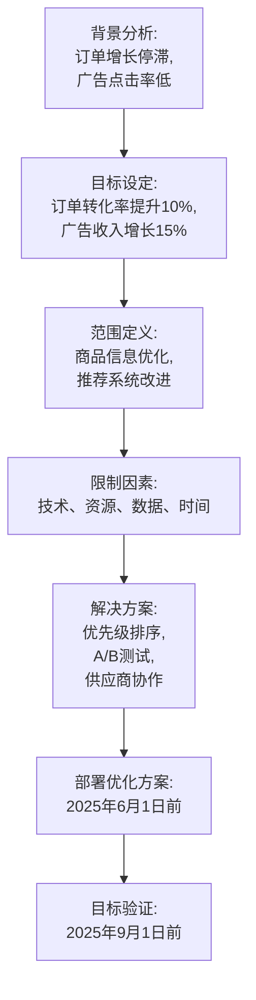
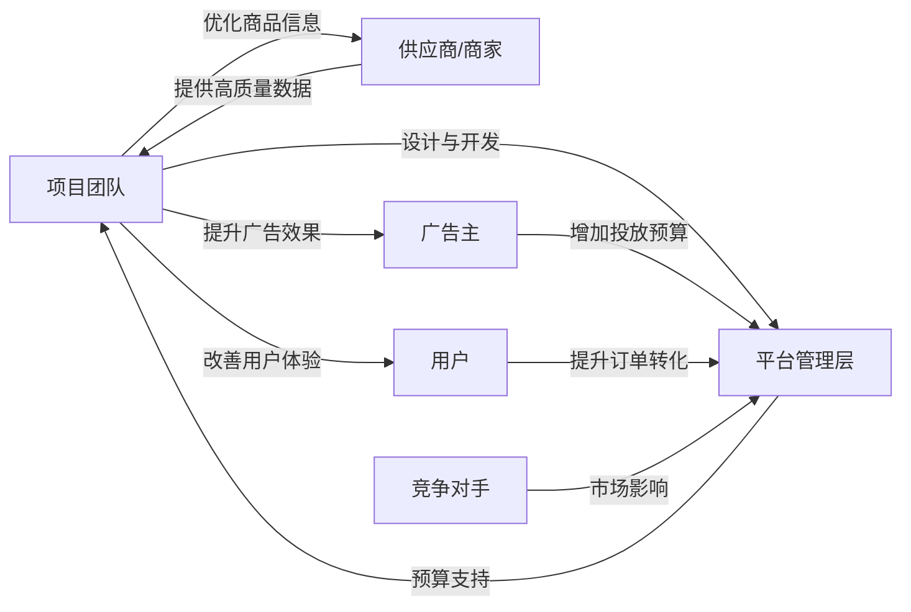
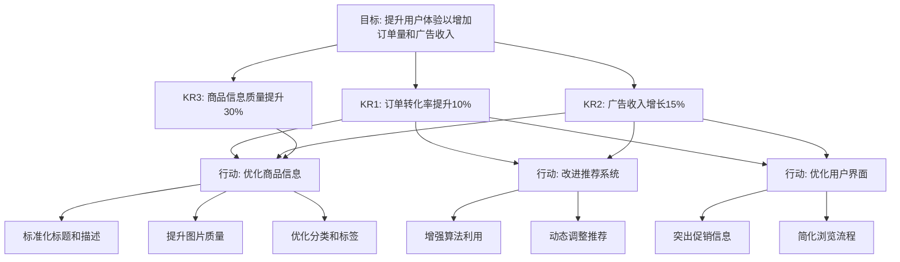
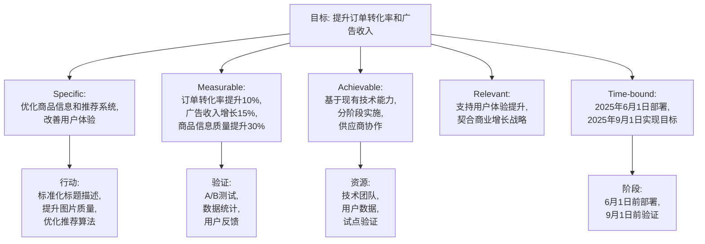
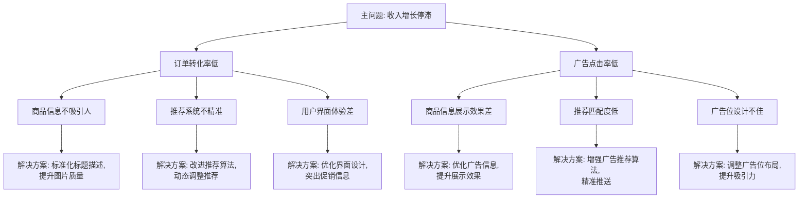
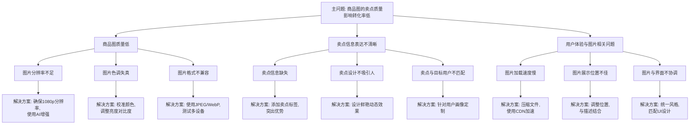
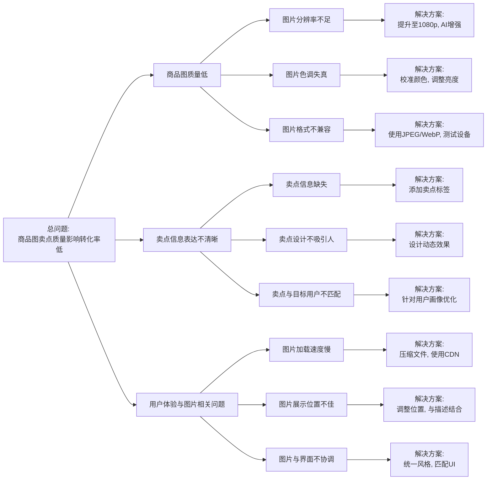

---

### 1. 背景  
CR 项目（假设是一个电商或内容推荐平台）的核心目标是通过优化商品信息来提升用户体验，从而增加平台订单量和广告收入。当前可能存在的问题包括：商品信息不够吸引人、描述不准确、搜索匹配度低、或者推荐算法未充分利用商品数据的潜力。这些问题可能导致用户流失或转化率下降。优化商品信息不仅是技术问题，还涉及内容质量、用户需求洞察和商业策略的结合。背景分析需要明确当前平台的痛点，比如订单增长停滞或广告点击率低于预期。

---

### 2. 成功的标准（使用 SMART 法则）  
成功的标准需要清晰、可衡量，并且与项目的核心目标（提升订单和广告收入）直接相关。以下是一个基于 SMART 法则制定的成功标准：

- **Specific（具体的）**：通过优化商品信息的质量（例如标题、图片、描述）和推荐系统的精准度，提升平台的订单转化率和广告点击率。  
- **Measurable（可衡量的）**：在优化后的3个月内，订单转化率提升10%（例如从2%升至2.2%），广告收入增加15%（例如从每月100万元升至115万元）。  
- **Achievable（可实现的）**：基于当前团队的技术能力、数据资源和市场趋势，10%的订单增长和15%的广告收入增长是合理的，且可以通过A/B测试和逐步迭代实现。  
- **Relevant（相关的）**：提升订单和广告收入直接契合平台的商业目标，优化商品信息是达成这一目标的关键杠杆，与用户体验和平台盈利能力密切相关。  
- **Time-bound（有时限的）**：在2025年6月1日前完成商品信息优化方案的部署，并在2025年9月1日前实现上述目标（即3个月的测试和验证期）。  

**成功标准总结**：  
“CR 项目将在2025年6月1日前完成商品信息优化方案部署，并在2025年9月1日前实现订单转化率提升10%、广告收入增长15%的目标，通过提升商品信息质量和推荐精准度实现。”

---

### 3. 范围  
项目的范围需要明确哪些方面会被优化，以及哪些不在本次优化的范围内。具体范围可能包括：  
- **纳入范围**：  
  - 商品标题、描述、图片的质量优化（例如标准化格式、关键词增强）。  
  - 商品分类和标签的准确性提升。  
  - 推荐算法对商品信息的利用率改进（例如基于用户行为的动态调整）。  
  - 用户界面展示商品信息的优化（例如突出促销信息或关键卖点）。  
- **排除范围**：  
  - 不涉及物流、支付系统等非商品信息相关的优化。  
  - 不包括广告主的投放策略调整（仅优化平台端的广告展示效果）。  

范围的明确可以避免项目目标发散，确保资源集中在商品信息优化上。

---

### 4. 限制因素  
项目的实施可能会受到以下限制因素的影响：  
- **技术限制**：现有平台的算法能力或数据处理能力可能不足以支持大规模优化，需要额外开发或升级。  
- **资源限制**：团队人力、预算或时间有限，可能无法同时优化所有商品类别，只能优先处理高流量品类。  
- **数据限制**：商品信息可能依赖供应商提供，若供应商数据质量低，会影响优化效果。  
- **用户行为不确定性**：优化后的商品信息是否真的能提升转化率，需通过实验验证，存在一定风险。  
- **时间压力**：需要在2025年6月1日前完成部署，可能面临开发和测试周期紧张的问题。  

解决这些限制可能需要优先级排序、技术外包或与供应商协作。

---

### 5. 利益相关者  
项目的成功依赖多个相关方的参与和支持：  
- **项目团队**：负责方案设计、开发和测试的核心团队（如产品经理、数据分析师、工程师）。  
- **平台管理层**：提供预算和战略支持，关注订单和收入增长的商业成果。  
- **供应商/商家**：提供高质量的商品信息（如图片、描述），直接影响优化效果。  
- **广告主**：受益于广告点击率提升，可能会增加投放预算。  
- **用户**：最终体验优化后的商品信息，决定订单转化率是否提升。  
- **竞争对手**（间接相关）**：他们的策略可能影响CR项目的市场表现，需要监控其动向。  

利益相关者的需求需要平衡，例如用户想要清晰信息，广告主想要高曝光，而管理层关注整体盈利。

---

### 综合分析  
CR 项目的目标是通过优化商品信息提升订单和广告收入。从背景看，这是一个合理的商业需求；成功的标准基于 SMART 法则清晰可行；范围聚焦于商品信息和推荐系统，避免发散；限制因素需要在实施中逐一解决；利益相关者的协作是成功的关键。接下来可以基于此制定详细的执行计划，例如先从高销量商品入手进行试点，逐步扩大优化范围。

有什么具体的部分需要我进一步细化吗？比如某个限制因素的解决方案，或者利益相关者的沟通策略？

---

## Visualization

以下是使用 Mermaid 语法生成的可视化内容，分为两个部分：项目流程图和利益相关者关系图。

### 项目流程图（Flowchart）
展示从背景分析到目标实现的逻辑流程。

### 利益相关者关系图（Graph）
展示利益相关者之间的交互关系。

---

### 说明
- **流程图**：从背景分析开始，逐步推进到目标设定、范围定义、限制因素识别、解决方案设计，最终到优化方案部署和目标验证，体现了项目的逻辑顺序。
- **关系图**：清晰展示了利益相关者之间的双向或单向关系，例如项目团队与供应商的协作、用户体验提升对管理层目标的贡献等。
- **关键词**：节点使用了文档中的核心术语，如“订单转化率”“广告收入”“商品信息优化”等，确保精准性。

如果您需要调整图表类型（例如将流程图改为序列图）或细化某个部分，请告诉我！

为了回答您的需求，我将以 OKR（目标与关键结果）形式拆解项目的核心流程，并通过清晰的视图展示目标、关键结果和具体行动之间的关系。这种方式可以帮助您更直观地理解项目管理的逻辑，提升流程的清晰度。以下是详细拆解：

---

### OKR 视图拆解

#### 1. **目标（Objective）**  
- **提升用户体验以增加订单量和广告收入**  
  这是项目的核心目标，旨在通过优化用户体验来驱动业务增长。

#### 2. **关键结果（Key Results）**  
- **KR1**：在2025年9月1日前，将订单转化率从2%提升至2.2%（提升10%）  
- **KR2**：在2025年9月1日前，广告收入从每月100万元提升至115万元（增长15%）  
- **KR3**：优化商品信息的质量，使完整度和吸引力提升30%（如图片清晰度、描述准确性等）  
这些关键结果是可量化的指标，直接衡量目标的达成情况。

#### 3. **行动计划（Initiatives）**  
为了实现上述关键结果，我们需要具体的行动举措：  
- **商品信息优化**：  
  - 标准化商品标题和描述格式  
  - 提升商品图片质量  
  - 优化商品分类和标签  
- **推荐系统改进**：  
  - 增强算法对商品信息的利用  
  - 基于用户行为动态调整推荐  
- **用户界面优化**：  
  - 突出商品的促销信息和关键卖点  
  - 简化搜索和浏览流程  

---

### Mermaid 层级图（Tree Diagram）
为了更直观地展示 OKR 的结构，我使用 Mermaid 语法创建了一个层级图，清晰呈现目标、关键结果和行动计划之间的关系：

---

### 图表说明
- **目标（Objective）**：位于顶层，定义了项目的最终方向。  
- **关键结果（Key Results）**：直接连接到目标，是衡量成功的具体指标。  
- **行动计划（Initiatives）**：进一步分解为具体任务，支持关键结果的实现。  
- **关系**：箭头展示了从目标到关键结果，再到行动计划的层级递进，以及某些行动如何同时支持多个关键结果（例如，“优化商品信息”同时支持 KR1、KR2 和 KR3）。

---

### 为什么这种视图更清晰？
1. **逻辑分层**：从目标到关键结果再到行动计划，层层递进，结构清晰。  
2. **可量化**：关键结果提供了明确的衡量标准，帮助团队聚焦于成果。  
3. **直观展示**：Mermaid 图通过树状结构可视化了复杂关系，避免了传统项目管理图可能出现的混乱。

如果您觉得还需要其他形式的视图（例如甘特图或泳道图）来进一步优化展示，请告诉我，我可以根据您的需求调整！

我将通过 **SMART 法则（Specific, Measurable, Achievable, Relevant, Time-bound）** 对您提供的 PSI（问题-方法-结果）背景内容进行梳理，将其转化为目标导向的表述，并配上 Mermaid 图表以直观展示。下面是具体梳理：

---

### SMART 目标梳理

#### 1. Specific（具体的）  
- **目标**：通过优化商品信息质量和推荐系统精准度，解决用户体验不佳的问题，提升平台的订单转化率和广告收入。  
- **细节**：聚焦于商品标题、描述、图片的优化，推荐算法的改进，以及用户界面的调整，确保用户更快找到符合需求的商品并完成购买，同时提升广告点击率。

#### 2. Measurable（可衡量的）  
- **指标**：  
  - 订单转化率从 2% 提升至 2.2%（增长 10%）。  
  - 广告收入从每月 100 万元增加至 115 万元（增长 15%）。  
  - 商品信息完整度和吸引力提升 30%（通过用户反馈和数据分析衡量）。  
- **验证方式**：通过 A/B 测试、数据统计和用户满意度调查跟踪效果。

#### 3. Achievable（可实现的）  
- **依据**：  
  - 当前团队具备技术能力（算法开发、界面设计）和数据资源（用户行为数据、商品信息）。  
  - 通过分阶段实施（如先优化高流量商品类别）和供应商协作，目标在资源范围内可行。  
- **前提**：需克服技术限制（如算法升级）和数据质量问题，通过试点验证逐步推广。

#### 4. Relevant（相关的）  
- **关联性**：  
  - 优化商品信息和推荐系统直接改善用户体验，与提升订单量和广告收入的商业目标高度一致。  
  - 项目成果将增强平台的市场竞争力，符合长期增长战略。  
- **价值**：用户满意度提升将带来更多复购，广告收入增长将吸引更多广告主，形成正向循环。

#### 5. Time-bound（有时限的）  
- **时间节点**：  
  - **2025年6月1日前**：完成优化方案的设计、开发和部署。  
  - **2025年9月1日前**：实现订单转化率提升 10%、广告收入增长 15%的目标（3个月测试和验证期）。  

---

### SMART 目标总结  
“CR 项目旨在通过优化商品信息质量和推荐系统精准度，在2025年6月1日前完成方案部署，并在2025年9月1日前实现订单转化率提升10%（从2%至2.2%）、广告收入增长15%（从100万元至115万元）的目标。这基于现有技术能力和数据资源，通过分阶段实施和A/B测试实现，与平台提升用户体验和盈利能力的战略高度相关。”

---

### Mermaid 图表（流程图）
以下是用 Mermaid 语法创建的流程图，展示 SMART 目标的结构和时间线：

---

### 图表说明
- **顶层目标**：清晰定义项目的总体方向。  
- **SMART 五要素**：每个要素单独列出，与目标直接关联，体现了具体性、可衡量性、可实现性、相关性和时间限制。  
- **子节点**：进一步分解为行动、验证和资源支持，展示了如何落地和评估目标。  
- **时间线**：在 Time-bound 部分明确关键节点，便于跟踪进度。  

这种 SMART 梳理方式将 PSI 的背景转化为更具目标导向的表述，同时通过流程图直观呈现了逻辑关系。如果您需要调整某个部分的细节或图表类型（如改为甘特图），请告诉我！

## 逻辑树

我将使用**逻辑树（Issue Tree）**模型，结合 **MECE 原则（Mutually Exclusive, Collectively Exhaustive，互斥且穷尽）**，将 CR 项目的问题分解为子问题，逐层分析解决方案，确保每个层级之间没有重叠且覆盖所有关键点。以下是详细分析：

---

### 逻辑树分析

#### 主问题  
- **收入增长停滞**  
  - 这是 CR 项目的核心问题，表现为订单量和广告收入未达预期增长。

#### 一级子问题（分解主问题）  
根据 MECE 原则，将收入增长停滞分解为两个独立且全面的关键驱动因素：  
1. **订单转化率低**  
   - 用户浏览商品后未完成购买，导致订单量增长受限。  
2. **广告点击率低**  
   - 广告展示效果不佳，影响广告收入增长。  

这两个子问题是收入的直接来源，互斥（订单和广告收入是独立的收入流）且穷尽（涵盖了收入增长停滞的所有主要原因）。

#### 二级子问题（进一步分解）  
##### 1. 订单转化率低  
- **1.1 商品信息不吸引人**  
  - 标题模糊、描述不准确或图片质量低，用户缺乏购买兴趣。  
- **1.2 推荐系统不精准**  
  - 推荐的商品与用户需求不符，导致用户流失。  
- **1.3 用户界面体验差**  
  - 浏览和购买流程复杂，关键信息不突出，用户放弃购买。  

##### 2. 广告点击率低  
- **2.1 商品信息展示效果差**  
  - 广告中的商品描述或图片未能吸引用户点击。  
- **2.2 推荐匹配度低**  
  - 广告推荐未精准匹配用户兴趣，点击意愿低。  
- **2.3 广告位设计不佳**  
  - 广告位置或样式未优化，用户忽略广告。  

二级子问题基于用户行为和技术因素分解，确保每个子问题独立且全面覆盖（例如，商品信息、推荐系统和界面设计是影响转化的三大独立领域）。

#### 解决方案（针对二级子问题）  
##### 1. 订单转化率低  
- **1.1 商品信息不吸引人**  
  - **解决方案**：标准化商品标题和描述，提升图片质量，增加关键词吸引力。  
- **1.2 推荐系统不精准**  
  - **解决方案**：改进推荐算法，利用用户行为数据动态调整推荐。  
- **1.3 用户界面体验差**  
  - **解决方案**：优化界面设计，突出促销信息，简化搜索和购买流程。  

##### 2. 广告点击率低  
- **2.1 商品信息展示效果差**  
  - **解决方案**：优化广告中的商品信息（如图片清晰度、描述简洁性）。  
- **2.2 推荐匹配度低**  
  - **解决方案**：增强广告推荐算法，基于用户兴趣精准推送。  
- **2.3 广告位设计不佳**  
  - **解决方案**：调整广告位布局和样式，提升可见性和吸引力。  

解决方案针对每个子问题提供具体措施，确保逻辑清晰且覆盖所有问题点。

---

### MECE 原则验证
- **互斥（Mutually Exclusive）**：  
  - 一级子问题（订单转化率低 vs 广告点击率低）无重叠，分别对应收入的不同来源。  
  - 二级子问题（如商品信息不吸引人 vs 推荐系统不精准）聚焦不同方面，避免重复。  
- **穷尽（Collectively Exhaustive）**：  
  - 一级分解涵盖收入增长的所有关键驱动因素。  
  - 二级分解包括用户体验的所有主要影响因素（信息质量、推荐精准度、界面设计）。  

---

### Mermaid 图表（逻辑树）
以下是用 Mermaid 语法绘制的逻辑树，直观展示问题分解和解决方案：

---

### 图表说明
- **树形结构**：从主问题（收入增长停滞）分叉至一级子问题（订单转化率低、广告点击率低），再细化为二级子问题，最后指向具体解决方案。  
- **MECE 体现**：每个层级的分支互不重叠且全面覆盖问题点，例如订单转化率低的三个原因（信息、推荐、界面）独立且穷尽。  
- **解决方案**：直接对应每个子问题，确保逻辑完整性和可操作性。  

---

### 逻辑树的优势与应用
- **清晰分解**：通过逐层拆分，主问题被转化为可管理的子问题，便于团队分工。  
- **目标导向**：解决方案直接指向问题根源，与提升收入的目标一致。  
- **实施建议**：可以基于逻辑树优先解决关键子问题（如商品信息优化），通过试点验证效果后推广。  

如果您需要进一步细化某个子问题（如“推荐系统不精准”的具体原因）或调整图表样式，请告诉我！

根据您提供的图片和描述，我理解您希望使用 **MECE 原则** 和 **逻辑树（Issue Tree）** 分析“商品图的卖点质量影响 CR 的转化率低”这一问题，并配上图表。以下是基于 MECE 原则的逻辑树拆解和解决方案，结合 CR 项目背景（电商或内容推荐平台）进行详细分析。

---

### 逻辑树分析

#### 主问题  
- **商品图的卖点质量影响 CR 的转化率低**  
  - 这是 CR 项目中订单转化率低的一个关键子问题，商品图（图片）作为卖点质量的重要组成部分，直接影响用户购买决策。

#### 一级子问题（按 MECE 原则分解）  
根据 MECE 原则，将“商品图的卖点质量影响转化率低”分解为独立且全面的驱动因素：  
1. **商品图质量低**  
   - 图片分辨率低、模糊或不清晰，直接影响用户对商品的吸引力。  
2. **卖点信息表达不清晰**  
   - 图片未能有效展示商品的核心卖点（如功能、优势、促销信息），用户无法快速理解价值。  
3. **用户体验与图片相关问题**  
   - 图片加载慢、展示位置不佳或与界面不协调，影响用户浏览和决策。  

这些子问题是互斥（分别聚焦图片质量、卖点表达和用户体验问题，不相互重叠）且穷尽（覆盖商品图影响转化的所有主要方面）。

#### 二级子问题（进一步分解）  
##### 1. 商品图质量低  
- **1.1 图片分辨率不足**  
  - 图片像素低或压缩过度，导致用户看不清商品细节。  
- **1.2 图片色调失真**  
  - 颜色不准确或暗淡，影响商品真实感。  
- **1.3 图片格式不兼容**  
  - 某些设备或浏览器无法正常显示图片。  

##### 2. 卖点信息表达不清晰  
- **2.1 卖点信息缺失**  
  - 图片未突出商品的核心优势（如材质、功能、促销）。  
- **2.2 卖点设计不吸引人**  
  - 文字或图形设计单调，缺乏视觉冲击力。  
- **2.3 卖点与目标用户不匹配**  
  - 图片展示的卖点未针对目标用户需求（如年轻人偏好时尚设计，但图片展示传统风格）。  

##### 3. 用户体验与图片相关问题  
- **3.1 图片加载速度慢**  
  - 图片文件过大或服务器响应慢，影响用户耐心。  
- **3.2 图片展示位置不佳**  
  - 图片未置于显眼位置，或与商品描述位置不协调。  
- **3.3 图片与界面不协调**  
  - 图片风格与平台整体设计不统一，影响美观和用户体验。  

二级子问题进一步细化，确保每个分支独立且涵盖所有可能的原因。

#### 解决方案（针对二级子问题）  
##### 1. 商品图质量低  
- **1.1 图片分辨率不足**  
  - **解决方案**：确保图片分辨率至少达到 1080p，使用高质量拍摄或 AI 增强工具。  
- **1.2 图片色调失真**  
  - **解决方案**：校准图片颜色，使用专业软件调整亮度和对比度。  
- **1.3 图片格式不兼容**  
  - **解决方案**：统一使用兼容性强的格式（如 JPEG、WebP），测试多设备显示效果。  

##### 2. 卖点信息表达不清晰  
- **2.1 卖点信息缺失**  
  - **解决方案**：在图片中添加清晰的卖点标签（如“耐用”“促销价”）。  
- **2.2 卖点设计不吸引人**  
  - **解决方案**：采用更具视觉冲击力的设计（如鲜艳颜色、动态效果）。  
- **2.3 卖点与目标用户不匹配**  
  - **解决方案**：根据用户画像优化图片内容，针对不同群体定制卖点展示。  

##### 3. 用户体验与图片相关问题  
- **3.1 图片加载速度慢**  
  - **解决方案**：压缩图片文件大小，使用 CDN 加速加载。  
- **3.2 图片展示位置不佳**  
  - **解决方案**：调整图片位置，置于用户视线范围内，与描述紧密结合。  
- **3.3 图片与界面不协调**  
  - **解决方案**：统一图片风格，与平台 UI 设计保持一致。  

---

### MECE 原则验证
- **互斥（Mutually Exclusive）**：  
  - 一级子问题（商品图质量低 vs 卖点信息表达不清晰 vs 用户体验问题）聚焦不同方面，无交叉。  
  - 二级子问题（如图片分辨率不足 vs 卖点信息缺失）也是独立原因，无重复。  
- **穷尽（Collectively Exhaustive）**：  
  - 一级子问题覆盖商品图影响转化的所有关键领域。  
  - 二级子问题全面列举每个领域的具体原因，确保无遗漏。

---

### Mermaid 图表（逻辑树）
以下是用 Mermaid 语法绘制的逻辑树，直观展示问题分解和解决方案：

---

### 图表说明
- **树形结构**：从主问题分叉至一级子问题（商品图质量、卖点信息、用户体验），再细化为二级子问题，最后指向具体解决方案。  
- **MECE 体现**：每个层级的分支互不重叠且全面覆盖，如“图片分辨率不足”和“卖点信息缺失”是独立问题。  
- **解决方案**：针对每个子问题提供可操作的措施，确保逻辑完整性。  

---

### 逻辑树的优势与应用
- **清晰分解**：将复杂问题（商品图影响转化）分解为可管理的子问题，便于团队聚焦和优先级排序。  
- **目标导向**：解决方案直接针对每个原因，有助于提升转化率，符合 CR 项目的目标。  
- **MECE 确保全面性**：避免遗漏关键因素，减少重复分析，提升分析效率。  

如果您需要进一步细化某个子问题（如“卖点设计不吸引人”的具体原因）或调整图表样式，请告诉我！

为了使用**代数结构**来拆解 MECE（Mutually Exclusive, Collectively Exhaustive，互斥且穷尽）原则，我将采用数学和逻辑的视角，将问题分解过程建模为一个集合理论或代数框架。这种方法将 MECE 的“互斥”和“穷尽”特性转化为集合的交集和并集关系，结合 CR 项目背景（例如“商品图的卖点质量影响 CR 的转化率低”）进行具体分析。以下是详细的步骤和解释：

---

### 1. 代数结构的基本概念
代数结构通常涉及集合、操作（如并集、交集、补集）和关系。我们可以将 MECE 原则建模为以下集合理论框架：
- **集合**：问题空间被分解为若干子问题集合。  
- **互斥（Mutually Exclusive）**：子问题集合之间两两交集为空（\(A_i \cap A_j = \emptyset\)，其中 \(i \neq j\)）。  
- **穷尽（Collectively Exhaustive）**：子问题集合的并集覆盖整个问题空间（\(\bigcup A_i = S\)，其中 \(S\) 是总问题集合）。  

通过代数结构，我们可以形式化地表示 MECE 拆解，并确保逻辑严谨。

---

### 2. 代数结构拆解 MECE 的步骤
#### 2.1 定义总问题集合 \(S\)  
- **总问题**：商品图的卖点质量影响 CR 的转化率低。  
- 记作集合 
  $$
  (S = \{x \mid x \text{ 是影响 CR 转化率低的原因，且与商品图的卖点质量相关}\}）
  $$
  。  
- 例如，\(S\) 包含所有可能的原因，如图片质量问题、卖点表达问题、用户体验问题等。

#### 2.2 按 MECE 原则分解为子集合 \(A_1, A_2, A_3, \dots\)  
根据上一节的逻辑树，我们将 \(S\) 拆分为互斥且穷尽的子集合：  
- $$
  \(A_1 = \{x \mid x \text{ 是商品图质量低的原因}\}\)
  $$
  
  
  - 例如：图片分辨率不足、图片色调失真、图片格式不兼容。  
- \(A_2 = \{x \mid x \text{ 是卖点信息表达不清晰的原因}\}\)  
  - 例如：卖点信息缺失、卖点设计不吸引人、卖点与目标用户不匹配。  
- \(A_3 = \{x \mid x \text{ 是用户体验与图片相关问题的原因}\}\)  
  - 例如：图片加载速度慢、图片展示位置不佳、图片与界面不协调。  

#### 2.3 验证 MECE 条件  
- **互斥（Mutually Exclusive）**：  
  - 确保 \(A_i \cap A_j = \emptyset\)（\(i \neq j\)）。  
  - 例如：\(A_1\)（商品图质量低）与 \(A_2\)（卖点信息表达不清晰）之间无交集，因为图片质量问题（分辨率、色调）与卖点表达问题（信息缺失、设计）是独立的原因。  
  - 类似地，\(A_2\) 和 \(A_3\)、\(A_1\) 和 \(A_3\) 也无交集。  
- **穷尽（Collectively Exhaustive）**：  
  - 确保 \(A_1 \cup A_2 \cup A_3 = S\)，即所有子集合的并集覆盖总问题空间。  
  - 例如：商品图质量、卖点表达和用户体验问题共同涵盖了商品图影响转化率低的所有可能原因，无遗漏。

#### 2.4 进一步细化（递归分解）  
我们可以对每个子集合 \(A_i\) 进行递归拆解，保持 MECE 原则。例如：  
- 对 \(A_1\)（商品图质量低）进一步分解：  
  - \(A_{1,1} = \{x \mid x \text{ 是图片分辨率不足}\}\)  
  - \(A_{1,2} = \{x \mid x \text{ 是图片色调失真}\}\)  
  - \(A_{1,3} = \{x \mid x \text{ 是图片格式不兼容}\}\)  
  - 验证：\(A_{1,1} \cap A_{1,2} = \emptyset\)，\(A_{1,1} \cup A_{1,2} \cup A_{1,3} = A_1\)。

类似地，可以对 \(A_2\) 和 \(A_3\) 进行递归拆解。

---

### 3. 代数表达  
我们可以用集合运算形式化地表示 MECE 拆解：  
- 总问题 \(S\)：  
  $$
  \[
  S = A_1 \cup A_2 \cup A_3
  \]
  $$
  
- 互斥条件：  
  $$
  \[
  A_i \cap A_j = \emptyset, \quad \forall i \neq j \text{ (其中 } i, j \in \{1, 2, 3\}\text{)}
  \]
  $$
  
- 穷尽条件：  
  \[
  $$
  A_1 \cup A_2 \cup A_3 = S
  \]
  $$
  

对于二级子问题（如 \(A_1\) 的分解）：  
$$
\[
A_1 = A_{1,1} \cup A_{1,2} \cup A_{1,3}
\]
$$

$$
\[
A_{1,1} \cap A_{1,2} = \emptyset, \quad A_{1,1} \cap A_{1,3} = \emptyset, \quad A_{1,2} \cap A_{1,3} = \emptyset
\]
$$

---

### 4. 解决方案映射  
每个子集合 \(A_i\)（或其子集合）对应一个解决方案集合 \(B_i\)，确保问题与解决措施一一对应：  
- \(B_1 = \{y \mid y \text{ 是解决商品图质量低的方法}\}\)  
  - 例如：提升图片分辨率、使用专业软件校准颜色、统一图片格式。  
- \(B_2 = \{y \mid y \text{ 是解决卖点信息表达不清晰的方法}\}\)  
  - 例如：添加卖点标签、设计视觉冲击力强的图片、针对用户画像优化卖点。  
- \(B_3 = \{y \mid y \text{ 是解决用户体验与图片相关问题的方法}\}\)  
  - 例如：压缩图片文件、使用 CDN 加速、调整图片位置和风格。  

映射关系：  
\[
A_i \rightarrow B_i, \quad i = 1, 2, 3
\]

---

### 5. Mermaid 图表（集合关系图）
以下是用 Mermaid 语法绘制的集合关系图，直观展示 MECE 拆解的代数结构：

---

### 图表说明
- **集合层次**：从总问题 \(S\) 分解为一级子集合 \(A_1, A_2, A_3\)，再细化为二级子集合（如 \(A_{1,1}, A_{1,2}, A_{1,3}\)），最后映射到解决方案集合 \(B_i\)。  
- **MECE 体现**：箭头连接表示集合包含关系，分支之间无交叉（互斥），所有分支覆盖总问题（穷尽）。  
- **代数特性**：通过集合的并集和交集关系直观展示 MECE 的数学结构。  

---

### 代数结构的优势
- **逻辑严谨**：通过集合理论确保 MECE 原则的数学正确性，避免主观判断的偏差。  
- **结构化分解**：将复杂问题形式化，适合复杂系统分析（如 CR 平台的转化问题）。  
- **可扩展性**：支持递归分解和解决方案映射，便于进一步细化（如对 \(A_{1,1}\) 再分解为设备类型或场景）。  

如果您需要更深入的代数建模（例如引入概率或权重）或调整图表，请告诉我！