## 微积分解读-无穷的故事

---

### 一、列举文章中的所有名词性成分（概念），使用中英文

以下是文章中出现的名词性成分或概念，列出中英文对照：

1. 数学 (Mathematics)
2. 数字 (Numbers)
3. 几何学 (Geometry)
4. 圆 (Circle)
5. 无限 (Infinity)
6. 微积分 (Calculus)
7. 面积 (Area)
8. 矩形 (Rectangle)
9. 极限 (Limit)
10. 周长 (Circumference)
11. 半径 (Radius)
12. 球体 (Sphere)
13. 圆柱体 (Cylinder)
14. 圆锥体 (Cone)
15. 多边形 (Polygon)
16. 对称性 (Symmetry)
17. 直线 (Straight Line)
18. 曲线 (Curve)
19. 空间 (Space)
20. 时间 (Time)
21. 运动 (Motion)
22. 量子力学 (Quantum Mechanics)
23. 概率波 (Probability Wave)
24. 薛定谔方程 (Schrödinger's Equation)
25. 普朗克长度 (Planck Length)
26. 重力常数 (Gravitational Constant, G)
27. 量子效应强度 (Quantum Effect Strength, ħ)
28. 光速 (Speed of Light, c)
29. 实数 (Real Numbers)
30. 芝诺悖论 (Zeno's Paradoxes)

---

### 二、列举概念并解释其定义

以下是对上述概念的定义解释：

1. **数学 (Mathematics)**：研究数量、结构、空间和变化的学科，起源于实用需求，如计数和测量。
2. **数字 (Numbers)**：表示数量的符号，最初用于计数，后发展为抽象数学的基础。
3. **几何学 (Geometry)**：研究形状、大小和空间关系的数学分支，源自古希腊语“地球测量”。
4. **圆 (Circle)**：平面中所有点到中心距离相等的几何形状，具有完美对称性。
5. **无限 (Infinity)**：无法量化的极大或无尽的概念，在数学中用于描述超越有限的性质。
6. **微积分 (Calculus)**：研究变化的数学分支，利用极限和无限来解决曲线和动态问题。
7. **面积 (Area)**：二维形状所占据的空间大小，通常以平方单位表示。
8. **矩形 (Rectangle)**：具有四条直边和四个直角的平面图形，面积为长乘宽。
9. **极限 (Limit)**：数学中描述一个过程趋向某值的概念，尽管永远无法完全到达。
10. **周长 (Circumference)**：圆的边界长度，与半径和直径相关。
11. **半径 (Radius)**：从圆心到圆周上任意一点的距离。
12. **球体 (Sphere)**：三维空间中所有点到中心距离相等的立体图形。
13. **圆柱体 (Cylinder)**：由两个平行圆底和连接它们的曲面构成的三维图形。
14. **圆锥体 (Cone)**：由一个圆底和一个顶点连接而成的三维图形。
15. **多边形 (Polygon)**：由多条直线段连接而成的闭合平面图形，如三角形、四边形等。
16. **对称性 (Symmetry)**：图形或物体在某种变换下保持不变的性质，如旋转对称。
17. **直线 (Straight Line)**：两点间最短路径，几何学中最基本的元素。
18. **曲线 (Curve)**：非直线的连续路径，如圆的周界。
19. **空间 (Space)**：物体存在和移动的三维环境，在物理和数学中有连续或离散的假设。
20. **时间 (Time)**：事件发生顺序的度量，与空间共同构成宇宙的基本框架。
21. **运动 (Motion)**：物体在空间中位置随时间变化的过程。
22. **量子力学 (Quantum Mechanics)**：描述微观粒子行为的物理理论，基于概率和不确定性。
23. **概率波 (Probability Wave)**：量子力学中描述粒子位置和状态的数学函数。
24. **薛定谔方程 (Schrödinger's Equation)**：量子力学中的核心方程，用于计算概率波随时间的变化。
25. **普朗克长度 (Planck Length)**：由基本物理常数组合定义的最小空间尺度，约为10⁻³⁵米。
26. **重力常数 (Gravitational Constant, G)**：衡量引力强度的物理常数。
27. **量子效应强度 (Quantum Effect Strength, ħ)**：量子力学中的普朗克常数除以2π，反映量子效应大小。
28. **光速 (Speed of Light, c)**：宇宙中信号传播的最高速度，约为3×10⁸米/秒。
29. **实数 (Real Numbers)**：包括所有有理数和无理数的连续数字集合，用于微积分中的精确描述。
30. **芝诺悖论 (Zeno's Paradoxes)**：古希腊哲学家芝诺提出的关于无限分割空间和时间的逻辑难题。

---

### 三、列举概念之间的关联（使用等式或逻辑关系）

以下是概念之间的关联，使用等式或逻辑关系串联：

1. **圆的面积公式 (Circle Area Formula)**：  
   \( A = r \cdot \frac{C}{2} \)  
   其中 \( A \) 为面积 (Area)，\( r \) 为半径 (Radius)，\( C \) 为周长 (Circumference)。

2. **周长与半径的关系 (Circumference and Radius)**：  
   \( C = 2\pi r \)  
   将此代入面积公式，得 \( A = \pi r^2 \)。

3. **极限与无限 (Limit and Infinity)**：  
   极限 (Limit) 是微积分 (Calculus) 中利用无限 (Infinity) 逼近目标值的工具，例如在比萨饼证明中，通过无限分割圆得到矩形。

4. **多边形逼近圆 (Polygon Approaching Circle)**：  
   多边形 (Polygon) 的边数趋向无限 (Infinity) 时，其形状趋向圆 (Circle)。

5. **球体、圆柱体、圆锥体的生成 (Sphere, Cylinder, Cone Generation)**：  
   - 圆 (Circle) 绕直径旋转生成球体 (Sphere)。  
   - 圆沿直线 (Straight Line) 移动生成圆柱体 (Cylinder)。  
   - 圆缩放并移动生成圆锥体 (Cone)。

6. **普朗克长度公式 (Planck Length Formula)**：  
   \( L_p = \sqrt{\frac{\hbar G}{c^3}} \)  
   其中 \( L_p \) 为普朗克长度 (Planck Length)，\( G \) 为重力常数 (Gravitational Constant)，\( \hbar \) 为量子效应强度 (Quantum Effect Strength)，\( c \) 为光速 (Speed of Light)。

7. **量子力学与薛定谔方程 (Quantum Mechanics and Schrödinger's Equation)**：  
   薛定谔方程 (Schrödinger's Equation) 描述概率波 (Probability Wave) 在空间 (Space) 和时间 (Time) 中的演化。

8. **芝诺悖论与运动 (Zeno’s Paradoxes and Motion)**：  
   芝诺悖论 (Zeno’s Paradoxes) 通过无限分割空间 (Space) 和时间 (Time) 质疑运动 (Motion) 的可能性，微积分 (Calculus) 通过极限 (Limit) 解决了悖论。

---

### 四、使用COT方式理顺关联（Chain of Thought）

#### 1. 定义与分类
- **数学 (Mathematics)** 是基础学科，分为几何学 (Geometry) 和微积分 (Calculus) 等分支。
- **几何学 (Geometry)** 研究直线 (Straight Line)、曲线 (Curve)、圆 (Circle)、多边形 (Polygon) 等形状。
- **微积分 (Calculus)** 利用无限 (Infinity) 和极限 (Limit) 处理动态变化，如面积 (Area) 计算。

#### 2. 比较
- **直线 (Straight Line)** 与 **曲线 (Curve)**：直线是几何学的基础，简单易测；曲线如圆 (Circle) 更复杂，需无限分割。
- **有限与无限 (Finite vs. Infinity)**：有限的数字 (Numbers) 用于计数，无限 (Infinity) 用于逼近极限 (Limit)。
- **离散与连续 (Discrete vs. Continuous)**：多边形 (Polygon) 是离散的，圆 (Circle) 是连续的，通过无限 (Infinity) 连接。

#### 3. 因果
- **圆 (Circle)** 的对称性 (Symmetry) 导致其在自然中无处不在，如水波纹。
- **微积分 (Calculus)** 的发明源于解决曲线 (Curve) 问题的需求，使用无限 (Infinity) 构建桥梁。
- **量子力学 (Quantum Mechanics)** 通过薛定谔方程 (Schrödinger’s Equation) 解释概率波 (Probability Wave)，依赖连续的空间 (Space) 和时间 (Time)。

#### 4. 科学方法论
- **观察**：圆 (Circle) 在自然中的普遍性引发几何学 (Geometry) 研究。
- **假设**：无限 (Infinity) 可连接直线 (Straight Line) 和曲线 (Curve)。
- **实验**：比萨饼证明通过无限分割验证圆的面积 (Area)。
- **结论**：极限 (Limit) 使复杂问题简化，如 \( A = \pi r^2 \)。

---

### 五、事实与看法

#### 事实
1. 数学起源于实用需求，如计数和测量。
2. 古埃及人因尼罗河洪水发展了几何学。
3. 圆的面积公式 \( A = r \cdot \frac{C}{2} \) 由阿基米德证明。
4. 极限是微积分的基础概念。
5. 普朗克长度公式为 \( L_p = \sqrt{\frac{\hbar G}{c^3}} \)。
6. 芝诺悖论质疑空间和时间的连续性。
7. 量子力学描述微观世界的概率行为。

#### 看法
1. 无限 (Infinity) 是解决几何难题的最佳想法之一。
2. 极限 (Limit) 像一个无法实现的目标，但仍能解决问题。
3. 圆 (Circle) 是最完美的形状，因其对称性和自然中的普遍性。
4. 完成无限 (Completed Infinity) 会导致逻辑混乱，应避免。
5. 实数 (Real Numbers) 并非真实存在，而是微积分的理想化工具。

---

### 六、FAQ列表

1. **什么是无限 (What is Infinity)?**  
   一个超越有限的概念，用于描述无尽的过程或数量。
2. **极限如何工作 (How does a Limit work)?**  
   通过无限逼近目标值解决问题，如比萨饼证明中的矩形。
3. **为什么不能除以零 (Why can’t we divide by zero)?**  
   因为结果趋向无限，导致逻辑矛盾。
4. **圆的面积如何计算 (How is the area of a circle calculated)?**  
   通过无限分割成矩形，得 \( A = \pi r^2 \)。
5. **芝诺悖论是什么 (What are Zeno’s Paradoxes)?**  
   质疑运动和连续性的哲学难题，如阿基里斯与乌龟。
6. **量子力学与微积分有何关系 (How is Quantum Mechanics related to Calculus)?**  
   微积分计算概率波的行为，如量子隧穿。
7. **普朗克长度是什么 (What is the Planck Length)?**  
   由基本常数定义的最小空间尺度，约为10⁻³⁵米。

---

### 七、列举所有类比

1. **比萨饼证明 (Pizza Proof)**：将圆分割成无限多片，重组为矩形。
2. **墙的谜题 (Riddle of the Wall)**：走一半距离永远无法到达墙，类比极限。
3. **英雄的追求 (Hero’s Quest)**：趋向极限如英雄追求 unreachable star。
4. **电影帧 (Movie Frames)**：离散帧高速播放模拟连续运动。
5. **模拟与数字时钟 (Analog vs. Digital Clock)**：模拟钟连续，数字钟离散。

---

### 八、10个金句

1. “无限使一切变得更简单。” (Infinity makes everything simpler.)
2. “圆是变化中的不变。” (A circle embodies change without change.)
3. “极限是一个无法实现的目标。” (A limit is like an unattainable goal.)
4. “对称性要求圆无处不在。” (Symmetry demands that circles appear everywhere.)
5. “微积分是无限的桥梁。” (Calculus is a bridge built by infinity.)
6. “除以零召唤无限。” (Dividing by zero summons infinity.)
7. “完成无限是逻辑的地狱。” (Completed infinity condemns us to logical hell.)
8. “实数并非真实，而是理想。” (Real numbers are not real, but an idealization.)
9. “芝诺让我们质疑一切。” (Zeno makes us question everything.)
10. “量子力学揭示微观世界的怪异。” (Quantum mechanics reveals the weirdness of the microworld.)

---

### 九、Mermaid格式内容（按图片分割子图）

以下是基于文章中每张图片的 Mermaid 图表示：

#### 图1：InfinitePowers_029_1 (圆与自然)
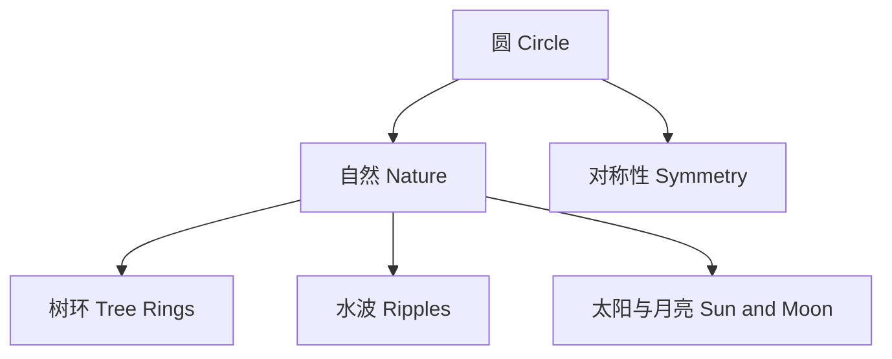

#### 图2：InfinitePowers_030_1 (比萨饼周长)
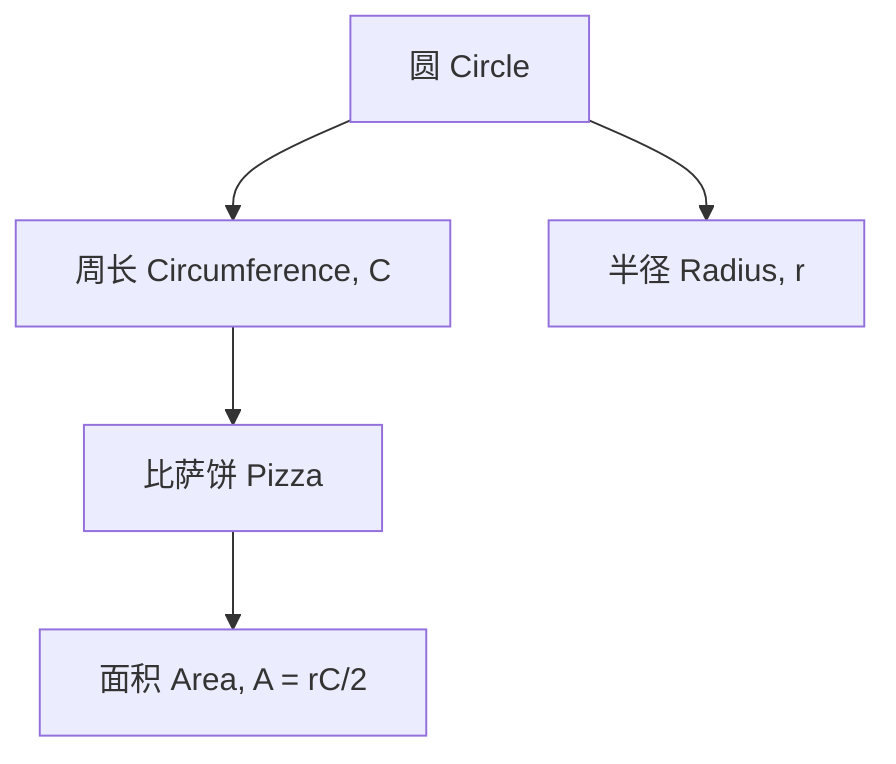

#### 图3：InfinitePowers_031_1 (比萨饼切片)
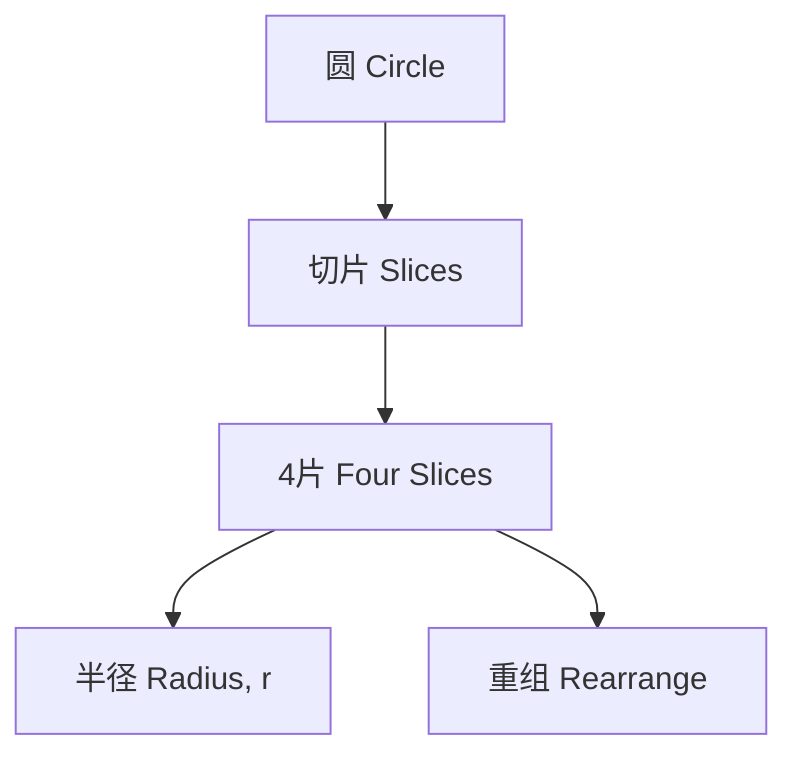

#### 图4：InfinitePowers_031_2 (四片重组)
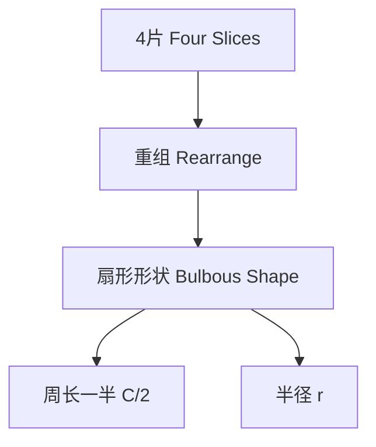

#### 图5：InfinitePowers_032_1 (八片重组)
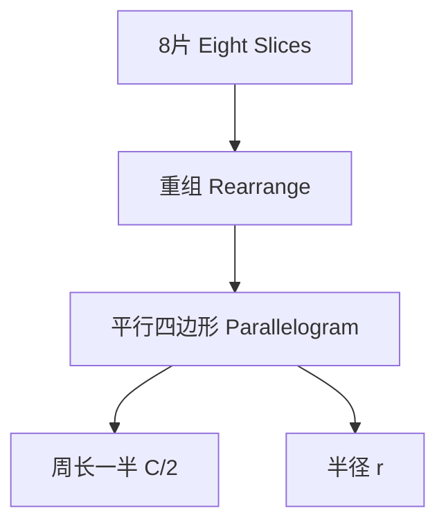

#### 图6：InfinitePowers_032_2 (八片调整)
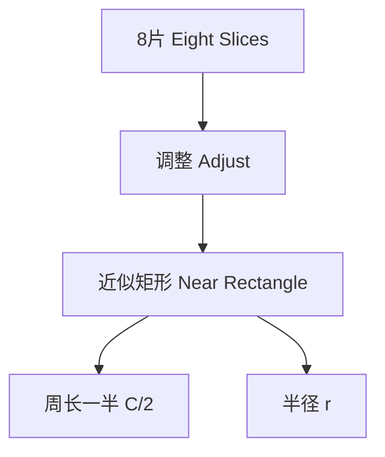

#### 图7：InfinitePowers_033_1 (十六片)
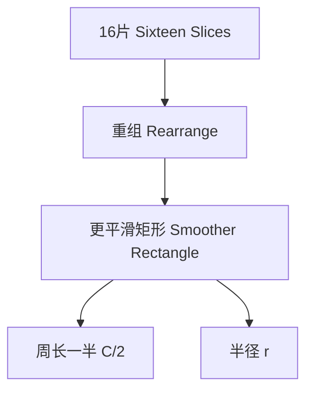

#### 图8：InfinitePowers_033_2 (极限矩形)
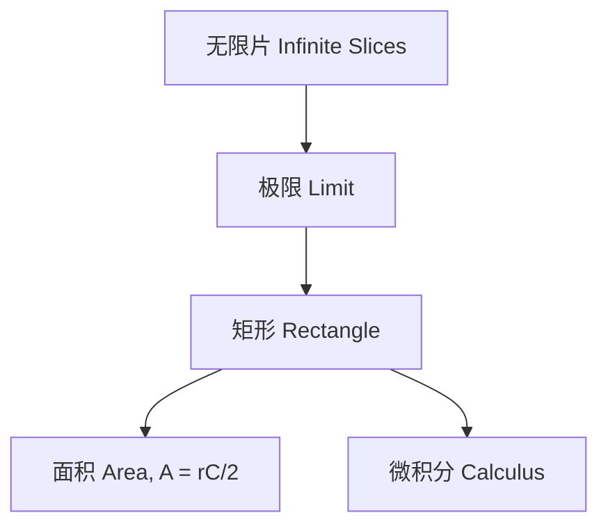

#### 图9：InfinitePowers_034_1 (墙的谜题)
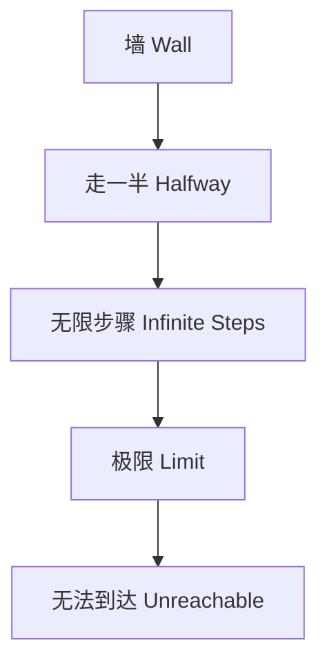

#### 图10：InfinitePowers_038_1 (多边形逼近圆)
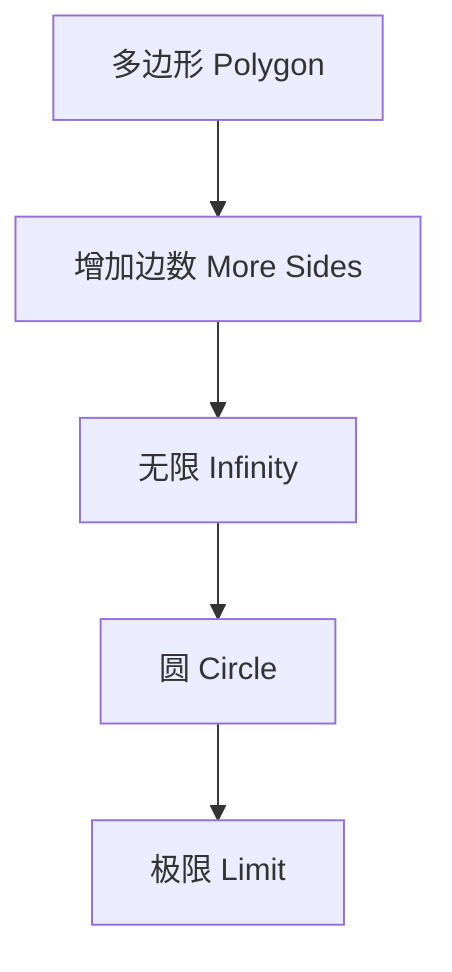

#### 图11：InfinitePowers_041_1 (除以零)
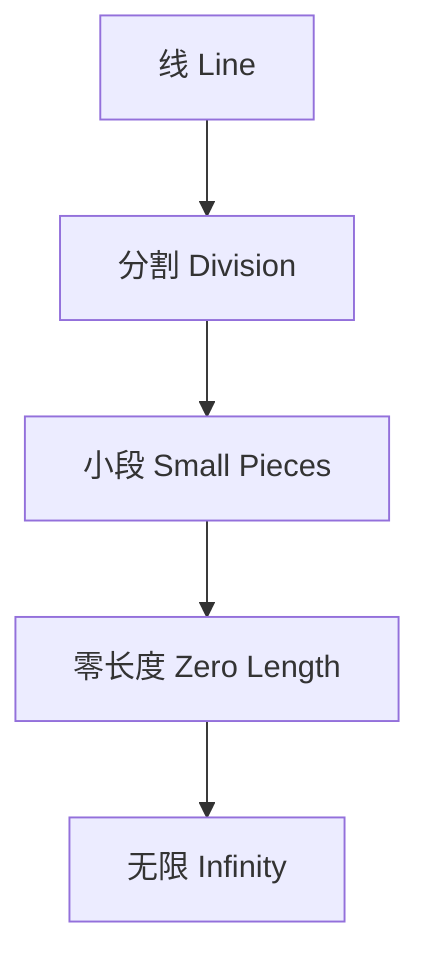

#### 图12：InfinitePowers-24 (阿基里斯与乌龟)
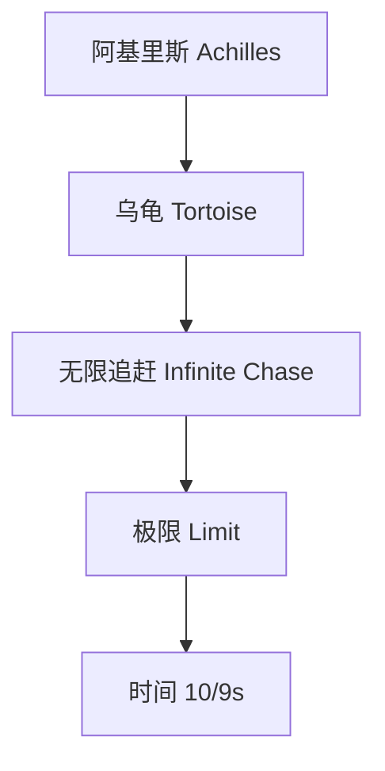

