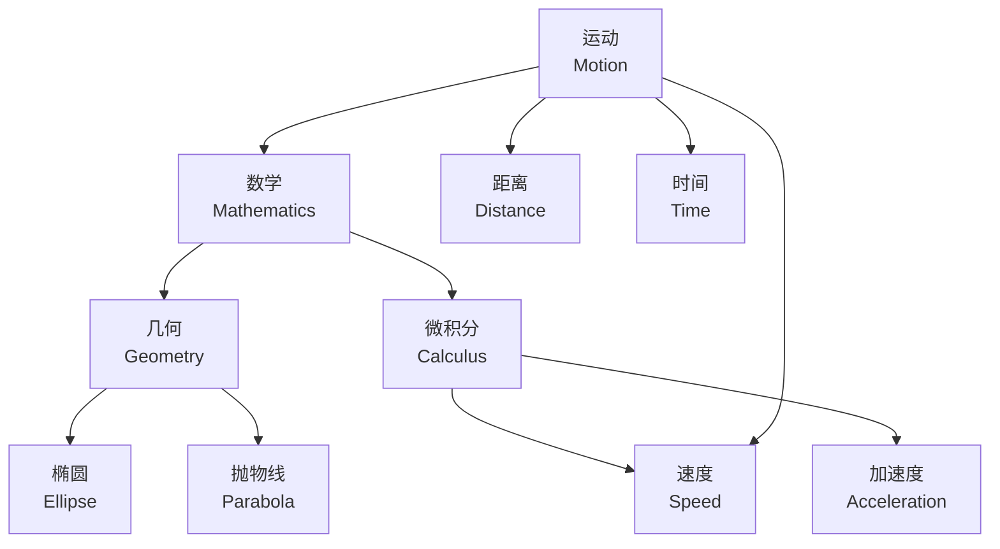
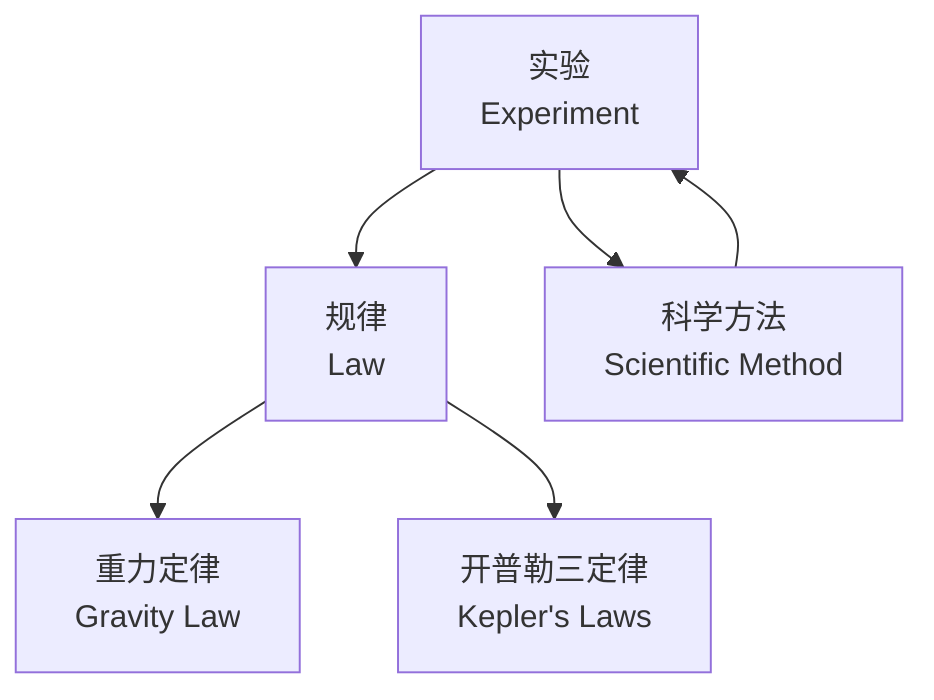
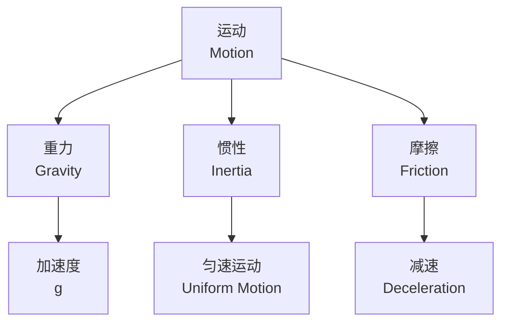
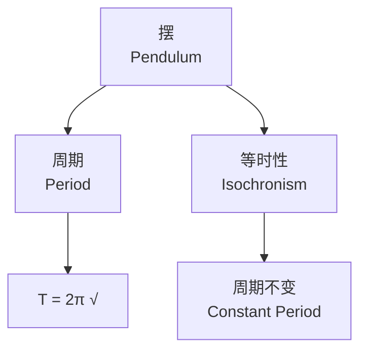
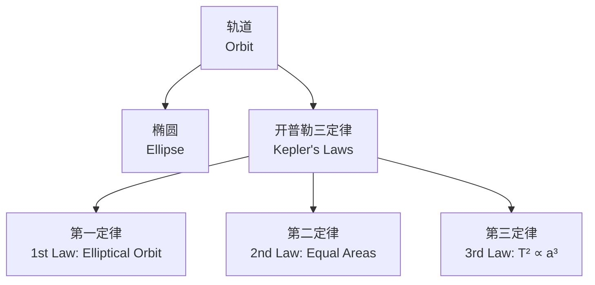
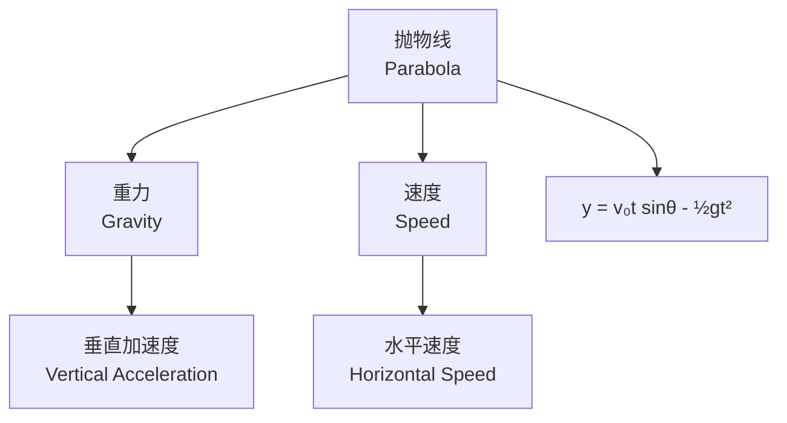
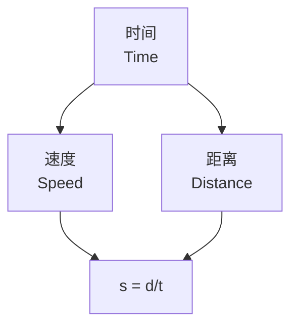
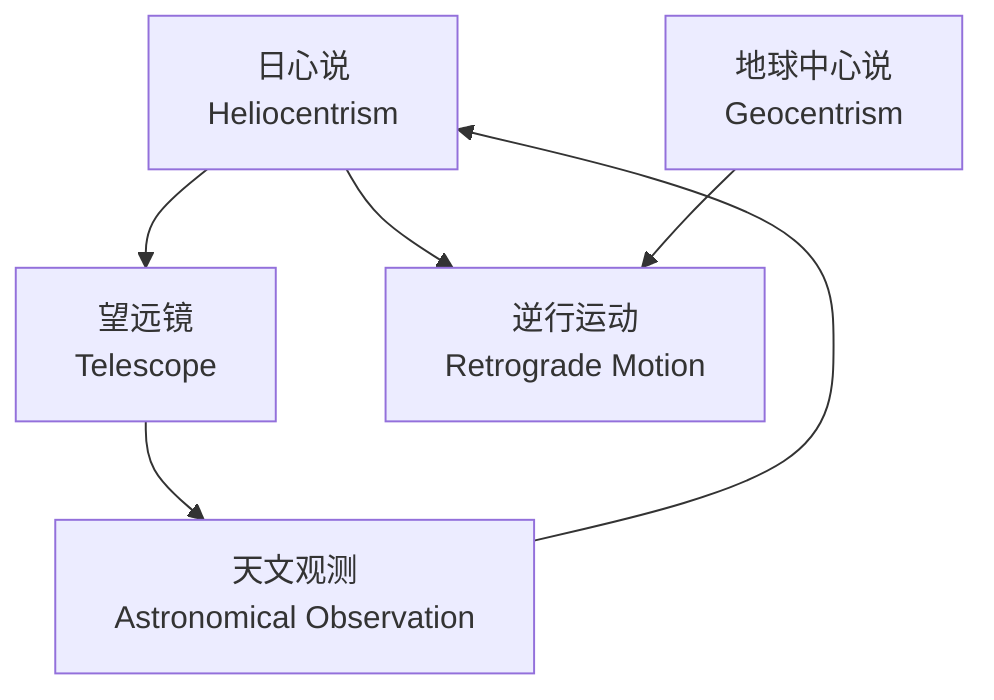
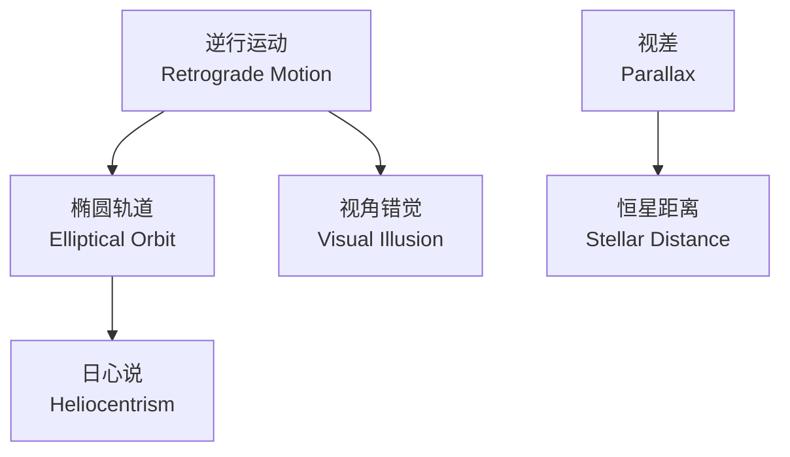
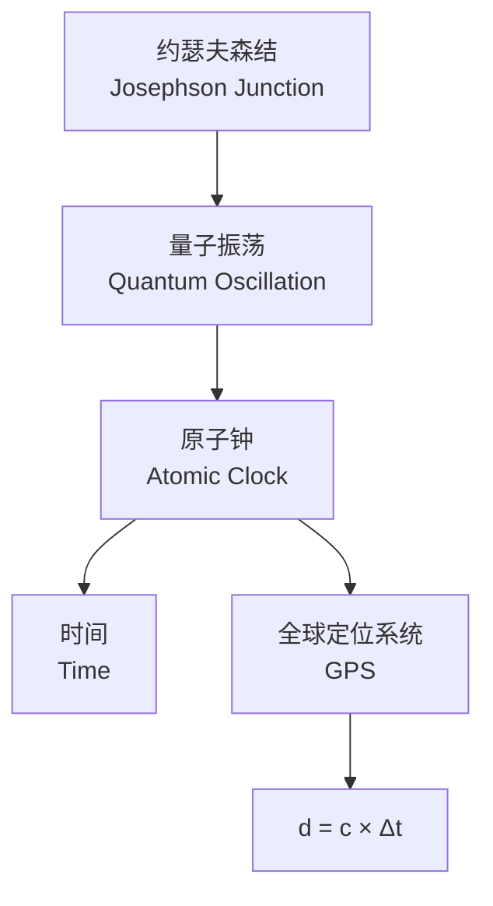

### 核心概念：运动 (Motion)
运动是所有概念的基础，定义为物体位置随时间变化的现象：  
- **等式**：运动的基本表达式为 **距离 (Distance) = 速度 (Speed) × 时间 (Time)**，即 \( d = s \times t \)。

---

### 1. 运动 (Motion) 与 数学 (Mathematics)、几何 (Geometry)、微积分 (Calculus)
- **数学 (Mathematics)** 是**描述运动的工具**，伽利略和开普勒用数学公式（如开普勒三定律）量化自然规律。
- **几何 (Geometry)** 提供形状描述，如椭圆 (Ellipse) 和抛物线 (Parabola)，分别对应轨道 (Orbit) 和抛射物路径。
- **微积分 (Calculus)** 用于分析运动中的变化率，例如速度 (Speed) 是距离对时间的导数：\( 
  $$
  s = \frac{ds}{dt}
  $$
  \)，加速度是速度对时间的导数：\(
  $$
  a = \frac{dv}{dt}
  $$
   \)。

**逻辑关系**：  
运动 → 用数学表达 → 几何定义路径 → 微积分计算变化。

---

### 2. 实验 (Experiment) 与 规律 (Law)、科学方法 (Scientific Method)
- **实验 (Experiment)** 是伽利略验证运动规律的方法，如斜面实验测量重力 (Gravity) 作用下的速度。
- **规律 (Law)** 是实验结果的总结，例如伽利略的自由落体规律：\( d = \frac{1}{2} g t^2 \)（忽略摩擦）。
- **科学方法 (Scientific Method)** 是实验的系统化步骤：观察 → 假设 → 实验 → 规律。

**逻辑关系**：  
实验 → 发现规律 → 科学方法系统化验证。

---

### 3. 重力 (Gravity)、惯性 (Inertia)、摩擦 (Friction) 与 运动 (Motion)
- **重力 (Gravity)** 是驱动落体运动的力，伽利略发现其加速度 \( g \) 为常数。
- **惯性 (Inertia)** 是物体保持运动或静止的性质，伽利略提出“无外力时匀速直线运动”，牛顿后来完善为第一定律。
- **摩擦 (Friction)** 是阻碍运动的力，伽利略通过斜面实验尽量减少其影响。

**等式**：  
合力 \( F = ma \)，其中 \( F = mg - F_{\text{friction}} \)（重力减去摩擦力）。

**逻辑关系**：  
重力驱动运动 → 惯性维持运动 → 摩擦阻碍运动。

---

### 4. 摆 (Pendulum)、周期 (Period)、等时性 (Isochronism)
- **摆 (Pendulum)** 是伽利略研究的周期性振荡物体。
- **周期 (Period)** 是摆完成一次振荡的时间，伽利略发现其公式为 \( T = 2\pi \sqrt{\frac{l}{g}} \)（\( l \) 为摆长，\( g \) 为重力加速度）。
- **等时性 (Isochronism)** 是摆小幅度振荡时周期不变的特性。

**逻辑关系**：  
摆 → 周期可测 → 等时性验证重力恒定。

---

### 5. 轨道 (Orbit)、椭圆 (Ellipse)、开普勒三定律 (Law)
- **轨道 (Orbit)** 是行星运动的路径，开普勒发现其为椭圆 (Ellipse)。
- **开普勒第一定律**：轨道为椭圆，太阳位于一个焦点。
- **开普勒第二定律**：行星扫过相等面积的时间相等，反映速度变化。
- **开普勒第三定律**：周期平方与轨道半长轴立方成正比，\( T^2 \propto a^3 \)。

**逻辑关系**：  
轨道 → 椭圆形状 → 定律量化运动。

---

### 6. 抛物线 (Parabola) 与 重力 (Gravity)、速度 (Speed)
- **抛物线 (Parabola)** 是伽利略发现的抛射物路径，源于水平速度和垂直重力加速度的合成。
- **等式**：抛物线轨迹方程为 \( y = v_0 t \sin\theta - \frac{1}{2} g t^2 \)，\( x = v_0 t \cos\theta \)。

**逻辑关系**：  
重力 + 初始速度 → 抛物线路径。

---

### 7. 时间 (Time)、距离 (Distance)、速度 (Speed)
- **时间 (Time)** 是运动的度量维度。
- **距离 (Distance)** 是运动的空间跨度。
- **速度 (Speed)** 连接两者：\( s = \frac{d}{t} \)。

**逻辑关系**：  
时间 + 距离 → 速度定义运动快慢。

---

### 8. 日心说 (Heliocentrism)、地球中心说 (Geocentrism)、望远镜 (Telescope)
- **日心说 (Heliocentrism)** 主张地球绕太阳运动，开普勒和伽利略支持。
- **地球中心说 (Geocentrism)** 是旧理论，逆行运动 (Retrograde Motion) 是其难点。
- **望远镜 (Telescope)** 是伽利略的工具，观测木星卫星和金星相位支持日心说。

**逻辑关系**：  
望远镜观测 → 支持日心说 → 否定地球中心说。

---

### 9. 逆行运动 (Retrograde Motion)、视差 (Parallax)
- **逆行运动 (Retrograde Motion)** 是行星相对地球的视角错觉，开普勒用椭圆轨道解释。
- **视差 (Parallax)** 是恒星位置偏移，用于测量距离，支持日心说。

**逻辑关系**：  
逆行运动 → 椭圆轨道解释 → 视差验证宇宙结构。

---

### 10. 原子钟 (Atomic Clock)、全球定位系统 (GPS)、约瑟夫森结 (Josephson Junction)
- **原子钟 (Atomic Clock)** 基于振荡原理，提供精确时间。
- **GPS** 用时间和距离计算位置：\( d = c \times \Delta t \)（\( c \) 为光速）。
- **约瑟夫森结 (Josephson Junction)** 是量子振荡设备，与摆的周期性类似。

**逻辑关系**：  
振荡 → 原子钟计时 → GPS定位。

---

### 总结方程与关系
1. 运动基本公式：\( d = s \times t \)
2. 重力落体：\( d = \frac{1}{2} g t^2 \)
3. 摆周期：\( T = 2\pi \sqrt{\frac{l}{g}} \)
4. 开普勒第三定律：\( T^2 \propto a^3 \)
5. 抛物线轨迹：\( y = v_0 t \sin\theta - \frac{1}{2} g t^2 \)

这些概念通过数学、实验和科学方法相互串联，揭示了从伽利略到现代科学的运动研究脉络。

以下是基于前述内容的 Mermaid 格式代码，将概念之间的关系拆分为多个独立的子图 (subgraph)，每个子图聚焦于一个特定的主题或图像。Mermaid 是一种基于文本的图表工具，这里使用有向图 (graph TD) 表示概念之间的逻辑关系。

---

### 1. 运动、数学、几何、微积分的关系

---

### 2. 实验、规律、科学方法

---

### 3. 重力、惯性、摩擦与运动

---

### 4. 摆、周期、等时性

---

### 5. 轨道、椭圆、开普勒三定律

---

### 6. 抛物线、重力、速度

---

### 7. 时间、距离、速度

---

### 8. 日心说、地球中心说、望远镜

---

### 9. 逆行运动与视差

---

### 10. 原子钟、GPS、约瑟夫森结

