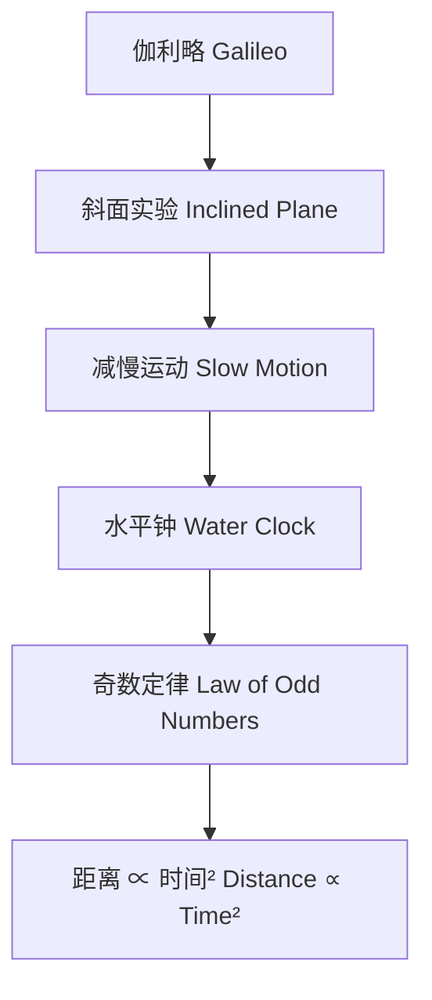
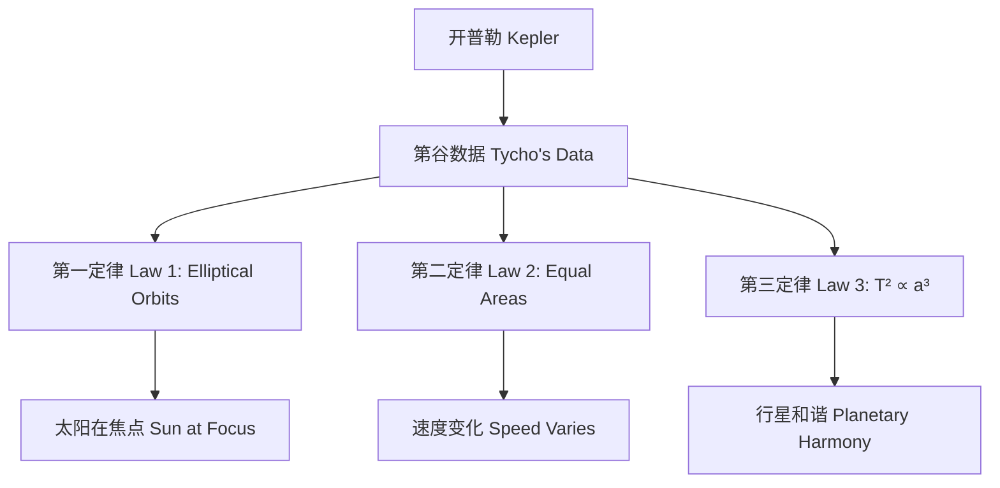
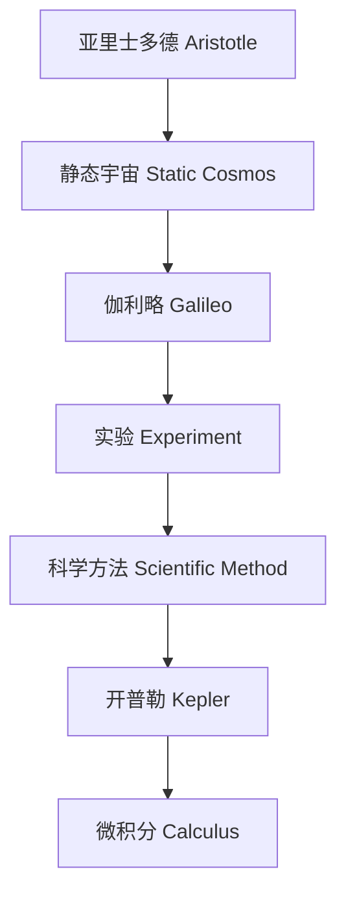

# 《Discovering the Laws of Motion》

# ## 1. 列举文章中的概念 (Concept)

概念是指文章中提到的抽象或具体的思维单位，用于描述现象、规律或方法。以下是提取的概念：

1. **运动 (Motion)**  
   - 文章核心主题，指物体位置随时间变化的现象，如落体、行星运动等。
2. **数学 (Mathematics)**  
   - 自然规律的语言，伽利略和开普勒用它描述运动。
3. **实验 (Experiment)**  
   - 通过观察和测量验证假设的方法，如伽利略的斜面实验。
4. **规律 (Law)**  
   - 自然界中可重复验证的模式，如奇数定律、开普勒三定律。
5. **重力 (Gravity)**  
   - 导致物体落下的力，伽利略研究其作用。
6. **惯性 (Inertia)**  
   - 物体保持运动或静止状态的性质，伽利略提出。
7. **摆 (Pendulum)**  
   - 周期性振荡的物体，伽利略发现其等时性。
8. **轨道 (Orbit)**  
   - 行星围绕太阳的路径，开普勒定义为椭圆。
9. **速度 (Speed)**  
   - 物体运动的快慢，如伽利略的瞬时速度概念。
10. **距离 (Distance)**  
   - 物体运动的空间跨度，如落体实验中的测量。
11. **时间 (Time)**  
   - 运动过程的持续性，如摆周期、行星周期。
12. **几何 (Geometry)**  
   - 描述自然形状和结构的数学分支，如椭圆、抛物线。
13. **微积分 (Calculus)**  
   - 处理变化率的数学工具，文章暗示其在运动研究中的重要性。
14. **科学方法 (Scientific Method)**  
   - 系统研究自然的方法，伽利略是首位实践者。
15. **椭圆 (Ellipse)**  
   - 开普勒发现的行星轨道形状。
16. **抛物线 (Parabola)**  
   - 伽利略发现的抛射物路径。
17. **周期 (Period)**  
   - 振荡或轨道运动的重复时间，如摆周期、行星年。
18. **视差 (Parallax)**  
   - 因观察位置变化导致的物体位置偏移，用于解释恒星位置。
19. **逆行运动 (Retrograde Motion)**  
   - 行星看似向后移动的现象，开普勒解释为视角错觉。
20. **等时性 (Isochronism)**  
   - 摆小幅度振荡周期不变的特性。
21. **摩擦 (Friction)**  
   - 阻碍运动的力，伽利略在实验中尽量减少其影响。
22. **日心说 (Heliocentrism)**  
   - 地球绕太阳运动的理论，伽利略和开普勒支持。
23. **地球中心说 (Geocentrism)**  
   - 亚里士多德和托勒密主张的宇宙观。
24. **望远镜 (Telescope)**  
   - 伽利略改进并用于天文观测的工具。
25. **原子钟 (Atomic Clock)**  
   - GPS中用于精确计时的设备，基于振荡原理。
26. **全球定位系统 (Global Positioning System, GPS)**  
   - 利用时间和距离计算位置的技术。
27. **约瑟夫森结 (Josephson Junction)**  
   - 基于摆原理的量子振荡设备。

---

### 2. 列举文章中的关联 (Association)
关联是指概念之间或概念与现象之间的联系，通常体现为因果、相关性或逻辑关系。以下是提取的关联：

1. **运动 (Motion) 与 数学 (Mathematics)**  
   - 运动规律通过数学语言表达，如伽利略的“自然之书用数学书写”。
2. **实验 (Experiment) 与 规律 (Law)**  
   - 实验揭示自然规律，如伽利略通过斜面实验发现奇数定律。
3. **重力 (Gravity) 与 落体距离 (Distance)**  
   - 重力导致落体距离随时间平方增加，如伽利略的发现。
4. **惯性 (Inertia) 与 抛射物路径 (Parabola)**  
   - 惯性使抛射物水平运动持续，结合重力形成抛物线。
5. **摆 (Pendulum) 与 时间 (Time)**  
   - 摆的周期与时间相关，伽利略发现其等时性。
6. **轨道 (Orbit) 与 椭圆 (Ellipse)**  
   - 行星轨道是椭圆，开普勒第一定律。
7. **速度 (Speed) 与 时间 (Time)**  
   - 速度随时间线性增加（伽利略落体），或随轨道位置变化（开普勒第二定律）。
8. **距离 (Distance) 与 时间 (Time)**  
   - 落体距离正比于时间平方，行星周期平方正比于距离立方。
9. **几何 (Geometry) 与 自然规律 (Law)**  
   - 几何形状（如椭圆、抛物线）描述自然运动规律。
10. **微积分 (Calculus) 与 运动 (Motion)**  
    - 微积分是理解变速运动的关键，如瞬时速度。
11. **科学方法 (Scientific Method) 与 实验 (Experiment)**  
    - 科学方法以实验为核心，伽利略是首位实践者。
12. **摆 (Pendulum) 与 等时性 (Isochronism)**  
    - 摆的小幅度振荡具有等时性。
13. **摩擦 (Friction) 与 实验精度 (Experiment Accuracy)**  
    - 摩擦影响实验结果，伽利略通过光滑斜面减少其干扰。
14. **日心说 (Heliocentrism) 与 逆行运动 (Retrograde Motion)**  
    - 日心说解释逆行运动为视角错觉。
15. **望远镜 (Telescope) 与 天文观测 (Astronomical Observation)**  
    - 伽利略用望远镜观测月球、太阳和木星，挑战旧观念。
16. **周期 (Period) 与 距离 (Distance)**  
    - 行星周期平方正比于距离立方，开普勒第三定律。
17. **视差 (Parallax) 与 恒星距离 (Stellar Distance)**  
    - 恒星无明显视差因其距离极远。
18. **原子钟 (Atomic Clock) 与 时间 (Time)**  
    - 原子钟通过振荡计数精确测量时间。
19. **全球定位系统 (GPS) 与 微积分 (Calculus)**  
    - GPS依赖微积分计算距离和位置。
20. **约瑟夫森结 (Josephson Junction) 与 摆 (Pendulum)**  
    - 约瑟夫森结的量子振荡与摆的数学原理相同。
21. **重力 (Gravity) 与 速度 (Speed)**  
    - 重力使落体速度随时间增加。
22. **轨道 (Orbit) 与 速度 (Speed)**  
    - 行星靠近太阳时速度加快，开普勒第二定律。
23. **实验 (Experiment) 与 摩擦 (Friction)**  
    - 伽利略通过理想化实验忽略摩擦，聚焦重力和惯性。
24. **数学 (Mathematics) 与 科学方法 (Scientific Method)**  
    - 数学是科学方法的核心工具，如伽利略和开普勒的计算。
25. **椭圆 (Ellipse) 与 几何 (Geometry)**  
    - 椭圆是几何学中定义的曲线，开普勒用其描述轨道。

### 2. **事实与看法**

#### (1) 列举文章中的事实
- 阿基米德死后，数学对自然的研究几乎停滞了1800年。
- 伽利略在文艺复兴时期的意大利继续阿基米德的工作，研究物体运动。
- 伽利略通过实验发现摆的规律性和落体的奇数定律。
- 开普勒研究行星运动，发现三条定律：椭圆轨道、等面积定律、周期平方与距离立方成正比。
- 伽利略生于1564年2月15日，死于1642年，在晚年被软禁。
- 开普勒生于1571年，1601年继承第谷的数据。
- 1543年，哥白尼提出日心说，韦萨利乌斯发表解剖学研究。
- 伽利略用望远镜观测到月球山脉、太阳黑子和木星卫星。
- GPS依靠原子钟和微积分实现精确定位。
- 约瑟夫森结基于摆的数学，用于探测微弱磁场。

#### (2) 列举文章中的看法
- “自然界的伟大之书是用数学语言书写的。”（伽利略）
- “几何与神的思维共存。”（开普勒）
- 亚里士多德的宇宙观认为天体永恒不变，而地球充满腐朽。
- 伽利略认为亚里士多德的落体理论是空洞的言辞。
- “科学中偏离真相一根头发丝是可以接受的，但偏离一条船缆就不行。”（伽利略）
- 开普勒相信行星运动背后有神圣的和谐。
- “伽利略的斜面实验体现了科学的艺术性。”（作者）
- “微积分在GPS中无处不在。”（作者）
- “开普勒的发现是思想史上惊人的一幕。”（考斯特勒）
- “摆的研究看似枯燥，实则意义深远。”（伽利略/作者）

---

### 3. **FAQ列表**
以下是从文章中提取的所有问题整理成FAQ：
1. **为什么阿基米德死后自然研究停滞了1800年？**  
   因为数学工具不足，直到伽利略和开普勒时代才复兴。
2. **伽利略如何发现落体的奇数定律？**  
   他用斜面实验减慢运动，用水平钟计时，发现距离与奇数序列相关。
3. **开普勒的三条定律是什么？**  
   第一定律：行星沿椭圆轨道运动，太阳在一焦点；第二定律：等时间扫过等面积；第三定律：周期平方与距离立方成正比。
4. **为什么亚里士多德的宇宙观被接受了两千年？**  
   因为它符合常识，且托勒密系统通过修补能解释行星运动。
5. **伽利略为何被软禁？**  
   他支持日心说，违背教会教义，被宗教裁判所判为异端。
6. **摆的等时性是什么？**  
   小角度摆动时，摆的周期与振幅无关。
7. **为什么伽利略无法解释摆周期与长度的关系？**  
   因为需要微分方程，而当时尚未发明。
8. **GPS如何利用摆的原理？**  
   它用原子钟计数振荡，类似摆的计时原理，结合微积分计算位置。
9. **开普勒为何最初相信柏拉图立体支配行星轨道？**  
   他受神秘主义驱动，认为几何统治宇宙。
10. **伽利略和开普勒有何不同？**  
    伽利略理性，研究地球运动；开普勒神秘，研究行星运动。

---

### 4. **Visualization（Mermaid格式）**
以下是基于文章内容的Mermaid格式可视化，分成多个子图。

#### 子图1：伽利略的落体实验

#### 子图2：开普勒的行星运动定律

#### 子图3：科学方法的演进

---

### 5. **列举文章中所有类比**
1. **宇宙如一本大书**  
   伽利略将宇宙比作一本用数学语言书写的书。
2. **行星运动如挡风玻璃雨刷**  
   开普勒第二定律用雨刷扫过的面积比喻行星速度变化。
3. **超车时的视错觉**  
   逆行运动比作高速公路上超车时慢车看似后退。
4. **摆如世界缩影**  
   作者引用布莱克的诗，将摆的振荡比作理解世界的窗口。
5. **自然界的主题重复**  
   摆的方程在发电机和约瑟夫森结中重复，如音乐主题的变奏。

---

### 6. **列举文章中10个金句**
1. “这本宏伟的书……是用数学语言书写的。”（伽利略）
2. “几何与神的思维共存，为上帝创造了世界的模式。”（开普勒）
3. “科学中偏离真相一根头发丝是可以接受的，但偏离一条船缆就不行。”（伽利略）
4. “我屈服于神圣的狂热。”（开普勒）
5. “自然界的伟大之书是用微积分书写的。”（作者）
6. “开普勒被毕达哥拉斯之梦迷住，在幻想的基础上建起了现代天文学的坚实大厦。”（考斯特勒）
7. “摆的研究看似枯燥，实则意义深远。”（伽利略/作者）
8. “我希望我们能嘲笑人群的愚蠢。”（伽利略致开普勒）
9. “物体在运动中保持运动，除非受到外力作用。”（伽利略的惯性定律）
10. “从教堂的吊灯到全球定位系统，伽利略的思想影响深远。”（作者）

---

