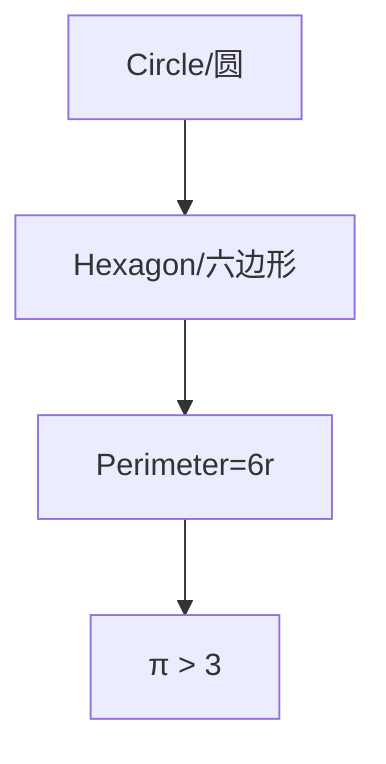
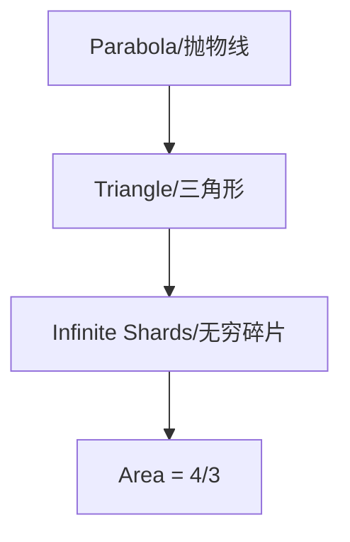
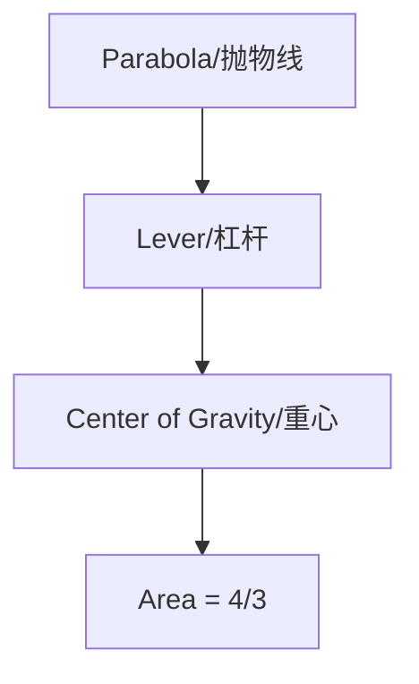
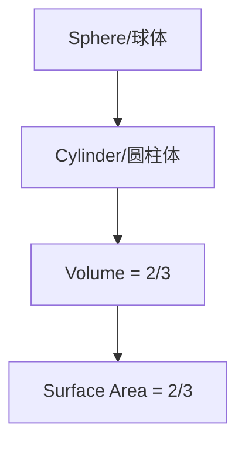
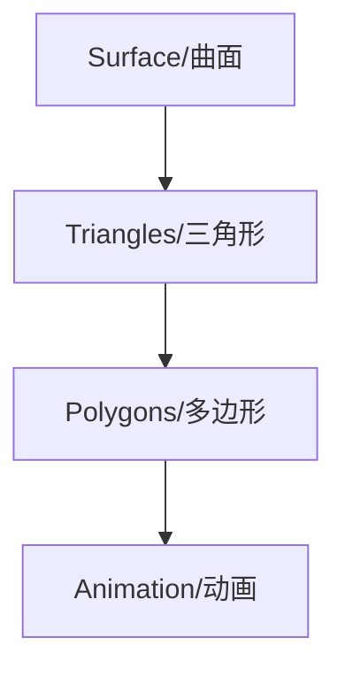
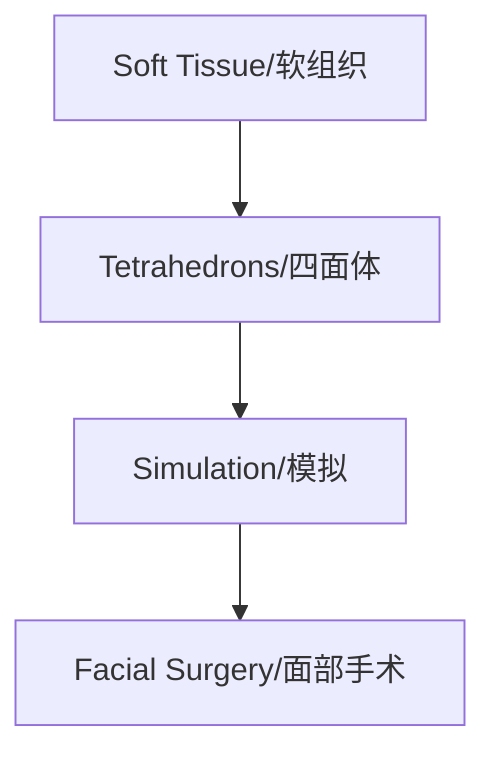

以下是对您提供的文档内容的全面分析和整理。我将逐一执行您的命令，并确保逻辑清晰、内容准确。由于内容较长，我会尽量简洁但不失完整性。

---

### 1. 列举其中的所有名词性成分，或者说是概念整理出来（中英文）

以下是文章中涉及的主要名词性成分或概念（按出现顺序整理，重复出现的仅列一次）：

1. Infinity / 无穷  
2. Archimedes / 阿基米德  
3. Geometry / 几何学  
4. Circle / 圆  
5. Pi (π) / 圆周率  
6. Calculus / 微积分  
7. Syracuse / 叙拉古  
8. Roman / 罗马人  
9. Lever / 杠杆  
10. Buoyancy / 浮力  
11. Hexagon / 六边形  
12. Circumference / 周长  
13. Diameter / 直径  
14. Polygon / 多边形  
15. Parabola / 抛物线  
16. Triangle / 三角形  
17. Method / 方法  
18. Eratosthenes / 埃拉托色尼  
19. Center of Gravity / 重心  
20. Sphere / 球体  
21. Cylinder / 圆柱体  
22. Palimpsest / 羊皮纸重写本  
23. Animation / 动画  
24. Facial Surgery / 面部手术  
25. Tetrahedron / 四面体  
26. Motion / 运动  
27. Screw / 螺杆  

---

### 2. 列举其中的所有名词性成分，并解释其定义（中英文）

1. **Infinity / 无穷**: A concept representing an unbounded or endless quantity or extent, often used in mathematics to describe processes with no finite limit.
2. **Archimedes / 阿基米德**: An ancient Greek mathematician, physicist, and engineer (circa 287–212 BCE), known for contributions to mathematics and mechanics.
3. **Geometry / 几何学**: The branch of mathematics concerned with shapes, sizes, and properties of space.
4. **Circle / 圆**: A round, two-dimensional shape where every point on the boundary is equidistant from the center.
5. **Pi (π) / 圆周率**: The mathematical constant defined as the ratio of a circle’s circumference to its diameter, approximately 3.14159.
6. **Calculus / 微积分**: A field of mathematics dealing with change and accumulation, including derivatives and integrals.
7. **Syracuse / 叙拉古**: An ancient Greek city in Sicily, home to Archimedes, famously defended against Roman siege.
8. **Roman / 罗马人**: Refers to the people or empire of ancient Rome, adversaries of Syracuse in 212 BCE.
9. **Lever / 杠杆**: A simple machine consisting of a rigid bar pivoting on a fulcrum, used to lift or move loads.
10. **Buoyancy / 浮力**: The upward force exerted by a fluid that opposes the weight of an object immersed in it.
11. **Hexagon / 六边形**: A polygon with six sides and six angles.
12. **Circumference / 周长**: The distance around the boundary of a circle.
13. **Diameter / 直径**: The straight-line distance passing through the center of a circle, connecting two points on its boundary.
14. **Polygon / 多边形**: A closed plane figure bounded by straight sides.
15. **Parabola / 抛物线**: A U-shaped curve formed by the intersection of a cone with a plane parallel to its side.
16. **Triangle / 三角形**: A polygon with three sides and three angles.
17. **Method / 方法**: Archimedes’ heuristic approach blending geometry and mechanics to intuit mathematical truths.
18. **Eratosthenes / 埃拉托色尼**: A Greek mathematician and librarian at Alexandria, a contemporary and friend of Archimedes.
19. **Center of Gravity / 重心**: The point where the mass of an object is balanced, critical in mechanics.
20. **Sphere / 球体**: A three-dimensional, perfectly round object where every point on the surface is equidistant from the center.
21. **Cylinder / 圆柱体**: A three-dimensional shape with two parallel circular bases connected by a curved surface.
22. **Palimpsest / 羊皮纸重写本**: A manuscript where original text has been erased and overwritten, as with the Archimedes Palimpsest.
23. **Animation / 动画**: The technique of creating the illusion of motion through sequences of images, often using polygons.
24. **Facial Surgery / 面部手术**: Surgical procedures to correct facial deformities, aided by mathematical modeling.
25. **Tetrahedron / 四面体**: A three-dimensional polyhedron with four triangular faces.
26. **Motion / 运动**: The change in position of an object over time, a concept beyond Archimedes’ statics.
27. **Screw / 螺杆**: A mechanical device with a helical ridge, attributed to Archimedes for lifting water.

---

### 3. 列举概念之间的关联（使用等式或逻辑关系）

以下是概念之间的主要关联（用中英文表示，部分涉及等式）：

1. **Circle / 圆** 和 **Pi (π) / 圆周率**:  
   - 等式: *C = πd*（圆的周长等于π乘以直径）  
   - *π = C / d*（π定义为周长与直径的比率）

2. **Circumference / 周长** 和 **Diameter / 直径**:  
   - 等式: *C = 2πr*（周长等于2π乘以半径，r = d/2）

3. **Polygon / 多边形** 和 **Circle / 圆**:  
   - 逻辑: 多边形通过增加边数（如从六边形到96边形）逼近圆，用于估计π。

4. **Hexagon / 六边形** 和 **Pi (π) / 圆周率**:  
   - 逻辑: *p = 6r*（六边形周长），*C > 6r*，推导出 *π > 3*。

5. **Infinity / 无穷** 和 **Calculus / 微积分**:  
   - 逻辑: 无穷是微积分的核心，通过无穷小分割和极限计算曲面面积或长度。

6. **Archimedes / 阿基米德** 和 **Method / 方法**:  
   - 逻辑: 阿基米德通过“方法”结合几何与力学（如杠杆和重心）探索曲面性质。

7. **Lever / 杠杆** 和 **Center of Gravity / 重心**:  
   - 等式: *W₁d₁ = W₂d₂*（杠杆平衡时，重量与距支点的距离成反比）。

8. **Parabola / 抛物线** 和 **Triangle / 三角形**:  
   - 逻辑: 阿基米德用无穷多三角形拼凑抛物线段，面积为大三角形的4/3。

9. **Sphere / 球体** 和 **Cylinder / 圆柱体**:  
   - 逻辑: 球的体积和表面积是圆柱体的2/3（包括上下盖）。

10. **Animation / 动画** 和 **Tetrahedron / 四面体**:  
    - 逻辑: 动画用多边形（如三角形、四面体）逼近曲面，类似阿基米德的无限逼近。

---

### 4. 使用COT（Chain of Thought）方式理顺关联

#### 逻辑步骤：
1. **定义与分类**:  
   - **定义**: 如上所述，每个概念有明确定义（例如，π是周长与直径的比）。  
   - **分类**: 可分为数学概念（π、微积分）、几何形状（圆、抛物线）、物理概念（浮力、杠杆）、应用领域（动画、手术）。

2. **比较**:  
   - **圆与多边形**: 圆是连续曲线，多边形是离散直线段，但通过无穷逼近可等效。  
   - **杠杆与微积分**: 杠杆处理静态平衡，微积分扩展到动态运动。

3. **因果**:  
   - 阿基米德的“方法”因结合几何与力学，得出抛物线面积为4/3（因果：方法 → 结果）。  
   - 无穷分割因用于逼近，导致π的数值范围确定。

4. **科学方法论**:  
   - 阿基米德用实验性直觉（Method）提出假设，再用穷竭法（exhaustion）验证，体现假设-验证的科学过程。

#### 串联逻辑：
- 阿基米德从圆的周长（*C = πd*）出发，用多边形逼近（无穷分割），推导出π的范围（3 + 10/71 < π < 3 + 10/70）。  
- 在抛物线中，他用三角形拼凑（无穷级数 *1 + 1/4 + 1/16 + …*），结合杠杆平衡（重心），得出面积为4/3。  
- 现代应用（如动画）继承无穷逼近思想，用三角形、四面体模拟曲面。

---

### 5. 事实与看法

#### 事实：
1. 阿基米德生活在公元前287-212年，保卫叙拉古对抗罗马人。
2. 他证明了浮力原理和杠杆定律。
3. 他用96边形计算π，得出 3 + 10/71 < π < 3 + 10/70。
4. 抛物线段面积是大三角形的4/3。
5. 球的体积和表面积是圆柱体的2/3。
6. 阿基米德的手稿在1998年以220万美元拍卖，现存于巴尔的摩。

#### 看法：
1. “阿基米德是最早的数学极客”（基于Plutarch的描述）。
2. “他比任何人都超前于时代”。
3. “π既有序又无序，神秘且迷人”。
4. “数学是发现而非发明”。
5. “无穷是微积分的核心”。

---

### 6. FAQ列表

1. **谁是阿基米德？**  
   - 古希腊数学家、物理学家，发明杠杆和浮力原理。
2. **什么是π？**  
   - 圆周率，圆周长与直径的比，约3.14159。
3. **阿基米德如何计算π？**  
   - 用内接和外接多边形逼近圆，得出范围。
4. **什么是穷竭法？**  
   - 通过有限步骤逐渐逼近目标值的方法。
5. **阿基米德的“方法”是什么？**  
   - 结合几何与力学的直觉方法，探索曲面性质。
6. **抛物线面积如何计算？**  
   - 用无穷三角形拼凑，得出4/3。
7. **现代如何应用阿基米德思想？**  
   - 动画用多边形逼近曲面，手术用四面体模拟组织。

---

### 7. Visualization（Mermaid格式）

以下为每张图片对应的Mermaid子图（简化表示）：

#### 图1：六边形逼近圆

#### 图2：抛物线段

#### 图3：杠杆法

#### 图4：球与圆柱体

#### 图5：动画三角形逼近

#### 图6：面部手术四面体

---

### 8. 列举文章中所有类比

1. 圆周长计算像走路步数（stride length × steps）。
2. 抛物线段如破碎陶器的三角碎片。
3. 阿基米德如立体主义画家。
4. π如阴阳平衡（秩序与混乱）。
5. 抛物线面积如分奶酪。
6. 方法如跷跷板平衡。
7. 多边形逼近如动画人物皮肤。

---

### 9. 列举10个金句

1. “He paved the way for integral calculus.”
2. “Has anyone ever been *more* ahead of his time?”
3. “Pi is elusive and mysterious, forever beyond reach.”
4. “Calculus uses the infinite to study the finite.”
5. “First comes intuition. Rigor comes later.”
6. “Out of the infinitely many straight lines, one area emerges.”
7. “We are discovering facts that already exist.”
8. “The straight and the jagged can impersonate the curved and the smooth.”
9. “Mathematics is endless. It humbled even Archimedes.”
10. “His legacy was the first principled use of infinite processes.”

---

如需进一步调整或补充，请告诉我！