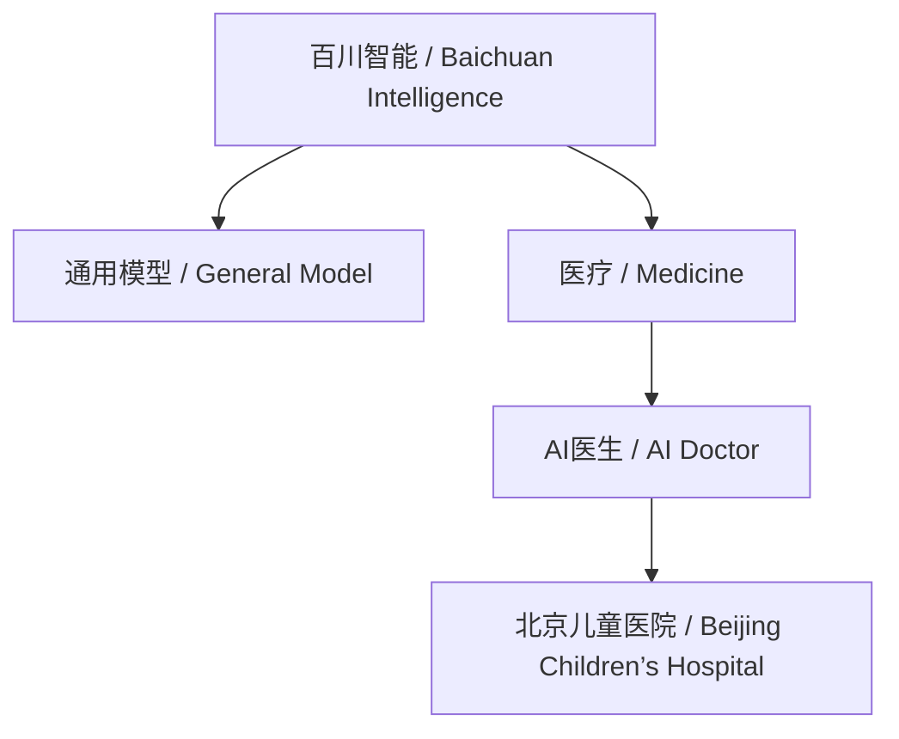
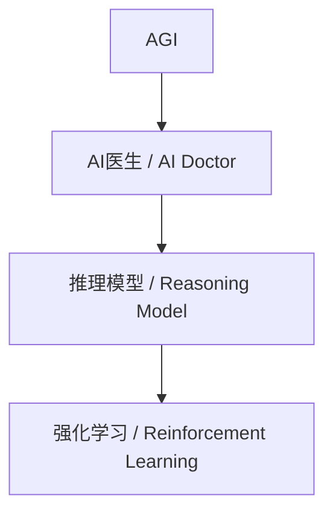
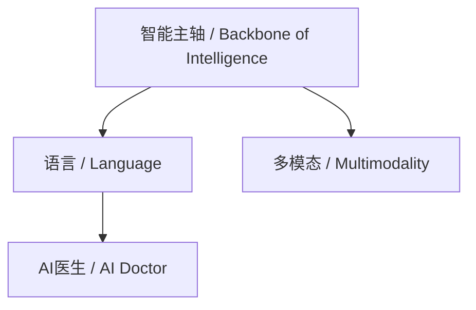

任务执行

由于这是一个复杂的多步骤任务，我将逐一完成每个部分，并确保逻辑清晰、结构化。为了便于理解，我将使用中英文双语标注概念，并通过逐步分析（Chain of Thought, COT）完成任务。

------

1. 列举所有名词性成分（概念整理）并解释定义

以下是从文章中提取的主要名词性成分或概念，并提供中英文定义：

1. **天才少年 / Genius Youth**
   - 定义：指在某一领域表现出卓越天赋的年轻人才，这里特指王小川早年在搜狗的职业起点。
   - Definition: Refers to young talents with exceptional abilities in a specific field, here specifically referring to Wang Xiaochuan's early career at Sogou.
2. **搜狗 / Sogou**
   - 定义：一家中国互联网公司，以搜索引擎和输入法技术闻名，王小川曾在此担任重要角色。
   - Definition: A Chinese internet company known for its search engine and input method technologies, where Wang Xiaochuan once held a significant role.
3. **基因测序 / Gene Sequencing**
   - 定义：通过技术手段分析DNA序列的过程，王小川研究生时期的学术研究方向。
   - Definition: The process of analyzing DNA sequences through technological means, the focus of Wang Xiaochuan’s graduate research.
4. **生命科学 / Life Science**
   - 定义：研究生命现象及其规律的学科，王小川长期关注的领域。
   - Definition: The study of life phenomena and their laws, a field of long-term interest to Wang Xiaochuan.
5. **百川智能 / Baichuan Intelligence**
   - 定义：王小川于2023年创立的AI公司，专注于通用模型与医疗AI的结合。
   - Definition: An AI company founded by Wang Xiaochuan in 2023, focusing on integrating general models with medical AI.
6. **通用模型 / General Model**
   - 定义：一种广泛适用的AI模型，强调泛化能力，与垂直领域模型相对。
   - Definition: A broadly applicable AI model emphasizing generalization, as opposed to vertical domain models.
7. **医疗 / Medicine**
   - 定义：与健康、疾病诊断和治疗相关的领域，百川智能的核心方向之一。
   - Definition: The field related to health, disease diagnosis, and treatment, a core focus of Baichuan Intelligence.
8. **AI医生 / AI Doctor**
   - 定义：利用人工智能技术模拟或辅助医生进行诊断和治疗的系统。
   - Definition: A system that uses artificial intelligence to simulate or assist doctors in diagnosis and treatment.
9. **推理模型 / Reasoning Model**
   - 定义：一种增强AI逻辑推理能力的模型，如百川的Baichuan-M1-preview。
   - Definition: A model that enhances AI’s logical reasoning capabilities, such as Baichuan’s Baichuan-M1-preview.
10. **AGI（通用人工智能） / Artificial General Intelligence**
    - 定义：具备人类般广泛智能的AI，能够适应多种任务，王小川认为造医生等价于实现AGI。
    - Definition: AI with human-like broad intelligence capable of adapting to various tasks; Wang Xiaochuan believes creating a doctor equates to achieving AGI.
11. **强化学习 / Reinforcement Learning**
    - 定义：一种通过试错和奖励机制优化AI行为的训练方法。
    - Definition: A training method that optimizes AI behavior through trial-and-error and reward mechanisms.
12. **多模态 / Multimodality**
    - 定义：AI处理多种数据类型（如文本、图像、声音）的能力。
    - Definition: The ability of AI to process multiple data types (e.g., text, images, sound).
13. **开源 / Open Source**
    - 定义：将技术或代码公开，供他人使用和改进，如百川的部分模型。
    - Definition: Making technology or code publicly available for others to use and improve, as with some of Baichuan’s models.
14. **垂直领域 / Vertical Domain**
    - 定义：专注于某一特定行业的应用领域，与通用模型相对。
    - Definition: Applications focused on a specific industry, as opposed to general models.
15. **熵增 / Entropy Increase**
    - 定义：物理学中系统混乱度随时间增加的现象，与生命系统的熵减相对。
    - Definition: A phenomenon in physics where a system’s disorder increases over time, contrasting with entropy reduction in life systems.
16. **熵减 / Entropy Reduction**
    - 定义：生命系统中混乱度减少、趋向有序的过程。
    - Definition: The process in life systems where disorder decreases and order increases.
17. **语言 / Language**
    - 定义：人类交流和思维的核心工具，王小川认为其是智能的主轴。
    - Definition: The core tool of human communication and thought, considered by Wang Xiaochuan as the backbone of intelligence.
18. **大厂 / Big Tech**
    - 定义：大型科技公司，如百度、腾讯，通常拥有雄厚资源。
    - Definition: Large technology companies, such as Baidu and Tencent, typically with substantial resources.
19. **投资人 / Investor**
    - 定义：为创业公司提供资金支持的个体或机构。
    - Definition: Individuals or institutions providing financial support to startups.
20. **北京儿童医院 / Beijing Children’s Hospital**
    - 定义：百川智能的医疗AI合作机构，计划部署AI儿科医生。
    - Definition: A medical institution collaborating with Baichuan Intelligence to deploy AI pediatric doctors.

------

2. 列举概念之间的关联（使用等式或逻辑关系）

以下是概念之间的逻辑关联，使用中英文标注并以等式或描述形式呈现：

1. **百川智能 = 通用模型 + 医疗 / Baichuan Intelligence = General Model + Medicine**
   - 描述：百川智能的战略是将通用AI模型能力与医疗场景结合。
   - Description: Baichuan Intelligence’s strategy integrates general AI model capabilities with medical scenarios.
2. **AI医生 ≈ AGI / AI Doctor ≈ AGI**
   - 描述：王小川认为，创造AI医生等价于实现通用人工智能，因为医生是复杂职业的标尺。
   - Description: Wang Xiaochuan believes creating an AI doctor is equivalent to achieving AGI, as doctors are a benchmark for complex professions.
3. **推理模型 ⊂ 通用模型 / Reasoning Model ⊂ General Model**
   - 描述：推理模型是通用模型的一个子集，增强逻辑推理能力。
   - Description: The reasoning model is a subset of the general model, enhancing logical reasoning capabilities.
4. **医疗 ≠ 垂直领域 / Medicine ≠ Vertical Domain**
   - 描述：王小川认为医疗不是传统意义上的垂直领域，而是AI技术的全面应用场景。
   - Description: Wang Xiaochuan argues that medicine is not a vertical domain in the traditional sense but a comprehensive application scenario for AI technologies.
5. **生命科学 → 熵减 / Life Science → Entropy Reduction**
   - 描述：生命科学探索生命从无序到有序的过程，与熵减相关。
   - Description: Life science explores the process of life moving from disorder to order, linked to entropy reduction.
6. **语言 = 智能主轴 / Language = Backbone of Intelligence**
   - 描述：王小川认为语言是智能的核心，多模态只是辅助。
   - Description: Wang Xiaochuan considers language the core of intelligence, with multimodality as a supplement.
7. **多模态 ∈ AI医生 / Multimodality ∈ AI Doctor**
   - 描述：AI医生需要多模态能力（如图像、声音处理）以实现全面诊断。
   - Description: AI doctors require multimodal capabilities (e.g., image and sound processing) for comprehensive diagnosis.
8. **开源 → 医疗合作 / Open Source → Medical Collaboration**
   - 描述：开源模型（如14B版本）促进与医疗机构的合作和信任。
   - Description: Open-source models (e.g., the 14B version) foster collaboration and trust with medical institutions.

------

3. 使用COT方式理顺关联

步骤1：定义与分类

- **定义**：明确每个概念的核心含义，如“AI医生”是AI技术在医疗中的应用，“AGI”是广泛适应的智能目标。
- **分类**：
  - 技术类：通用模型、推理模型、强化学习、多模态、开源。
  - 应用类：医疗、AI医生、北京儿童医院。
  - 理论类：生命科学、熵增、熵减、语言。

步骤2：比较

- **通用模型 vs. 医疗**：通用模型追求泛化，医疗则需特定数据和场景，但王小川认为医疗能包容所有AI技术。
- **语言 vs. 多模态**：语言是智能核心，多模态增强交互但不决定智能本质。

步骤3：因果

- **因**：王小川对生命科学的兴趣（基因测序）→ **果**：创立百川智能聚焦医疗AI。
- **因**：AI技术进步（如强化学习）→ **果**：推理模型（如M1）实现复杂诊断。

步骤4：科学方法论

- 假设：造医生等价于AGI。
- 实验：百川M1在脑梗案例中的诊断验证。
- 结论：AI医生能力已超基层医院，朝AGI迈进。

------

4. 事实与看法

事实

1. 王小川2000年研究生论文研究基因测序。
2. 百川智能成立于2023年。
3. 百川8个月未更新大版本模型，转向医疗。
4. 1月25日发布Baichuan-M1-preview。
5. M1为脑梗患者提供了诊断参考。
6. 2025年第一季度，AI医生将在北京儿童医院上岗。
7. 百川累计融资超50亿元。

看法

1. “医疗不是垂直场景”——王小川认为医疗涵盖所有AI技术。
2. “造医生等价于AGI”——医生职业复杂度是AGI标尺。
3. “语言才是智能主轴”——视频和图像训练走偏。
4. “生命不全是用物理来算的”——生命走向熵减而非熵增。
5. “百川是最稳的大模型独角兽之一”——投资人观点。

------

5. FAQ列表

1. **百川在忙什么？**
   - 答：忙于开发全场景推理模型Baichuan-M1-preview及医疗AI产品。
2. **为什么百川8个月没更新大版本？**
   - 答：专注医疗模型和产品开发。
3. **为什么百川转向医疗而非通用模型？**
   - 答：王小川认为医疗是大模型的高价值场景，非垂直领域。
4. **M1能做什么？**
   - 答：可进行复杂病症推理诊断，如脑梗案例。
5. **百川的AI医生何时落地？**
   - 答：2025年第一季度将在北京儿童医院及海淀区上岗。

------

6. Visualization（Mermaid格式）

Subgraph 1: 百川智能战略

mermaid

Subgraph 2: AGI与AI医生

mermaid

Subgraph 3: 智能主轴

mermaid

------

7. 类比

1. **医生是AGI的标尺**：医生职业复杂度类比AGI的能力标准。
2. **自然数与偶数双射**：类比造医生与实现AGI的等价性。
3. **水涨船高**：医疗场景随AI能力提升而增强，非单纯应用。
4. **提线木偶**：类比AI变革中人的被动性。

------

8. 10个金句

1. “造医生等价于AGI，医生是人类职业中最复杂的之一。”
2. “医疗不是垂直场景，因为任何一个AI技术在医疗上都有用武之地。”
3. “以前是把物理变数学，现在是把语言变数学，未来是把生命变数学。”
4. “语言才是智能主轴，视频里没有智能。”
5. “生命不全是用物理来算的，生命看起来不精确，但走向了熵减。”
6. “得医生者得天下。”
7. “医疗是大模型皇冠上的明珠。”
8. “从科学时代走向智能时代。”
9. “中国一年就诊人次84亿，这里当然有超级应用。”
10. “就像一艘船，你丢了点东西，也会获得新东西。”

------

# vision

王小川在文章中描绘的AI模型应用场景主要集中于**医疗领域**，特别是通过构建**AI医生**来解决医疗资源短缺、提升诊断能力并推动生命科学的进步。他将这一场景视为通向通用人工智能（AGI）的重要路径，同时强调其社会价值和产业落地潜力。以下是对其描绘的具体场景的整理和分析，使用逻辑推理（COT）逐步展开。

------

王小川描绘的AI模型应用场景

1. 核心场景：AI医生

王小川将AI模型的核心应用场景定义为**AI医生**，即利用人工智能技术模拟或辅助人类医生进行诊断、治疗和健康管理。他认为这是AI技术与生命科学结合的高价值领域，并将其与AGI的实现直接挂钩。

- **具体描述**：
  - **复杂病症诊断**：如百川的Baichuan-M1-preview在脑梗患者案例中提供诊断参考，能力超过市一级医院。
  - **儿科医疗**：2025年第一季度，AI儿科医生将在北京儿童医院上岗，解决儿科医生短缺问题。
  - **基层医疗支持**：与海淀区合作，每个居民拥有“AI医生助理”，提升基层医疗供给。
- **落地计划**：
  - **时间表**：2025年第一季度实现初步落地（如海淀区AI医生助理）。
  - **扩展目标**：从儿科到全科，从院内到居家，推动“Hospital at Home”（居家医院）模式。
- 场景特点

王小川描绘的AI应用场景具有以下特点：

- **非垂直领域**：他强调“医疗不是垂直场景”，因为医疗能包容所有AI技术（如推理、多模态、RAG等），是“水涨船高”式的超级应用，而非“沿途下蛋”的单一功能。
- **超级应用潜力**：引用中国每年84亿就诊人次，医疗AI可成为日活跃用户（DAU）达3000万至1亿的超级应用。
- **社会价值导向**：解决“医生供给不足”的核心瓶颈，让“人人都有医生用”。
- 场景的层次与应用形式

王小川的AI医生场景分为多个层次和应用形式：

- **C端（个人用户）**：
  - 形态：类似“医生朋友”的助手，了解用户健康史，提供咨询和慢病管理。
  - 示例：居民通过AI医生助理获取健康建议，减少医院挤兑。
- **B端（医院端）**：
  - 形态：医生助手，辅助诊断和全病程管理。
  - 示例：M1为内蒙古脑梗患者提供诊断方向，与协和专家会诊结果吻合。
- **G端（政府端）**：
  - 形态：支持家庭医生计划和公立医院改革。
  - 示例：与海淀卫健委合作，打通医疗系统，提供AI服务。
- 技术支撑的场景细节

王小川描绘的AI医生依赖多种技术能力：

- **推理模型**：如Baichuan-M1-preview，用于复杂病症的逻辑推理。
- **多模态**：处理影像、咳嗽声音等数据（如咳嗽模型判断呼吸道感染）。
- **强化学习**：提升模型诊断的准确性和适应性。
- **长窗口记忆**：记录个体全生命周期健康信息。
- **RAG（检索增强生成）**：查阅医学文献支持诊断。
- 场景的未来愿景

- **短期（2025年）**：
  - AI医生解决儿科资源短缺、疑难病诊断（如罕见病分类）。
  - 示例：北京儿童医院的“一大四小”计划（超级医生模型覆盖居家、社区等场景）。
- **中期**：
  - 推动“Hospital at Home”，实现居家疾病管理，减少交叉感染。
  - 数据飞轮：更多医院合作提供数据，反哺模型提升。
- **长期**：
  - **生命科学突破**：通过海量临床数据（如“出生即入组”）推动AI for Science，探索生命数学原理。
  - **生物自由**：AI医生让人免受疾病困扰，延续人类文明。
- 与大厂竞争的场景定位

王小川强调AI医生场景“在大厂射程之外”：

- **差异化**：大厂聚焦通用模型和流量竞争（如API价格战），而百川专注医疗落地。
- **壁垒**：医疗需要专业数据和与医院、政府深度合作，大厂当前优先级较低。
- 具体案例与验证

- **脑梗案例**：M1为病危患者提供三个诊断方向，与协和专家一致，验证了复杂诊断能力。
- **咳嗽模型**：通过声音判断呼吸道感染类型，展示多模态应用。
- **儿科试点**：北京儿童医院的AI医生部署，解决医疗挤兑问题。

------

COT推理过程

1. **定义问题**：王小川的AI模型应用场景是什么？
   - 从文章提取：核心是AI医生，目标是医疗。
2. **分类**：分为C端（居民）、B端（医院）、G端（政府）应用。
3. **因果分析**：
   - 因：医生供给不足、AI技术进步。
   - 果：AI医生成为解决方案。
4. **比较**：
   - 与通用模型：医疗场景更聚焦但包容性强。
   - 与大厂：百川避开红海，选蓝海。
5. **科学方法论**：
   - 假设：AI医生可提升医疗供给。
   - 实验：M1脑梗诊断、北京儿童医院试点。
   - 结论：场景可行且具社会价值。

------

最终回答

王小川描绘的AI模型应用场景是以**AI医生**为核心的医疗领域应用，具体包括：

- **短期落地**：2025年在儿科（如北京儿童医院）和基层（如海淀区）部署AI医生，解决资源短缺和复杂诊断。
- **应用形式**：C端的“医生朋友”、B端的医生助手、G端的公卫支持。
- **技术支撑**：推理模型、多模态、强化学习等，打造超级应用（DAU 3000万-1亿）。
- **长期愿景**：通过“Hospital at Home”和生命科学数据，推动“生物自由”，实现AGI并延续人类文明。 这一场景定位于“大厂射程之外”，以医疗为切入点，兼具社会价值与技术理想。

如果您需要更详细的某个场景分析（如技术细节或落地计划），请告诉我！

